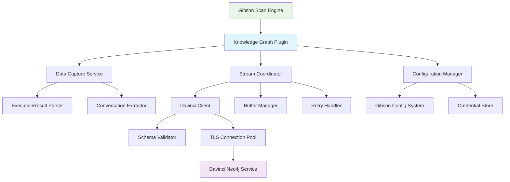

# Design Document

## Overview

The Knowledge Graph Plugin is an Output domain plugin for the Gibson security testing framework that enables real-time streaming of conversation data to the Davinci Neo4j knowledge graph service. It integrates seamlessly with Gibson's plugin architecture to capture and transmit scan conversations, metadata, and findings during security testing operations. The plugin will be deployed as a standalone plugin in ~/Code/ai/zero-day-ai/plugins directory and maintains Gibson's core principle of non-blocking execution while providing valuable conversation analytics capabilities.

## Steering Document Alignment

### Technical Standards (tech.md)

The design follows established Gibson technical patterns:
- **Result Pattern**: Uses `models.Result[T]` for consistent error handling throughout
- **Repository Pattern**: Implements clean data access abstraction for configuration and credential management
- **Plugin Interface Compliance**: Implements Output domain plugin interface fully with Execute, Validate, and GetMetadata methods
- **Dual Model System**: Separates business logic models from data transmission models
- **Import Conventions**: Uses proper import aliases to avoid package shadowing (e.g., `coremodels` vs `dbmodels`)

### Project Structure (structure.md)

Implementation follows Gibson's project organization while being deployed as a standalone plugin:
- Plugin located in `~/Code/ai/zero-day-ai/plugins/knowledge-graph/`
- Follows Gibson's plugin directory structure with `plugin.yaml` manifest
- Core interfaces from `pkg/core/plugin/` for plugin integration
- Configuration management through Gibson's `pkg/cli/config/` patterns
- Testing structure with unit, integration, and e2e test separation
- Modular component organization with single responsibility principle

## Code Reuse Analysis

### Existing Components to Leverage

- **Gibson Plugin Framework**: Core plugin interfaces (`shared.Plugin`, `shared.PluginContext`, `shared.ExecutionResult`)
- **Gibson Configuration System**: Viper-based configuration with environment variable support (`pkg/cli/config`)
- **Gibson Credential Management**: AES-256-GCM encrypted credential storage from services layer
- **Gibson Logging**: Structured logging with context and correlation IDs
- **Gibson HTTP Client**: Existing HTTP client patterns with TLS support and connection pooling
- **Gibson Result Pattern**: Functional error handling (`models.Result[T]`) for consistent API design
- **Gibson Validation**: Input validation patterns from `internal/validation/`

### Integration Points

- **Plugin Discovery System**: Registers as Output domain plugin through Gibson's plugin discovery mechanism
- **ExecutionResult Pipeline**: Hooks into plugin execution context to access conversation data directly from `shared.ExecutionResult` struct
- **Configuration Pipeline**: Extends existing config.yaml structure and integrates with CLI flag system (`--knowledge-graph-url`)
- **Credential Storage**: Integrates with Gibson's encrypted credential repository for API key management
- **Health Monitoring**: Connects to Gibson's existing health check infrastructure

## Architecture

The Knowledge Graph Plugin follows a modular, event-driven architecture with clear separation between Gibson integration and Davinci communication. The design emphasizes non-blocking operation, graceful degradation, and robust error handling.

### Modular Design Principles

- **Single File Responsibility**: Each file handles one specific concern (plugin.go for interface, config.go for configuration, client.go for HTTP, etc.)
- **Component Isolation**: Clean separation between Gibson plugin interface, data capture, streaming, and Davinci communication
- **Service Layer Separation**: Distinct layers for plugin lifecycle, data extraction, transmission, and error handling
- **Utility Modularity**: Focused utilities for schema validation, connection management, and data transformation



## Components and Interfaces

### Plugin Interface Component (plugin.go)
- **Purpose:** Implements Gibson's Output domain plugin interface and manages plugin lifecycle
- **Interfaces:**
  - `Execute(ctx context.Context, target *shared.Target) (*shared.SecurityResult, error)`
  - `GetMetadata() *shared.PluginMetadata`
  - `Validate() error`
  - `HealthCheck() models.Result[HealthStatus]`
- **Dependencies:** Gibson plugin framework, configuration manager, stream coordinator
- **Reuses:** Gibson BasePlugin patterns, shared plugin types, metadata validation from `pkg/core/plugin`

### Data Capture Service (capture.go)
- **Purpose:** Extracts conversation data from ExecutionResult structs regardless of --verbose flag setting
- **Interfaces:**
  - `CaptureConversation(result *shared.ExecutionResult) (*ConversationData, error)`
  - `ExtractPromptResponse(context *shared.PluginContext) ([]*PromptResponsePair, error)`
  - `ParseExecutionData(data interface{}) models.Result[ConversationData]`
- **Dependencies:** Gibson execution context, shared data types
- **Reuses:** Gibson Result pattern, existing data extraction utilities from shared module

### Stream Coordinator (streamer.go)
- **Purpose:** Manages concurrent streaming of conversation data with buffering and flow control
- **Interfaces:**
  - `StreamConversation(data *ConversationData) models.Result[*StreamResponse]`
  - `StartStreaming(ctx context.Context) error`
  - `StopStreaming() error`
  - `FlushBuffer() models.Result[int]`
- **Dependencies:** Davinci client, buffer manager, retry handler
- **Reuses:** Gibson's goroutine management patterns, worker pool utilities

### Davinci Client (client.go)
- **Purpose:** Handles HTTP communication with Davinci service including authentication and retries
- **Interfaces:**
  - `SendConversation(data *ConversationPayload) models.Result[*DavinciResponse]`
  - `ValidateConnection() models.Result[ConnectionStatus]`
  - `GetAPISpec() models.Result[OpenAPISpec]`
  - `HealthCheck() models.Result[*ServiceHealth]`
- **Dependencies:** HTTP client, TLS configuration, schema validator
- **Reuses:** Gibson HTTP utilities, TLS configuration patterns, exponential backoff

### Configuration Manager (config.go)
- **Purpose:** Manages plugin configuration from CLI flags, config files, and environment variables
- **Interfaces:**
  - `LoadConfiguration() models.Result[*PluginConfig]`
  - `GetDavinciURL() string`
  - `GetCredentials() models.Result[*DavinciCredentials]`
  - `ValidateConfig(config *PluginConfig) models.Result[bool]`
- **Dependencies:** Gibson configuration system, credential store
- **Reuses:** Viper configuration from `pkg/cli/config`, Gibson config patterns

### Buffer Manager (buffer.go)
- **Purpose:** Provides intelligent buffering for high-throughput conversation streaming
- **Interfaces:**
  - `BufferConversation(data *ConversationData) error`
  - `FlushBuffer() models.Result[int]`
  - `SetBufferSize(size int) error`
  - `GetBufferStats() *BufferStatistics`
- **Dependencies:** Memory management utilities, timer utilities
- **Reuses:** Gibson's resource management patterns, channel-based queuing

### Schema Validator (validator.go)
- **Purpose:** Validates outgoing data against Davinci's OpenAPI specification
- **Interfaces:**
  - `ValidatePayload(data *ConversationPayload) models.Result[ValidationResult]`
  - `FetchOpenAPISpec(url string) models.Result[*OpenAPISpec]`
  - `CheckSchemaCompatibility(version string) models.Result[bool]`
- **Dependencies:** OpenAPI parser, JSON schema validator
- **Reuses:** Gibson's validation patterns from `internal/validation/`

### Authentication Handler (auth.go)
- **Purpose:** Manages API key authentication and credential retrieval
- **Interfaces:**
  - `GetAPIKey() models.Result[string]`
  - `ValidateCredentials(creds *DavinciCredentials) models.Result[bool]`
  - `RefreshCredentials() models.Result[*DavinciCredentials]`
- **Dependencies:** Gibson credential service
- **Reuses:** Gibson's encrypted credential storage patterns

### Error Handler (errors.go)
- **Purpose:** Provides consistent error handling and recovery strategies
- **Interfaces:**
  - `HandleServiceUnavailable(err error) models.Result[RecoveryStrategy]`
  - `HandleAuthenticationError(err error) models.Result[AuthRecovery]`
  - `HandleValidationError(err error) models.Result[ValidationRecovery]`
- **Dependencies:** Logging service, retry handler
- **Reuses:** Gibson's error handling patterns and Result type

### Health Monitor (health.go)
- **Purpose:** Monitors plugin health and reports status to Gibson
- **Interfaces:**
  - `CheckHealth() models.Result[HealthStatus]`
  - `CheckDavinciConnection() models.Result[bool]`
  - `GetMetrics() models.Result[*PluginMetrics]`
- **Dependencies:** Davinci client, buffer manager
- **Reuses:** Gibson's health monitoring patterns

## Data Models

### ConversationData
```go
type ConversationData struct {
    ID           uuid.UUID                `json:"id" validate:"required"`
    ScanID       uuid.UUID                `json:"scan_id" validate:"required"`
    TargetID     uuid.UUID                `json:"target_id" validate:"required"`
    Timestamp    time.Time                `json:"timestamp" validate:"required"`
    PluginName   string                   `json:"plugin_name" validate:"required"`
    Exchanges    []PromptResponsePair     `json:"exchanges" validate:"required,dive"`
    Metadata     ConversationMetadata     `json:"metadata"`
    Findings     []SecurityFinding        `json:"findings,omitempty"`
}
```

### PromptResponsePair
```go
type PromptResponsePair struct {
    ID          uuid.UUID              `json:"id" validate:"required"`
    Prompt      string                 `json:"prompt" validate:"required"`
    Response    string                 `json:"response" validate:"required"`
    Timestamp   time.Time              `json:"timestamp" validate:"required"`
    TokenCount  int                    `json:"token_count,omitempty"`
    Latency     time.Duration          `json:"latency,omitempty"`
    Metadata    map[string]interface{} `json:"metadata,omitempty"`
}
```

### ConversationMetadata
```go
type ConversationMetadata struct {
    ModelName     string                 `json:"model_name,omitempty"`
    Temperature   float64                `json:"temperature,omitempty"`
    MaxTokens     int                    `json:"max_tokens,omitempty"`
    SystemPrompt  string                 `json:"system_prompt,omitempty"`
    Categories    []string               `json:"categories,omitempty"`
    Tags          []string               `json:"tags,omitempty"`
    Risk          string                 `json:"risk,omitempty"`
    Custom        map[string]interface{} `json:"custom,omitempty"`
}
```

### SecurityFinding
```go
type SecurityFinding struct {
    ID          uuid.UUID              `json:"id" validate:"required"`
    Type        string                 `json:"type" validate:"required"`
    Severity    string                 `json:"severity" validate:"required,oneof=critical high medium low info"`
    Category    string                 `json:"category" validate:"required"`
    Description string                 `json:"description" validate:"required"`
    Evidence    string                 `json:"evidence,omitempty"`
    Confidence  float64                `json:"confidence" validate:"min=0,max=1"`
    Metadata    map[string]interface{} `json:"metadata,omitempty"`
}
```

### PluginConfig
```go
type PluginConfig struct {
    Enabled           bool          `json:"enabled" default:"false"`
    DavinciURL       string        `json:"davinci_url" validate:"required_if=Enabled true,url"`
    CredentialName   string        `json:"credential_name"`
    BufferSize       int           `json:"buffer_size" default:"100"`
    FlushInterval    time.Duration `json:"flush_interval" default:"5s"`
    MaxRetries       int           `json:"max_retries" default:"3"`
    RetryBackoff     time.Duration `json:"retry_backoff" default:"1s"`
    Timeout          time.Duration `json:"timeout" default:"30s"`
    ValidateSchema   bool          `json:"validate_schema" default:"true"`
    StreamConcurrency int          `json:"stream_concurrency" default:"10"`
    TLSConfig        *TLSConfig    `json:"tls_config,omitempty"`
}
```

### DavinciCredentials
```go
type DavinciCredentials struct {
    URL       string     `json:"url" validate:"required,url"`
    APIKey    string     `json:"api_key" validate:"required"`
    Username  string     `json:"username,omitempty"`
    Password  string     `json:"password,omitempty"`
    TLSConfig *TLSConfig `json:"tls_config,omitempty"`
}
```

### StreamResponse
```go
type StreamResponse struct {
    Success       bool                   `json:"success"`
    ConversationID uuid.UUID             `json:"conversation_id,omitempty"`
    Error         string                 `json:"error,omitempty"`
    RetryAfter    *time.Duration         `json:"retry_after,omitempty"`
    Metadata      map[string]interface{} `json:"metadata,omitempty"`
}
```

## Error Handling

### Error Scenarios

1. **Davinci Service Unavailable**
   - **Handling:** Log warning with correlation ID, disable streaming for current scan, continue Gibson execution normally
   - **User Impact:** Scan proceeds without interruption, warning message indicates graph data not captured
   - **Recovery:** Automatic retry with exponential backoff on next scan execution

2. **Authentication Failure**
   - **Handling:** Log credential error with troubleshooting guidance, disable plugin for current scan
   - **User Impact:** Clear error message with steps to update credentials via `gibson credential update`
   - **Recovery:** Plugin re-enables automatically when valid credentials are provided

3. **Schema Validation Failure**
   - **Handling:** Log detailed validation errors with field-level information, attempt to send without validation if configured
   - **User Impact:** Detailed error logs for debugging, scan continues normally
   - **Recovery:** Automatic schema re-fetch and validation on service reconnection

4. **Network Connectivity Issues**
   - **Handling:** Implement exponential backoff with jitter, buffer data locally up to buffer limit, retry transmission
   - **User Impact:** Transparent to user, scan performance maintained
   - **Recovery:** Automatic reconnection and buffer flush when connectivity restored

5. **Rate Limiting**
   - **Handling:** Respect retry-after headers, implement token bucket rate limiting, queue messages
   - **User Impact:** Slight delay in graph updates, scan continues normally
   - **Recovery:** Automatic rate limit adherence with adaptive throttling

6. **Memory/Resource Exhaustion**
   - **Handling:** Implement circuit breaker pattern, drop oldest buffered messages, log resource warning
   - **User Impact:** Warning about reduced graph functionality, scan continues
   - **Recovery:** Automatic recovery when resource pressure decreases below threshold

7. **Invalid Conversation Data**
   - **Handling:** Validate data structure, log specific validation errors, skip invalid data
   - **User Impact:** Warning in logs with details about invalid fields
   - **Recovery:** Continue processing valid conversation data

8. **Partial Transmission Failure**
   - **Handling:** Track transmission state, retry failed items only, maintain order when possible
   - **User Impact:** No impact on scan execution
   - **Recovery:** Automatic retry of failed transmissions with deduplication

## Testing Strategy

### Unit Testing

- **Plugin Interface**: Test Execute, Validate, GetMetadata methods with mocked dependencies
- **Configuration Loading**: Test config priority (CLI > file > env), validation rules, default values
- **Data Extraction**: Test conversation parsing from ExecutionResult, handling of nil/empty fields, edge cases
- **Schema Validation**: Test OpenAPI contract validation, version compatibility checks, validation error messages
- **Buffer Management**: Test buffer operations, overflow handling, flush triggers, concurrent access
- **Client Communication**: Mock Davinci service, test request/response handling, authentication headers
- **Error Handling**: Test all error scenarios with proper fallbacks, logging, and recovery strategies
- **Credential Management**: Test encrypted credential retrieval, API key handling, credential refresh

### Integration Testing

- **Gibson Plugin Integration**: Test plugin discovery, lifecycle management, execution context access
- **Configuration System**: Test end-to-end configuration loading with Gibson's Viper config system
- **Credential Integration**: Test with Gibson's encrypted credential storage and retrieval
- **HTTP Communication**: Test with mock Davinci service, verify TLS, retries, timeouts
- **Concurrent Operations**: Test multiple simultaneous conversations, buffer management under load
- **Performance Testing**: Verify < 100ms latency, < 10MB memory overhead, < 5% CPU impact
- **Resilience Testing**: Test network failures, service unavailability, authentication failures

### End-to-End Testing

- **Complete Scan Flow**: Execute Gibson scans with `--graph` flag enabled, verify data transmission
- **Configuration Scenarios**: Test CLI flag (`--knowledge-graph-url`), config file, and environment variable
- **Error Recovery**: Test service disruption during scans, verify graceful degradation and recovery
- **Performance Benchmarks**: Measure actual latency, memory usage, CPU impact in production-like environment
- **Security Validation**: Test TLS communication, credential security, no sensitive data in logs
- **Data Integrity**: Verify all conversation data is captured and transmitted correctly
- **Plugin Health**: Test health monitoring integration with Gibson's status system

### Test Data Management

- **Mock Davinci Service**: Containerized mock service for integration testing
- **Sample Conversation Data**: Realistic test data covering various AI model interactions
- **Configuration Test Cases**: Valid and invalid configuration scenarios
- **Error Simulation**: Network condition simulation, rate limiting, service failures
- **Performance Test Data**: Large datasets for load testing and benchmarking