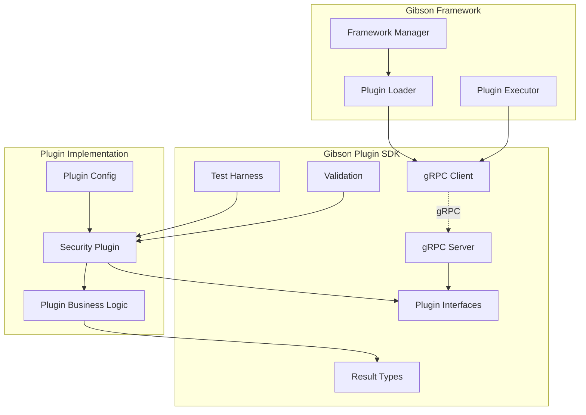

# Design Document

## Overview

The Gibson SDK Extraction design implements a clean separation between the Gibson framework core and its plugin ecosystem by extracting shared plugin code into a standalone Go module (`github.com/gibson-sec/gibson-framework/plugin-sdk`). This design strictly follows the Gibson framework's established patterns including the Result[T] error handling from `pkg/core/models`, the dual model system (core models vs database models), repository patterns from `pkg/core/database/repositories`, and the service factory pattern from `pkg/services`. The SDK will maintain consistency with the framework's import aliases (coremodels, dbmodels) and Cobra CLI structure while using gRPC via HashiCorp's go-plugin for process isolation.

## Steering Document Alignment

### Technical Standards (tech.md)
This design strictly adheres to Gibson framework's established technical patterns from the codebase:
- **Result[T] Pattern**: Uses exact implementation from `pkg/core/models/result.go` with Ok(), Err(), IsOk(), IsErr(), Unwrap() methods
- **Dual Model System**: Follows framework pattern with coremodels (`pkg/core/models`) for business logic and dbmodels (`pkg/core/database/models`) for persistence
- **Repository Pattern**: Implements interfaces pattern from `pkg/core/database/repositories/interfaces.go` with Result[T] returns
- **Service Factory**: Follows `pkg/services/service_factory.go` pattern for dependency injection
- **Import Aliases**: Maintains framework convention - `coremodels` for core models, `dbmodels` for database models
- **Cobra CLI**: Extends existing CLI structure from `cmd/gibson/` and `pkg/cli/commands/`

### Project Structure (structure.md)
The SDK follows Gibson framework's exact modular organization:
- **Package Structure**: Mirrors framework layout - `pkg/` for public packages, `internal/` for internal packages, `cmd/` for CLI commands
- **Test Organization**: Test files (*_test.go) alongside implementation, integration tests in `tests/integration/` with `-tags=integration`
- **Config Management**: Uses Viper like framework's `pkg/cli/config/config.go`
- **Output Formatting**: Follows framework's output pattern from `pkg/cli/output/` with JSON, YAML, Table, CSV formatters

## Code Reuse Analysis

### Existing Components to Leverage from Gibson Framework
- **Result[T] Implementation**: Direct copy from `pkg/core/models/result.go` maintaining exact same methods (Ok, Err, IsOk, IsErr, Unwrap, UnwrapOr, Error)
- **Validation Utilities**: Copy validation patterns from `internal/validation/` including SQL injection, XSS, command injection checks
- **Security Domains**: Extract exact domain definitions (Model, Data, Interface, Infrastructure, Output, Process) from `shared/`
- **Model Patterns**: Follow dual model pattern - FindingDB from `pkg/core/database/models/finding.go` for persistence, Finding from `pkg/core/models/` for business logic
- **Service Patterns**: Follow service implementation patterns from `pkg/services/` with GetDefaultConfig() and service structs

### Integration Points with Gibson Framework
- **Framework Import Path**: Framework replaces `replace` directive in go.mod with direct import `github.com/gibson-sec/gibson-framework/plugin-sdk`
- **Plugin Loader Integration**: Extends existing plugin loader in framework to use SDK interfaces
- **CLI Extension**: New commands added to existing Cobra structure in `cmd/gibson/` following pattern of status.go, target.go, version.go
- **Repository Integration**: SDK types integrate with existing repository interfaces returning Result[T]
- **Makefile Integration**: Extends existing Makefile targets for SDK operations (similar to existing build, test, lint targets)

## Architecture

The SDK architecture follows a layered approach with clean separation of concerns:

### Modular Design Principles
- **Single File Responsibility**: Each file handles one specific interface or type family
- **Component Isolation**: Plugin, validation, and testing components are independent modules
- **Service Layer Separation**: Clear separation between gRPC transport and business logic
- **Utility Modularity**: Helper utilities are focused single-purpose modules



## Components and Interfaces

### Plugin Interface Component
- **Purpose:** Define the core SecurityPlugin interface and extensions
- **Interfaces:**
  - `SecurityPlugin`: Core plugin interface with GetInfo, Execute, Validate, Health, Configure, GetCapabilities
  - `StreamingPlugin`: Extension for real-time streaming of findings
  - `BatchPlugin`: Extension for batch processing multiple targets
- **Dependencies:** Result[T] types, domain definitions, model types
- **Reuses:** Existing interface patterns from shared package

### Result Type System
- **Purpose:** Provide functional error handling consistent with Gibson patterns
- **Interfaces:**
  - `Result[T]`: Generic result container
  - Methods: `Ok()`, `Err()`, `IsOk()`, `IsErr()`, `Unwrap()`, `UnwrapOr()`, `Map()`, `AndThen()`
- **Dependencies:** None (foundational type)
- **Reuses:** Pattern from framework's core models

### gRPC Communication Layer
- **Purpose:** Enable process-isolated plugin execution via gRPC
- **Interfaces:**
  - `PluginServer`: gRPC server implementation
  - `PluginClient`: gRPC client for framework
  - Protocol buffer definitions for all types
- **Dependencies:** HashiCorp go-plugin, protobuf
- **Reuses:** Handshake pattern from HashiCorp plugin examples

### Testing Framework
- **Purpose:** Comprehensive testing utilities for plugin validation
- **Interfaces:**
  - `PluginTestHarness`: Main testing interface
  - `ComplianceTests`: Interface compliance validation
  - `PerformanceBenchmarks`: Performance testing
  - `SecurityValidation`: Security checks
- **Dependencies:** Standard Go testing package
- **Reuses:** Testing patterns from framework tests

### Validation Component
- **Purpose:** Validate plugin configurations and inputs
- **Interfaces:**
  - `ValidatePlugin()`: Full plugin validation
  - `ValidateConfig()`: Configuration schema validation
  - `ValidateFinding()`: Finding validation
  - `SanitizeInput()`: Input sanitization
- **Dependencies:** Go validator library
- **Reuses:** Validation logic from internal/validation

## Data Models (Following Gibson Framework Patterns)

### PluginInfo Model (Following Gibson's Model Pattern)
```go
// In pkg/core/models/plugin_info.go (business logic model)
type PluginInfo struct {
    ID          uuid.UUID              `json:"id" validate:"required"`
    Name        string                 `json:"name" validate:"required,min=1,max=255"`
    Version     string                 `json:"version" validate:"required,semver"`
    Description string                 `json:"description"`
    Author      string                 `json:"author"`
    License     string                 `json:"license"`
    Domains     []SecurityDomain       `json:"domains" validate:"required,min=1"`
    Capabilities []string              `json:"capabilities"`
    Config      ConfigSchema           `json:"config"`
    Runtime     RuntimeRequirements    `json:"runtime"`
    CreatedAt   time.Time             `json:"created_at"`
    UpdatedAt   time.Time             `json:"updated_at"`
}

// In pkg/core/database/models/plugin_info.go (database model)
type PluginInfoDB struct {
    ID          uuid.UUID              `db:"id"`
    Name        string                 `db:"name"`
    Version     string                 `db:"version"`
    Description *string                `db:"description"`
    Author      *string                `db:"author"`
    License     *string                `db:"license"`
    Domains     string                 `db:"domains"` // JSON string
    Capabilities *string               `db:"capabilities"` // JSON string
    Config      *string                `db:"config"` // JSON string
    Runtime     *string                `db:"runtime"` // JSON string
    CreatedAt   time.Time             `db:"created_at"`
    UpdatedAt   time.Time             `db:"updated_at"`
}
```

### AssessRequest Model
```go
type AssessRequest struct {
    Target    *Target           `json:"target" validate:"required"`
    Config    map[string]interface{} `json:"config"`
    ScanID    uuid.UUID         `json:"scan_id"`
    Timeout   time.Duration     `json:"timeout"`
    Metadata  map[string]string `json:"metadata"`
}
```

### AssessResponse Model
```go
type AssessResponse struct {
    Success       bool           `json:"success"`
    Error         string         `json:"error,omitempty"`
    Findings      []*Finding     `json:"findings"`
    StartTime     time.Time      `json:"start_time"`
    EndTime       time.Time      `json:"end_time"`
    ResourceUsage *ResourceUsage `json:"resource_usage,omitempty"`
}
```

### Finding Model
```go
type Finding struct {
    ID          uuid.UUID        `json:"id"`
    Title       string           `json:"title" validate:"required"`
    Description string           `json:"description"`
    Severity    Severity         `json:"severity" validate:"required"`
    Confidence  Confidence       `json:"confidence" validate:"required"`
    Domain      SecurityDomain   `json:"domain" validate:"required"`
    Category    PayloadCategory  `json:"category"`
    Evidence    []Evidence       `json:"evidence"`
    Remediation string           `json:"remediation"`
    References  []string         `json:"references"`
    Metadata    map[string]interface{} `json:"metadata"`
}
```

## Error Handling

### Error Scenarios

1. **Plugin Load Failure**
   - **Handling:** Return Err[T] with detailed error about missing plugin or version mismatch
   - **User Impact:** Clear error message with resolution steps (update SDK, check compatibility)

2. **Interface Compliance Failure**
   - **Handling:** Validation phase catches missing methods, returns structured validation report
   - **User Impact:** Detailed report showing which methods are missing or incorrectly implemented

3. **gRPC Communication Failure**
   - **Handling:** Automatic retry with exponential backoff, fallback to error state
   - **User Impact:** Temporary failure message with retry indication, permanent failure after max retries

4. **Plugin Crash/Panic**
   - **Handling:** Process isolation prevents framework crash, error captured and logged
   - **User Impact:** Plugin marked as failed, error report generated with stack trace

5. **Version Incompatibility**
   - **Handling:** Compatibility check at load time, prevent loading incompatible versions
   - **User Impact:** Clear message about version requirements and upgrade path

6. **Resource Exhaustion**
   - **Handling:** Resource limits enforced, plugin terminated if exceeded
   - **User Impact:** Finding indicating resource limit exceeded with usage statistics

## Testing Strategy

### Unit Testing
- **Approach:** Table-driven tests for all SDK components
- **Key Components:**
  - Result[T] type methods and error handling
  - Interface method signatures and returns
  - Validation logic for all input types
  - Mock plugin implementations

### Integration Testing
- **Approach:** Test full plugin lifecycle with test plugins
- **Key Flows:**
  - Plugin load, execute, unload sequence
  - gRPC communication round-trip
  - Error propagation across process boundary
  - Streaming and batch operations

### End-to-End Testing
- **Approach:** Test SDK with real Gibson framework
- **Scenarios:**
  - Multiple plugins running concurrently
  - Plugin upgrade and version migration
  - Framework-SDK version compatibility
  - Performance under load

### Compliance Testing
- **Approach:** Automated compliance validation suite
- **Checks:**
  - Interface implementation completeness
  - Error handling correctness
  - Resource usage compliance
  - Security validation (input sanitization, output safety)