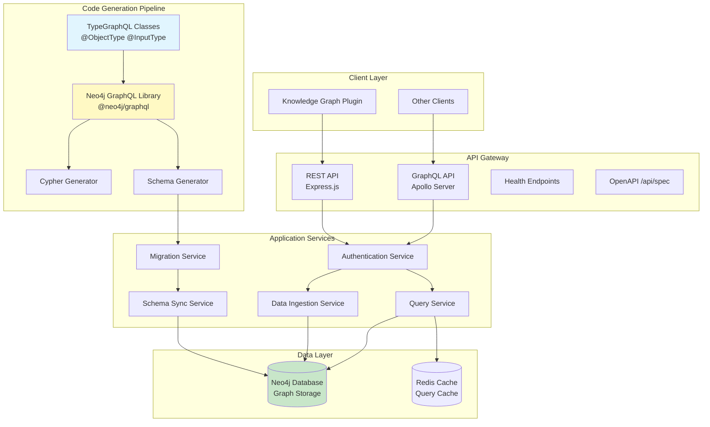
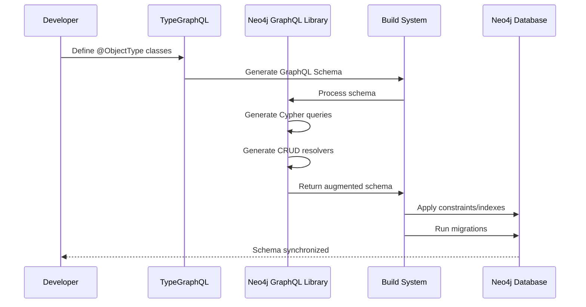

# Design Document

## Overview

Davinci is a microservice-based knowledge graph system built on Neo4j that captures and analyzes real-time conversation data from AI/ML security testing operations. The service provides automated schema synchronization between API endpoints and Neo4j Cypher queries through the Neo4j GraphQL Library and TypeGraphQL, enabling seamless evolution of the graph schema as API contracts change. The architecture is client-agnostic, allowing integration with any security testing framework through RESTful and GraphQL APIs with sub-100ms latency for data ingestion.

## Steering Document Alignment

### Technical Standards (tech.md)

The design follows modern microservice architectural patterns:
- **API-First Design**: OpenAPI 3.0 specification drives development with automatic documentation generation
- **Schema-Driven Development**: TypeGraphQL classes define the contract, generating both API endpoints and Neo4j schema automatically
- **Automated Code Generation**: Neo4j GraphQL Library generates optimized Cypher queries from GraphQL operations
- **Microservice Patterns**: Circuit breaker, health checks, graceful degradation, and comprehensive error handling
- **Security-First**: TLS 1.3, API key authentication with rotation, input validation, and complete audit logging
- **Event-Driven Architecture**: Asynchronous processing for high-throughput conversation ingestion

### Project Structure (structure.md)

The implementation follows Domain-Driven Design with modular organization:
- **Domain Layer**: Core entities (Scan, Target, Plugin, Conversation, Finding) as first-class graph nodes
- **Application Layer**: Business logic services for ingestion, querying, and schema management
- **Infrastructure Layer**: Neo4j persistence, Redis caching, and external integrations
- **API Layer**: RESTful and GraphQL endpoints with automatic schema generation
- **Code Generation Layer**: TypeGraphQL definitions and Neo4j GraphQL Library integration
- **Migration Layer**: Schema evolution and backward compatibility management

## Code Reuse Analysis

### Existing Components to Leverage

- **Neo4j GraphQL Library (@neo4j/graphql)**: Automatic Cypher query generation from GraphQL schemas
- **TypeGraphQL**: Decorator-based GraphQL schema definition with TypeScript type safety
- **Apollo Server**: Production-ready GraphQL server with subscription support
- **Express.js**: RESTful API framework with extensive middleware ecosystem
- **Neo4j Driver**: Official Neo4j database driver for Node.js
- **Redis Client**: Caching layer for frequently accessed graph data
- **OpenAPI Generator**: Automatic API documentation and client SDK generation

### Integration Points

- **Gibson Knowledge Graph Plugin**: Primary client consuming the API for conversation streaming
- **Neo4j Database**: Graph persistence layer with automatic schema management
- **Redis Cache**: Performance optimization for frequent queries
- **Monitoring Stack**: Prometheus metrics and Grafana dashboards
- **Authentication System**: API key management and validation
- **Schema Registry**: Version control for API and graph schemas

## Architecture

The Davinci service implements a layered microservice architecture with automatic schema synchronization as its core innovation, ensuring API endpoints and Neo4j schemas remain perfectly aligned through code generation.

### Modular Design Principles

- **Single File Responsibility**: Each TypeScript file handles one domain concern (models/, services/, resolvers/)
- **Component Isolation**: Complete separation between API, business logic, schema generation, and persistence
- **Service Layer Separation**: Clear boundaries between HTTP handlers, GraphQL resolvers, business services, and repositories
- **Utility Modularity**: Schema synchronization, code generation, and migration utilities as focused modules
- **Event-Driven Processing**: Asynchronous message handling for high-throughput ingestion



## Components and Interfaces

### Authentication Service (src/services/auth.service.ts)
- **Purpose:** Validates API keys, manages authentication tokens, handles authorization
- **Interfaces:**
  ```typescript
  authenticate(apiKey: string): Promise<AuthResult>
  validateToken(token: string): Promise<ValidationResult>
  rotateApiKey(keyId: string): Promise<NewApiKey>
  checkPermissions(token: string, resource: string): Promise<boolean>
  ```
- **Dependencies:** Redis for token caching, bcrypt for key hashing
- **Reuses:** Express middleware patterns, JWT utilities

### Data Ingestion Service (src/services/ingestion.service.ts)
- **Purpose:** Processes real-time conversation data and stores it in Neo4j with proper relationships
- **Interfaces:**
  ```typescript
  ingestConversation(data: ConversationInput): Promise<ConversationNode>
  ingestBatch(conversations: ConversationInput[]): Promise<BatchResult>
  establishRelationships(entities: EntityMap): Promise<void>
  validateIncomingData(data: any): ValidationResult
  ```
- **Dependencies:** Neo4j driver, validation service, schema service
- **Reuses:** Neo4j OGM patterns, transaction management

### Schema Synchronization Service (src/services/schema-sync.service.ts)
- **Purpose:** Automatically synchronizes API schemas with Neo4j graph schema using code generation
- **Interfaces:**
  ```typescript
  generateGraphQLSchema(): Promise<GraphQLSchema>
  syncNeo4jConstraints(schema: GraphQLSchema): Promise<void>
  generateCypherQueries(schema: GraphQLSchema): Map<string, string>
  validateSchemaCompatibility(v1: Schema, v2: Schema): CompatibilityResult
  ```
- **Dependencies:** Neo4j GraphQL Library, TypeGraphQL, neo4j-driver
- **Reuses:** GraphQL schema utilities, Neo4j constraint management

### Query Service (src/services/query.service.ts)
- **Purpose:** Handles GraphQL and REST queries with optimized Cypher generation
- **Interfaces:**
  ```typescript
  executeGraphQLQuery(query: string, variables: object): Promise<QueryResult>
  findRelationships(nodeId: string, depth: number): Promise<RelationshipMap>
  searchConversations(criteria: SearchCriteria): Promise<ConversationNode[]>
  getGraphStatistics(): Promise<GraphStats>
  ```
- **Dependencies:** Neo4j driver, Redis cache, query optimizer
- **Reuses:** Cypher query builder, caching strategies

### Migration Service (src/services/migration.service.ts)
- **Purpose:** Handles schema evolution, versioning, and backward compatibility
- **Interfaces:**
  ```typescript
  generateMigration(from: Schema, to: Schema): Migration
  applyMigration(migration: Migration): Promise<MigrationResult>
  rollbackMigration(migrationId: string): Promise<RollbackResult>
  getMigrationHistory(): Promise<MigrationHistory[]>
  ```
- **Dependencies:** Neo4j driver, schema registry, version control
- **Reuses:** Database migration patterns, version comparison

### Health Monitoring Service (src/services/health.service.ts)
- **Purpose:** Provides health checks and readiness probes for the service
- **Interfaces:**
  ```typescript
  checkOverallHealth(): Promise<HealthStatus>
  checkNeo4jHealth(): Promise<ComponentHealth>
  checkRedisHealth(): Promise<ComponentHealth>
  getMetrics(): Promise<ServiceMetrics>
  ```
- **Dependencies:** Neo4j driver, Redis client, system metrics
- **Reuses:** Health check patterns, Prometheus metrics

## Data Models

### Core Graph Entities (TypeGraphQL Definitions)

#### ConversationNode (src/models/conversation.model.ts)
```typescript
@ObjectType()
@Node()
export class ConversationNode {
  @Field(() => ID)
  @Property()
  id: string;

  @Field()
  @Property()
  prompt: string;

  @Field()
  @Property()
  response: string;

  @Field()
  @Property()
  timestamp: Date;

  @Field(() => ConversationMetadata)
  @Property()
  metadata: ConversationMetadata;

  @Field(() => Int, { nullable: true })
  @Property()
  tokenCount?: number;

  @Field(() => Float, { nullable: true })
  @Property()
  latency?: number;

  @Relationship("PART_OF", () => ScanNode)
  scan: ScanNode;

  @Relationship("FOLLOWS", () => ConversationNode, { nullable: true })
  previousConversation?: ConversationNode;

  @Relationship("DISCOVERS", () => FindingNode)
  findings: FindingNode[];
}
```

#### ScanNode (src/models/scan.model.ts)
```typescript
@ObjectType()
@Node()
export class ScanNode {
  @Field(() => ID)
  @Property()
  id: string;

  @Field()
  @Property()
  scanType: string;

  @Field()
  @Property()
  startTime: Date;

  @Field({ nullable: true })
  @Property()
  endTime?: Date;

  @Field(() => ScanStatus)
  @Property()
  status: ScanStatus;

  @Field(() => GraphQLJSON, { nullable: true })
  @Property()
  configuration?: object;

  @Relationship("TARGETS", () => TargetNode)
  target: TargetNode;

  @Relationship("EXECUTES", () => PluginNode)
  plugins: PluginNode[];

  @Relationship("CONTAINS", () => ConversationNode)
  conversations: ConversationNode[];

  @Relationship("INITIATED_BY", () => UserNode, { nullable: true })
  user?: UserNode;
}
```

#### TargetNode (src/models/target.model.ts)
```typescript
@ObjectType()
@Node()
export class TargetNode {
  @Field(() => ID)
  @Property()
  id: string;

  @Field()
  @Property()
  name: string;

  @Field(() => TargetType)
  @Property()
  type: TargetType;

  @Field()
  @Property()
  endpoint: string;

  @Field(() => [String])
  @Property()
  capabilities: string[];

  @Field(() => GraphQLJSON, { nullable: true })
  @Property()
  configuration?: object;

  @Relationship("SCANNED_BY", () => ScanNode, { direction: "IN" })
  scans: ScanNode[];
}
```

#### FindingNode (src/models/finding.model.ts)
```typescript
@ObjectType()
@Node()
export class FindingNode {
  @Field(() => ID)
  @Property()
  id: string;

  @Field(() => Severity)
  @Property()
  severity: Severity;

  @Field(() => FindingCategory)
  @Property()
  category: FindingCategory;

  @Field()
  @Property()
  title: string;

  @Field()
  @Property()
  description: string;

  @Field(() => Float)
  @Property()
  confidence: number;

  @Field(() => GraphQLJSON, { nullable: true })
  @Property()
  evidence?: object;

  @Field(() => [String], { nullable: true })
  @Property()
  cweIds?: string[];

  @Relationship("DISCOVERED_IN", () => ConversationNode, { direction: "IN" })
  conversation: ConversationNode;

  @Relationship("AFFECTS", () => TargetNode)
  affectedTarget: TargetNode;

  @Relationship("RELATED_TO", () => FindingNode)
  relatedFindings: FindingNode[];
}
```

#### PluginNode (src/models/plugin.model.ts)
```typescript
@ObjectType()
@Node()
export class PluginNode {
  @Field(() => ID)
  @Property()
  id: string;

  @Field()
  @Property()
  name: string;

  @Field()
  @Property()
  version: string;

  @Field(() => PluginDomain)
  @Property()
  domain: PluginDomain;

  @Field(() => [String])
  @Property()
  capabilities: string[];

  @Field(() => GraphQLJSON, { nullable: true })
  @Property()
  configuration?: object;

  @Relationship("EXECUTED_IN", () => ScanNode, { direction: "IN" })
  scans: ScanNode[];

  @Relationship("GENERATED", () => ConversationNode)
  conversations: ConversationNode[];
}
```

### Input Types (TypeGraphQL)

#### ConversationInput (src/models/inputs/conversation.input.ts)
```typescript
@InputType()
export class ConversationInput {
  @Field()
  scanId: string;

  @Field()
  targetId: string;

  @Field()
  pluginName: string;

  @Field()
  prompt: string;

  @Field()
  response: string;

  @Field(() => ConversationMetadataInput, { nullable: true })
  metadata?: ConversationMetadataInput;

  @Field(() => [FindingInput], { nullable: true })
  findings?: FindingInput[];
}
```

### Enums

```typescript
enum ScanStatus {
  PENDING = "PENDING",
  RUNNING = "RUNNING",
  COMPLETED = "COMPLETED",
  FAILED = "FAILED",
  CANCELLED = "CANCELLED"
}

enum Severity {
  CRITICAL = "CRITICAL",
  HIGH = "HIGH",
  MEDIUM = "MEDIUM",
  LOW = "LOW",
  INFO = "INFO"
}

enum TargetType {
  LLM = "LLM",
  API = "API",
  AGENT = "AGENT",
  CHATBOT = "CHATBOT",
  EMBEDDING = "EMBEDDING"
}

enum PluginDomain {
  MODEL = "MODEL",
  DATA = "DATA",
  INTERFACE = "INTERFACE",
  INFRASTRUCTURE = "INFRASTRUCTURE",
  OUTPUT = "OUTPUT",
  PROCESS = "PROCESS"
}

enum FindingCategory {
  INJECTION = "INJECTION",
  JAILBREAK = "JAILBREAK",
  DATA_LEAKAGE = "DATA_LEAKAGE",
  BIAS = "BIAS",
  HALLUCINATION = "HALLUCINATION",
  DENIAL_OF_SERVICE = "DENIAL_OF_SERVICE",
  MISCONFIGURATION = "MISCONFIGURATION"
}
```

### Neo4j Relationships

```cypher
// Core Relationships
(scan:ScanNode)-[:TARGETS]->(target:TargetNode)
(scan:ScanNode)-[:EXECUTES]->(plugin:PluginNode)
(scan:ScanNode)-[:CONTAINS]->(conversation:ConversationNode)
(conversation:ConversationNode)-[:PART_OF]->(scan:ScanNode)
(conversation:ConversationNode)-[:FOLLOWS]->(previousConversation:ConversationNode)
(conversation:ConversationNode)-[:DISCOVERS]->(finding:FindingNode)
(finding:FindingNode)-[:AFFECTS]->(target:TargetNode)
(finding:FindingNode)-[:RELATED_TO]->(relatedFinding:FindingNode)
(plugin:PluginNode)-[:GENERATED]->(conversation:ConversationNode)
```

## Schema Synchronization Implementation

### Automatic Code Generation Pipeline

The service implements a sophisticated multi-stage code generation pipeline that ensures API and Neo4j schemas remain synchronized:



### Code Generation Configuration (codegen.config.ts)

```typescript
import { Neo4jGraphQL } from "@neo4j/graphql";
import { buildSchema } from "type-graphql";
import { ConversationNode, ScanNode, TargetNode, FindingNode, PluginNode } from "./models";

export async function generateSchema() {
  // Generate GraphQL schema from TypeGraphQL classes
  const typeDefs = await buildSchema({
    resolvers: [ConversationResolver, ScanResolver, QueryResolver],
    emitSchemaFile: "./generated/schema.graphql",
  });

  // Create Neo4j GraphQL instance with auto-generation
  const neoSchema = new Neo4jGraphQL({
    typeDefs,
    features: {
      authorization: { key: "API_KEY" },
      subscriptions: true,
      filters: {
        String: ["CONTAINS", "STARTS_WITH", "ENDS_WITH"],
        DateTime: ["BEFORE", "AFTER", "BETWEEN"]
      }
    }
  });

  // Generate Cypher queries and resolvers
  const augmentedSchema = await neoSchema.getSchema();

  // Generate migration scripts
  await generateMigrations(augmentedSchema);

  return augmentedSchema;
}
```

### Migration Generator (src/migrations/generator.ts)

```typescript
export class MigrationGenerator {
  async generateConstraints(schema: GraphQLSchema): Promise<string[]> {
    const constraints = [];

    // Generate unique constraints for ID fields
    for (const type of getNodeTypes(schema)) {
      constraints.push(
        `CREATE CONSTRAINT ${type}_id_unique IF NOT EXISTS
         FOR (n:${type}) REQUIRE n.id IS UNIQUE`
      );
    }

    // Generate existence constraints for required fields
    for (const field of getRequiredFields(schema)) {
      constraints.push(
        `CREATE CONSTRAINT ${field.type}_${field.name}_exists IF NOT EXISTS
         FOR (n:${field.type}) REQUIRE n.${field.name} IS NOT NULL`
      );
    }

    return constraints;
  }

  async generateIndexes(schema: GraphQLSchema): Promise<string[]> {
    const indexes = [];

    // Generate indexes for frequently queried fields
    indexes.push(
      "CREATE INDEX scan_timestamp IF NOT EXISTS FOR (s:ScanNode) ON (s.startTime)",
      "CREATE INDEX conversation_timestamp IF NOT EXISTS FOR (c:ConversationNode) ON (c.timestamp)",
      "CREATE INDEX finding_severity IF NOT EXISTS FOR (f:FindingNode) ON (f.severity)",
      "CREATE TEXT INDEX conversation_prompt IF NOT EXISTS FOR (c:ConversationNode) ON (c.prompt)"
    );

    return indexes;
  }
}
```

## Error Handling

### Error Scenarios

1. **Neo4j Connection Failure**
   - **Handling:** Circuit breaker with exponential backoff, switch to degraded read-only mode, cache recent data
   - **User Impact:** API returns 503 Service Unavailable with retry-after header
   - **Recovery:** Automatic reconnection attempts, restore full functionality when connection reestablished

2. **Schema Validation Failure**
   - **Handling:** Reject invalid schema changes at build time, maintain current schema version, detailed error reporting
   - **User Impact:** Build fails with specific validation errors and suggested fixes
   - **Recovery:** Developer fixes schema issues and rebuilds

3. **Migration Failure**
   - **Handling:** Automatic transaction rollback, preserve data integrity, alert administrators via monitoring
   - **User Impact:** Service temporarily returns 503 during rollback (typically < 30 seconds)
   - **Recovery:** Automatic rollback to previous schema version, manual intervention for complex failures

4. **API Rate Limit Exceeded**
   - **Handling:** Return 429 Too Many Requests with Retry-After header, implement sliding window rate limiting
   - **User Impact:** Client receives clear rate limit information and must implement backoff
   - **Recovery:** Rate limit resets based on sliding window configuration

5. **Invalid Conversation Data**
   - **Handling:** Validate against TypeGraphQL schema, return detailed field-level errors, log for security analysis
   - **User Impact:** 400 Bad Request with specific validation errors for each invalid field
   - **Recovery:** Client corrects data and retries request

6. **Authentication Failure**
   - **Handling:** Return 401 Unauthorized, increment failed attempt counter, temporary lockout after threshold
   - **User Impact:** Must provide valid API key, account locked after 5 failed attempts
   - **Recovery:** Valid authentication or wait for lockout period to expire

7. **Memory/Resource Exhaustion**
   - **Handling:** Implement memory limits, graceful degradation, shed non-critical operations
   - **User Impact:** Reduced functionality (e.g., complex queries disabled), simpler operations continue
   - **Recovery:** Automatic when memory pressure reduces, manual restart if critical

8. **Redis Cache Failure**
   - **Handling:** Bypass cache and query Neo4j directly, log cache miss metrics
   - **User Impact:** Slightly increased latency for cached queries
   - **Recovery:** Automatic reconnection to Redis, cache warming on recovery

## Testing Strategy

### Unit Testing

- **Schema Generation**: Test TypeGraphQL to GraphQL schema conversion with all decorators
- **Cypher Query Generation**: Verify Neo4j GraphQL Library generates correct Cypher for all operations
- **Migration Generation**: Test schema diff calculation, constraint/index generation, rollback scripts
- **Authentication Service**: Test API key validation, token management, permission checking
- **Data Validation**: Test input validation against TypeGraphQL schemas, error message generation
- **Relationship Management**: Test proper relationship creation and traversal logic
- **Error Handlers**: Test all error scenarios with mocked dependencies
- **Cache Logic**: Test Redis caching strategies, TTL management, cache invalidation

### Integration Testing

- **Neo4j Integration**: Test with Neo4j test containers, verify constraints and indexes
- **Schema Synchronization**: Test end-to-end schema generation, migration application, rollback
- **API Contract Testing**: Test OpenAPI spec generation and compliance
- **GraphQL Subscriptions**: Test real-time updates via WebSocket connections
- **Authentication Flow**: Test complete auth flow with Redis session management
- **Performance Testing**: Verify < 100ms ingestion latency, < 500ms query latency
- **Concurrent Operations**: Test high-throughput conversation ingestion (100+ concurrent)
- **Cache Integration**: Test Redis caching with Neo4j fallback

### End-to-End Testing

- **Complete Data Flow**: Test conversation ingestion through API to Neo4j storage
- **Schema Evolution**: Test live schema migrations with production-like data
- **Multi-Client Scenarios**: Test concurrent access from multiple Knowledge Graph Plugin instances
- **Failure Recovery**: Test service recovery from database, cache, and network failures
- **Security Testing**: Test authentication, authorization, input validation, SQL/Cypher injection prevention
- **Load Testing**: Test with 10,000+ nodes, 100,000+ relationships
- **Graph Traversal**: Test complex Cypher queries with multiple relationship hops
- **Monitoring Integration**: Verify Prometheus metrics and health endpoints

### Test Data Management

- **Test Fixtures**: TypeScript factories for all node types using @faker-js/faker
- **Graph Scenarios**: Pre-built graph structures for common test cases
- **Migration Test Data**: Multiple schema versions with compatible test data
- **Performance Data**: Large dataset generator for load testing
- **Security Test Cases**: Malicious inputs, injection attempts, malformed data

## Performance Optimization

### Caching Strategy

- **Query Result Caching**: Redis with 5-minute TTL for frequent queries
- **Schema Caching**: In-memory caching of compiled GraphQL schemas
- **Authentication Caching**: 15-minute session tokens in Redis
- **Relationship Caching**: Cache frequently traversed relationship paths

### Neo4j Optimization

- **Index Strategy**: Automatic index creation based on query patterns via EXPLAIN
- **Query Optimization**: Use of query hints, PROFILE analysis, and query rewriting
- **Connection Pooling**: Configurable pool size (default: 50) with health checks
- **Batch Operations**: Batch conversation ingestion using UNWIND
- **Eager Loading**: Fetch related nodes in single query to avoid N+1

### Monitoring and Alerting

- **Prometheus Metrics**: Request latency, throughput, error rates, Neo4j query times
- **Grafana Dashboards**: Real-time visualization of service health and performance
- **Alert Thresholds**: P50 latency > 100ms, P99 latency > 1s, error rate > 1%
- **Custom Metrics**: Graph size, relationship density, schema version, migration status