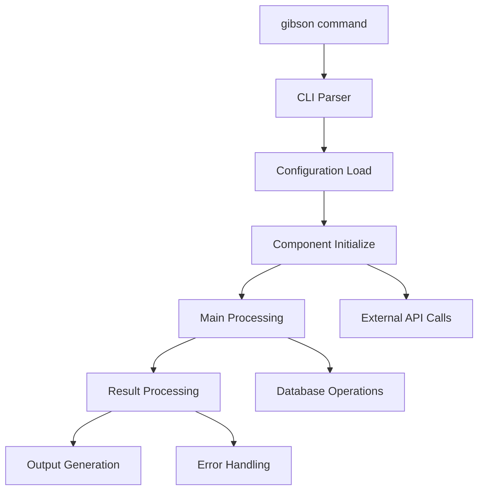

# Workflow: [Command/Workflow Name]

## Overview

**Command**: `gibson [command] [subcommand] [options]`

**Purpose**: [What this workflow accomplishes]

**Typical Use Cases**: 
- [Use case 1]
- [Use case 2]
- [Use case 3]

## Command Entry Point

### CLI Command Definition
**File**: `gibson/cli/commands/[command].py`

**Function**: `[function_name]()`

**Parameters**:
- `[param1]`: [Description and type]
- `[param2]`: [Description and validation]

## Complete Execution Flow

### Step-by-Step Workflow

1. **Command Parsing**
   - File: `gibson/cli/commands/[command].py:[line]`
   - Process: [What happens in parsing]
   - Validation: [Input validation performed]

2. **Configuration Loading**
   - File: `gibson/core/config.py:[line]`
   - Process: [Configuration resolution]
   - Dependencies: [Config files, environment variables]

3. **[Major Step 3]**
   - File: `gibson/[component]/[file].py:[line]`
   - Process: [Detailed step description]
   - Data Flow: [How data moves]

4. **[Continue with all major steps]**

### Visual Workflow Diagram



## File Interactions

### Files Read
- `[file1]`: [Purpose of reading this file]
- `[file2]`: [Data extracted from this file]

### Files Written/Modified
- `[file1]`: [What gets written]
- `[file2]`: [Modification type]

### Database Operations
- **Tables Accessed**: [List of database tables]
- **Read Operations**: [What data is read]
- **Write Operations**: [What data is written]
- **Transactions**: [Transaction boundaries]

### External API Calls
- **[API/Service Name]**: 
  - Endpoint: [URL pattern]
  - Purpose: [Why it's called]
  - Data: [What data is sent/received]

## Performance Characteristics

### Typical Execution Time
- **Small operations**: [Time range]
- **Medium operations**: [Time range]  
- **Large operations**: [Time range]

### Resource Usage
- **Memory**: [Typical memory usage]
- **CPU**: [CPU intensity patterns]
- **Network**: [Network usage patterns]
- **Disk I/O**: [File system usage]

### Bottlenecks Identified
1. **[Bottleneck 1]**: [Description and impact]
2. **[Bottleneck 2]**: [Performance issue details]

## Error Handling

### Common Error Scenarios
1. **[Error Type]**
   - **Cause**: [What causes this error]
   - **Handling**: [How error is handled]
   - **User Impact**: [What user experiences]
   - **Recovery**: [How to recover]

2. **[Another Error Type]**
   - **Cause**: [Error cause]
   - **Handling**: [Error handling mechanism]
   - **User Impact**: [User experience]

### Error Recovery Mechanisms
- **[Recovery Type 1]**: [How system recovers]
- **[Recovery Type 2]**: [Recovery process]

## Data Transformations

### Input Data Format
```
[Input structure/format]
```

### Intermediate Data Formats
1. **Step [X] Output**:
   ```
   [Data format after step X]
   ```

2. **Step [Y] Output**:
   ```
   [Data format after step Y]
   ```

### Final Output Format
```
[Final output structure]
```

## Configuration Impact

### Required Configuration
- `[config_key]`: [Purpose and default value]
- `[another_key]`: [Configuration impact]

### Optional Configuration
- `[optional_key]`: [What this controls]
- `[feature_flag]`: [Feature behavior]

## Optimization Opportunities

### Performance Improvements
1. **[Optimization 1]**: 
   - **Current Implementation**: [How it works now]
   - **Suggested Improvement**: [Better approach]
   - **Impact**: [Performance gain expected]

2. **[Optimization 2]**:
   - **Issue**: [Current performance issue]
   - **Solution**: [Proposed solution]
   - **Complexity**: [Implementation difficulty]

### Code Quality Improvements
- **[Improvement 1]**: [Refactoring opportunity]
- **[Improvement 2]**: [Code organization enhancement]

## Testing Coverage

### Existing Tests
- **Unit Tests**: [What's covered by unit tests]
- **Integration Tests**: [Integration test coverage]

### Missing Test Coverage
- **[Missing Area 1]**: [What needs testing]
- **[Missing Area 2]**: [Testing gap]

## Usage Examples

### Basic Usage
```bash
# Simple command execution
gibson [command] [basic-options]
```

### Advanced Usage
```bash
# Complex command with multiple options
gibson [command] [subcommand] --option1 value1 --option2 value2
```

### Common Troubleshooting
1. **Problem**: [Common issue]
   **Solution**: [How to resolve]

2. **Problem**: [Another issue]
   **Solution**: [Resolution steps]

## Related Workflows
- [Related workflow 1]: [How they connect]
- [Related workflow 2]: [Integration points]

## Implementation Files
- **Primary**: `gibson/cli/commands/[command].py`
- **Core Logic**: `gibson/core/[component]/[file].py`
- **Supporting**: `gibson/[other-files].py`