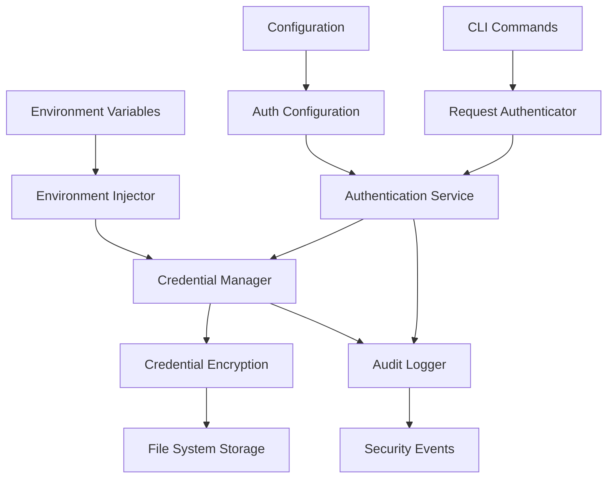
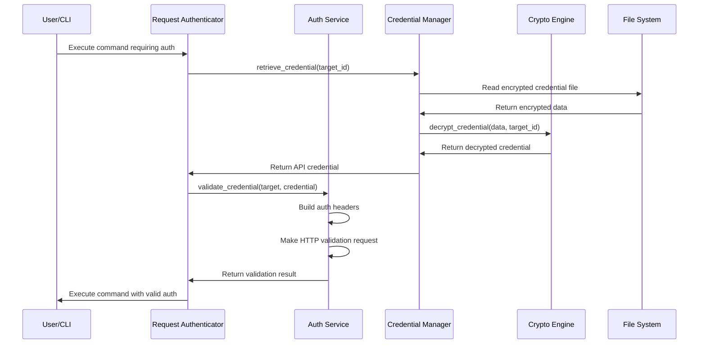
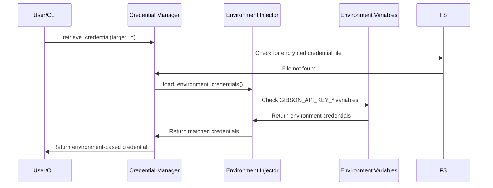
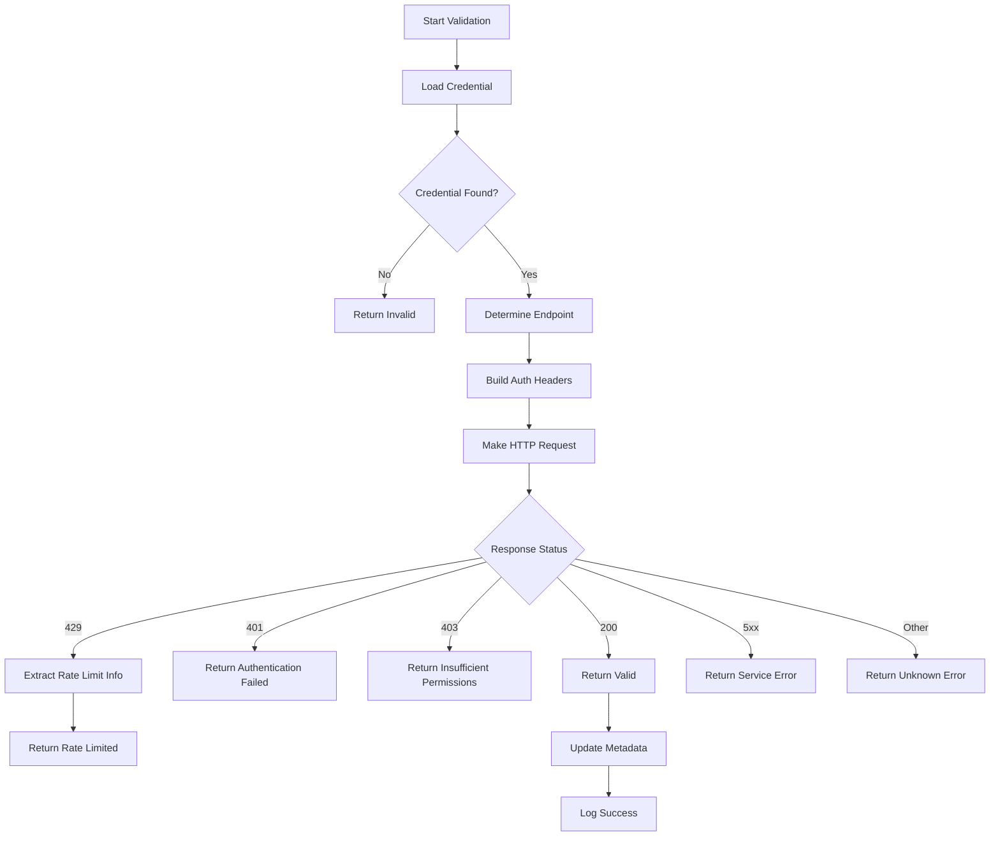

# Authentication System

## Overview

The Gibson authentication system (`gibson/core/auth/`) provides comprehensive security services for managing API credentials, user authentication, and access control throughout the framework. It implements enterprise-grade security patterns including encrypted credential storage, multi-provider authentication support, audit logging, and environment-aware credential injection.

## Architecture Components

### Core Authentication Services

#### Authentication Service (`auth_service.py`)
- **Primary Purpose**: API credential validation and testing
- **Key Features**: Multi-provider support, rate limit detection, comprehensive error handling
- **Integration**: HTTP client with retry logic and performance monitoring

#### Credential Manager (`credential_manager.py`) 
- **Primary Purpose**: Secure encrypted storage and retrieval of API credentials
- **Key Features**: AES-256-GCM encryption, metadata tracking, environment variable fallback
- **Storage Pattern**: File-based encrypted storage with secure permissions

#### Cryptographic Engine (`crypto.py`)
- **Primary Purpose**: AES-256-GCM encryption with secure key derivation
- **Key Features**: PBKDF2 key derivation, per-target unique keys, cryptographically secure randomness
- **Security Standards**: FIPS-compliant cryptographic primitives

### Authentication Architecture



## Core Components Analysis

### Authentication Service

The `AuthenticationService` class provides comprehensive API credential validation:

#### Key Responsibilities
- **Credential Validation**: Test API keys against target endpoints
- **Provider Detection**: Automatic detection of API provider types (OpenAI, Anthropic, etc.)
- **Rate Limit Handling**: Extract and process rate limit information
- **Error Classification**: Detailed error categorization and recovery recommendations

#### Validation Flow
```python
async def validate_credential(
    self, target: TargetModel, credential: Optional[ApiKeyCredentialModel] = None
) -> AuthenticationValidationResult:
    """Validate API key credential for a target."""
    
    # 1. Retrieve credential if not provided
    # 2. Validate credential format and content
    # 3. Determine validation endpoint
    # 4. Perform HTTP validation request with retries
    # 5. Parse response and extract rate limit info
    # 6. Update credential metadata on success
    # 7. Return comprehensive validation result
```

#### Provider-Specific Endpoint Detection
```python
def _get_validation_endpoint(
    self, target: TargetModel, credential: ApiKeyCredentialModel
) -> Optional[str]:
    """Get validation endpoint URL for credential testing."""
    
    # OpenAI: /v1/models endpoint
    if "openai" in base_url.lower():
        return f"{base_url}/v1/models"
    
    # Anthropic: /v1/messages endpoint  
    elif "anthropic" in base_url.lower():
        return f"{base_url}/v1/messages"
    
    # Google: /v1/models endpoint
    elif "googleapis.com" in base_url.lower():
        return f"{base_url}/v1/models"
    
    # Fallback to common health check endpoints
    return f"{base_url}/health"
```

#### Authentication Header Formats
```python
def _build_auth_headers(self, credential: ApiKeyCredentialModel) -> Dict[str, str]:
    """Build authentication headers for validation request."""
    
    if credential.key_format == ApiKeyFormat.BEARER_TOKEN:
        headers["Authorization"] = f"Bearer {credential.token}"
    elif credential.key_format == ApiKeyFormat.ANTHROPIC_FORMAT:
        headers["x-api-key"] = credential.token
    elif credential.key_format == ApiKeyFormat.CUSTOM_HEADER:
        headers[credential.header_name] = credential.token
    
    return headers
```

### Credential Manager

The `CredentialManager` class handles secure credential lifecycle management:

#### Core Features

##### Encrypted Storage
```python
def store_credential(
    self, target_id: UUID, credential: ApiKeyCredentialModel, target_name: Optional[str] = None
) -> bool:
    """Store encrypted credential with metadata."""
    
    # 1. Validate credential data
    # 2. Encrypt credential using AES-256-GCM
    # 3. Save encrypted data to secure file
    # 4. Create comprehensive metadata
    # 5. Set secure file permissions (600)
    # 6. Update metadata cache
```

##### Environment Variable Fallback
```python
def retrieve_credential(self, target_id: UUID) -> Optional[ApiKeyCredentialModel]:
    """Retrieve and decrypt credential."""
    
    if not credential_path.exists():
        # Check environment variables as fallback
        env_creds = load_environment_credentials()
        target_str = str(target_id).replace("-", "").lower()[:8]
        
        # Match target ID to environment variable patterns
        for env_target, api_key in env_creds.items():
            if env_target.startswith(target_str):
                return ApiKeyCredentialModel(
                    token=api_key,
                    key_format=ApiKeyFormat.BEARER_TOKEN,
                    environment_variable=f"GIBSON_API_KEY_{env_target.upper()}"
                )
```

##### Metadata Tracking
```python
@dataclass
class CredentialMetadata:
    """Credential metadata for tracking and management."""
    
    credential_id: UUID
    target_id: UUID
    target_name: Optional[str] = None
    key_format: ApiKeyFormat
    masked_key: str                    # Last 4 characters visible
    validation_status: ValidationStatus
    last_validated: Optional[datetime]
    last_used: Optional[datetime]
    usage_count: int = 0
    created_at: datetime
    expires_at: Optional[datetime] = None
```

### Cryptographic Engine

The `CredentialEncryption` class provides military-grade encryption:

#### Security Specifications
- **Algorithm**: AES-256-GCM (Authenticated Encryption)
- **Key Derivation**: PBKDF2-HMAC-SHA256 with 100,000 iterations
- **Key Size**: 256-bit encryption keys
- **IV/Nonce**: 96-bit cryptographically random nonces
- **Authentication**: 128-bit authentication tags
- **Salt**: 256-bit random salts for key derivation

#### Encryption Process
```python
def encrypt_credential(self, credential_data: str, target_id: str) -> Tuple[bytes, str]:
    """Encrypt credential data for secure storage."""
    
    # 1. Generate cryptographically random salt and IV
    salt = secrets.token_bytes(self.SALT_SIZE)       # 32 bytes
    iv = secrets.token_bytes(self.IV_SIZE)           # 12 bytes
    
    # 2. Derive unique encryption key per target
    key = self._derive_key(target_id, salt)
    
    # 3. Create AES-256-GCM cipher
    cipher = Cipher(algorithms.AES(key), modes.GCM(iv))
    
    # 4. Encrypt with authentication
    encryptor = cipher.encryptor()
    ciphertext = encryptor.update(credential_data.encode("utf-8"))
    encryptor.finalize()
    tag = encryptor.tag                              # 16 bytes
    
    # 5. Combine components: salt + iv + tag + ciphertext
    encrypted_data = salt + iv + tag + ciphertext
    
    return encrypted_data, key_id
```

#### Key Derivation
```python
def _derive_key(self, target_id: str, salt: bytes) -> bytes:
    """Derive encryption key from master key and target ID."""
    
    # Combine master key with target ID for unique keys
    key_material = self._master_key + target_id.encode("utf-8")
    
    # Use PBKDF2 for secure key stretching
    kdf = PBKDF2HMAC(
        algorithm=hashes.SHA256(),
        length=self.KEY_SIZE,              # 32 bytes (256 bits)
        salt=salt,
        iterations=self.PBKDF2_ITERATIONS, # 100,000 iterations
    )
    
    return kdf.derive(key_material)
```

## Authentication Flow Patterns

### Standard Authentication Flow



### Environment Variable Authentication



### Credential Validation Flow



## Security Features

### Encryption Security

#### AES-256-GCM Benefits
- **Authenticated Encryption**: Provides both confidentiality and authenticity
- **Tamper Detection**: Authentication tag prevents unauthorized modifications
- **Performance**: Hardware-accelerated on modern processors
- **FIPS Compliance**: Approved by NIST for government use

#### Key Management
- **Per-Target Keys**: Each credential encrypted with unique key
- **Master Key Rotation**: Support for master key updates
- **Secure Defaults**: Cryptographically secure random generation
- **Memory Safety**: Keys cleared from memory after use

### File System Security

#### Permission Management
```python
def ensure_file_permissions(file_path: Path) -> None:
    """Ensure file has secure permissions (600)."""
    try:
        os.chmod(file_path, 0o600)  # Read/write for owner only
    except OSError as e:
        logger.warning(f"Failed to set secure permissions on {file_path}: {e}")

def ensure_directory_permissions(dir_path: Path) -> None:
    """Ensure directory has secure permissions (700)."""
    dir_path.mkdir(parents=True, exist_ok=True)
    try:
        os.chmod(dir_path, 0o700)  # Full access for owner only
    except OSError as e:
        logger.warning(f"Failed to set secure permissions on {dir_path}: {e}")
```

#### Storage Structure
```
~/.gibson/credentials/           # Main credentials directory (700)
├── {target-uuid}.enc           # Encrypted credential files (600)
└── metadata/                   # Metadata directory (700)
    └── {target-uuid}.json      # Credential metadata files (600)
```

### Environment Security

#### Secure Environment Detection
```python
def detect_ci_environment() -> Optional[str]:
    """Detect CI/CD environment for secure credential injection."""
    
    ci_indicators = {
        'GITHUB_ACTIONS': 'github',
        'GITLAB_CI': 'gitlab',
        'JENKINS_URL': 'jenkins',
        'TRAVIS': 'travis',
        'CIRCLECI': 'circleci',
        'BUILDKITE': 'buildkite'
    }
    
    for env_var, platform in ci_indicators.items():
        if os.getenv(env_var):
            return platform
    
    return None
```

#### Environment Variable Patterns
```bash
# Standard API key pattern
export GIBSON_API_KEY_OPENAI="sk-..."
export GIBSON_API_KEY_ANTHROPIC="claude-..."
export GIBSON_API_KEY_GOOGLE="AIza..."

# Target-specific patterns
export GIBSON_API_KEY_TARGET_12345678="custom-key-..."

# Provider-specific with metadata
export GIBSON_OPENAI_API_KEY="sk-..."
export GIBSON_ANTHROPIC_API_KEY="claude-..."
```

## Error Handling and Recovery

### Authentication Error Types
```python
class AuthErrorType(Enum):
    """Types of authentication errors."""
    
    AUTHENTICATION_FAILED = "authentication_failed"
    INVALID_KEY_FORMAT = "invalid_key_format"
    INSUFFICIENT_PERMISSIONS = "insufficient_permissions"
    RATE_LIMIT_EXCEEDED = "rate_limit_exceeded"
    NETWORK_TIMEOUT = "network_timeout"
    SERVICE_UNAVAILABLE = "service_unavailable"
    INVALID_ENDPOINT = "invalid_endpoint"
    STORAGE_ERROR = "storage_error"
    CONFIGURATION_ERROR = "configuration_error"
```

### Validation Status Tracking
```python
class ValidationStatus(Enum):
    """Credential validation status."""
    
    UNTESTED = "untested"                    # Never validated
    VALID = "valid"                          # Successfully validated
    INVALID = "invalid"                      # Validation failed
    EXPIRED = "expired"                      # Credential expired
    INSUFFICIENT_PERMISSIONS = "insufficient_permissions"
    RATE_LIMITED = "rate_limited"           # Currently rate limited
    NETWORK_ERROR = "network_error"         # Network/service error
    UNKNOWN_ERROR = "unknown_error"         # Unexpected error
```

### Recovery Recommendations
```python
def _create_validation_result(self, error_type: AuthErrorType) -> AuthenticationValidationResult:
    """Create validation result with recovery recommendations."""
    
    if error_type == AuthErrorType.AUTHENTICATION_FAILED:
        result.add_recommendation("Verify API key is correct and active")
        result.add_recommendation("Check if API key has been revoked or expired")
        
    elif error_type == AuthErrorType.INSUFFICIENT_PERMISSIONS:
        result.add_recommendation("Verify API key has required permissions/scopes")
        result.add_recommendation("Check API documentation for required permissions")
        
    elif error_type == AuthErrorType.RATE_LIMIT_EXCEEDED:
        result.add_recommendation("Reduce request frequency or upgrade API plan")
        if rate_limit_info and rate_limit_info.retry_after:
            result.add_recommendation(f"Wait {rate_limit_info.retry_after} seconds before retrying")
```

## Configuration and Customization

### Authentication Configuration
```python
class AuthConfig(BaseModel):
    """Authentication system configuration."""
    
    credentials_path: Optional[Path] = None
    master_key: Optional[str] = None
    encryption_enabled: bool = True
    environment_fallback: bool = True
    validation_timeout: int = 30
    max_validation_retries: int = 3
    cache_validation_results: bool = True
    audit_logging: bool = True
```

### Provider-Specific Settings
```yaml
auth:
  providers:
    openai:
      validation_endpoint: "/v1/models"
      header_format: "bearer"
      rate_limit_headers: ["x-ratelimit-remaining", "x-ratelimit-reset"]
    
    anthropic:
      validation_endpoint: "/v1/messages"
      header_format: "x-api-key"
      rate_limit_headers: ["ratelimit-remaining", "ratelimit-reset"]
    
    google:
      validation_endpoint: "/v1/models"
      header_format: "bearer"
      oauth_scopes: ["https://www.googleapis.com/auth/cloud-platform"]
```

## Performance Characteristics

### Encryption Performance
- **AES-256-GCM**: Hardware-accelerated encryption ~1-2ms per operation
- **PBKDF2**: 100,000 iterations ~50-100ms key derivation
- **File I/O**: Negligible overhead for credential files <1KB
- **Memory Usage**: Minimal - credentials cleared after use

### Validation Performance
- **HTTP Requests**: Configurable timeout (default 30s)
- **Retry Logic**: Exponential backoff with 3 attempts maximum
- **Connection Pooling**: Reuse HTTP connections for efficiency
- **Caching**: Optional validation result caching

### Storage Efficiency
- **Encrypted Credentials**: ~200-300 bytes per credential
- **Metadata Files**: ~500-1000 bytes per credential
- **Directory Structure**: Flat hierarchy for O(1) lookup
- **Cleanup**: Automatic expired credential cleanup

## Integration Points

### CLI Integration
```python
# Command-level authentication
@app.command()
async def secure_command(
    target: str,
    credential_manager: CredentialManager = Depends(get_credential_manager)
):
    """Command requiring authentication."""
    
    # Authentication handled transparently
    credential = credential_manager.retrieve_credential(target_id)
    
    # Proceed with authenticated operation
    result = await execute_with_auth(target, credential)
```

### Core System Integration
```python
# Base orchestrator integration
class Base:
    async def _initialize_authentication_services(self) -> None:
        """Initialize authentication services."""
        
        self.credential_manager = CredentialManager(config=self.config.auth)
        await self.credential_manager.initialize()
        
        self.auth_service = AuthenticationService(
            credential_manager=self.credential_manager,
            config=self.config.auth
        )
        
        self.request_authenticator = RequestAuthenticator(
            credential_manager=self.credential_manager,
            auth_service=self.auth_service
        )
```

## Usage Examples

### Basic Credential Management
```python
from gibson.core.auth import CredentialManager
from gibson.models.auth import ApiKeyCredentialModel, ApiKeyFormat

# Initialize credential manager
cred_manager = CredentialManager()

# Store encrypted credential
credential = ApiKeyCredentialModel(
    token="sk-1234567890abcdef",
    key_format=ApiKeyFormat.OPENAI_FORMAT,
    validation_endpoint="https://api.openai.com/v1/models"
)

success = cred_manager.store_credential(
    target_id=target_uuid,
    credential=credential,
    target_name="OpenAI Production"
)

# Retrieve and use credential
retrieved_cred = cred_manager.retrieve_credential(target_uuid)
if retrieved_cred:
    print(f"Retrieved credential: {retrieved_cred.masked_key}")
```

### Authentication Validation
```python
from gibson.core.auth import AuthenticationService
from gibson.models.target import TargetModel

# Initialize authentication service
auth_service = AuthenticationService(timeout=30, max_retries=3)

# Create target
target = TargetModel(
    name="OpenAI API",
    base_url="https://api.openai.com",
    authentication_type="api_key"
)

# Validate credential
async with auth_service:
    result = await auth_service.validate_credential(target)
    
    if result.is_valid:
        print("✓ Authentication successful")
        print(f"Response time: {result.response_time_ms:.1f}ms")
        
        if result.rate_limit_info:
            print(f"Requests remaining: {result.rate_limit_info.requests_remaining}")
    else:
        print("✗ Authentication failed")
        print(f"Error: {result.error_message}")
        for rec in result.recommendations:
            print(f"• {rec}")
```

### Environment-Based Authentication
```bash
# Set environment variables
export GIBSON_API_KEY_OPENAI="sk-1234567890abcdef"
export GIBSON_API_KEY_ANTHROPIC="claude-1234567890abcdef"

# Gibson automatically detects and uses environment credentials
gibson scan --target openai-production
```

This authentication system provides enterprise-grade security for Gibson's credential management needs while maintaining usability and performance for security testing operations.