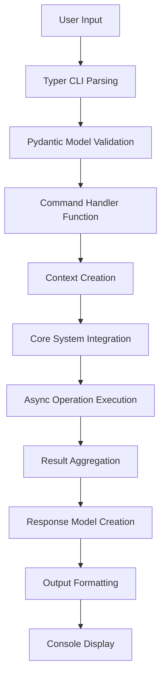

# CLI Workflow Tracing Architecture

## Overview

Gibson's CLI workflow tracing system provides comprehensive visibility into command execution paths, enabling debugging, performance optimization, and understanding of complex operation flows. This document details how CLI commands trace through the system from user input to final output.

## Tracing Architecture

### Execution Flow Stages



### Tracing Components

#### 1. CLI Entry Point Tracing
Every CLI command starts with Typer framework parsing:

```python
# Entry point tracing pattern
@app.command()
async def scan_command(
    target: str = typer.Argument(..., help="Target to scan"),
    scan_type: ScanType = typer.Option(ScanType.QUICK, help="Scan type"),
    verbose: bool = typer.Option(False, "--verbose", "-v")
):
    """Trace starts here - CLI argument parsing and validation"""
    
    # 1. Command execution tracing
    start_time = time.time()
    command_trace = CommandTrace(
        command="scan",
        arguments={"target": target, "scan_type": scan_type},
        start_time=start_time
    )
    
    # 2. Request model creation and validation tracing
    try:
        request = ScanRequest(
            target=HttpUrl(target),
            scan_type=scan_type,
            verbose=verbose
        )
        command_trace.add_stage("validation", "success")
    except ValidationError as e:
        command_trace.add_stage("validation", "failed", str(e))
        return ErrorResponse.from_validation_error(e)
```

#### 2. Context Resolution Tracing
Context creation involves configuration resolution and service initialization:

```python
async def trace_context_creation(request: CommandRequest) -> Tuple[Context, ContextTrace]:
    """Trace context creation and configuration resolution."""
    
    context_trace = ContextTrace()
    
    # 1. Configuration file resolution
    config_sources = []
    if request.config_file:
        config_sources.append(("file", request.config_file))
    config_sources.extend([
        ("env", "environment_variables"),
        ("default", "system_defaults")
    ])
    
    context_trace.add_config_sources(config_sources)
    
    # 2. Service initialization tracing
    context = Context(
        config_file=request.config_file,
        config_override=request.config_override
    )
    
    # Trace service initialization
    services_initialized = []
    async with context:
        if hasattr(context, 'database'):
            services_initialized.append("database")
        if hasattr(context, 'module_manager'):
            services_initialized.append("module_manager")
        # ... other services
    
    context_trace.add_services(services_initialized)
    return context, context_trace
```

#### 3. Core Operation Tracing
Core operations are traced through their execution paths:

```python
async def trace_scan_execution(request: ScanRequest, context: Context) -> ScanTrace:
    """Trace scan execution through all stages."""
    
    scan_trace = ScanTrace(scan_id=uuid.uuid4())
    
    # 1. Target resolution tracing
    target_manager = context.get_target_manager()
    target_trace = await target_manager.trace_target_resolution(request.target)
    scan_trace.add_target_trace(target_trace)
    
    # 2. Module selection and loading tracing
    module_manager = context.get_module_manager()
    module_trace = await module_manager.trace_module_selection(
        domains=request.domains,
        target_type=target_trace.target_type
    )
    scan_trace.add_module_trace(module_trace)
    
    # 3. Execution orchestration tracing
    orchestrator = context.get_orchestrator()
    execution_trace = await orchestrator.trace_execution(
        target=target_trace.resolved_target,
        modules=module_trace.selected_modules,
        config=request
    )
    scan_trace.add_execution_trace(execution_trace)
    
    return scan_trace
```

## Command-Specific Tracing

### Scan Command Tracing

**Complete Scan Workflow**:
```python
# gibson/cli/commands/scan.py execution trace
async def trace_scan_workflow(target: str, scan_type: ScanType) -> ScanWorkflowTrace:
    """Complete scan workflow tracing."""
    
    workflow_trace = ScanWorkflowTrace()
    
    # Stage 1: Input Processing
    workflow_trace.start_stage("input_processing")
    
    # 1.1: Target resolution
    if target.startswith(('http://', 'https://')):
        target_type = "url"
        resolved_target = HttpUrl(target)
    elif '/' in target:
        target_type = "file_path"
        resolved_target = Path(target)
    else:
        # Named target lookup
        target_type = "named_target"
        target_manager = TargetManager()
        resolved_target = await target_manager.resolve_named_target(target)
    
    workflow_trace.add_trace_point("target_resolution", {
        "input_target": target,
        "target_type": target_type,
        "resolved_target": str(resolved_target)
    })
    
    # Stage 2: Authentication Resolution
    workflow_trace.start_stage("authentication")
    
    if target_type == "named_target":
        credential_manager = CredentialManager()
        credentials = await credential_manager.get_target_credentials(target)
        workflow_trace.add_trace_point("credential_lookup", {
            "has_credentials": credentials is not None,
            "auth_type": credentials.auth_type if credentials else None
        })
    
    # Stage 3: Module Selection
    workflow_trace.start_stage("module_selection")
    
    module_manager = ModuleManager()
    available_modules = await module_manager.get_compatible_modules(
        target_type=target_type,
        scan_type=scan_type
    )
    
    workflow_trace.add_trace_point("module_filtering", {
        "total_modules": len(available_modules),
        "scan_type": scan_type,
        "selected_modules": [m.name for m in available_modules]
    })
    
    # Stage 4: Execution
    workflow_trace.start_stage("execution")
    
    executor = ScanExecutor()
    execution_results = await executor.execute_modules(
        target=resolved_target,
        modules=available_modules,
        credentials=credentials
    )
    
    workflow_trace.add_trace_point("module_execution", {
        "modules_executed": len(execution_results),
        "successful": sum(1 for r in execution_results if r.success),
        "failed": sum(1 for r in execution_results if not r.success),
        "total_duration": sum(r.duration for r in execution_results)
    })
    
    return workflow_trace
```

### Payload Sync Command Tracing

**Git Synchronization Workflow**:
```python
# gibson/cli/commands/payloads.py sync operation trace
async def trace_payload_sync_workflow(sources: List[str]) -> PayloadSyncTrace:
    """Trace payload synchronization workflow."""
    
    sync_trace = PayloadSyncTrace()
    
    # Stage 1: Source Discovery
    sync_trace.start_stage("source_discovery")
    
    payload_manager = PayloadManager()
    configured_sources = await payload_manager.get_configured_sources()
    
    if not sources:
        # Use all configured sources
        active_sources = configured_sources
    else:
        # Filter to specified sources
        active_sources = [s for s in configured_sources if s.name in sources]
    
    sync_trace.add_trace_point("source_selection", {
        "configured_sources": len(configured_sources),
        "requested_sources": sources,
        "active_sources": [s.name for s in active_sources]
    })
    
    # Stage 2: Git Operations per Source
    sync_trace.start_stage("git_synchronization")
    
    git_sync = GitSync(workspace_dir=payload_manager.workspace_dir)
    
    for source in active_sources:
        source_trace = GitSourceTrace(source_name=source.name)
        
        # 2.1: Authentication Resolution
        source_trace.start_stage("authentication")
        
        git_url = GitURL.from_url(source.url)
        auth_method, credentials = await git_sync.resolve_authentication(git_url)
        
        source_trace.add_trace_point("auth_resolution", {
            "git_url": str(git_url),
            "auth_method": auth_method.value,
            "has_ssh_keys": git_sync._has_ssh_keys(),
            "requires_token": auth_method == AuthMethod.TOKEN
        })
        
        # 2.2: Repository Operations
        source_trace.start_stage("git_operations")
        
        if source.operation == "clone":
            clone_result = await git_sync.clone_repository(
                git_url=git_url,
                target_path=payload_manager.get_source_path(source.name)
            )
            source_trace.add_trace_point("clone_operation", clone_result.to_dict())
            
        elif source.operation == "update":
            update_result = await git_sync.update_repository(
                repo_path=payload_manager.get_source_path(source.name)
            )
            source_trace.add_trace_point("update_operation", update_result.to_dict())
        
        # 2.3: Payload Processing
        source_trace.start_stage("payload_processing")
        
        payload_files = await payload_manager.discover_payload_files(
            source_path=payload_manager.get_source_path(source.name)
        )
        
        processed_payloads = []
        for payload_file in payload_files:
            processing_result = await payload_manager.process_payload_file(payload_file)
            processed_payloads.append(processing_result)
        
        source_trace.add_trace_point("payload_processing", {
            "files_discovered": len(payload_files),
            "payloads_processed": len(processed_payloads),
            "successful": sum(1 for p in processed_payloads if p.success),
            "failed": sum(1 for p in processed_payloads if not p.success)
        })
        
        sync_trace.add_source_trace(source_trace)
    
    return sync_trace
```

## Performance Tracing

### Execution Time Tracking

```python
class PerformanceTrace:
    """Track performance metrics during command execution."""
    
    def __init__(self):
        self.start_time = time.time()
        self.stages = {}
        self.current_stage = None
    
    def start_stage(self, stage_name: str):
        """Start timing a new execution stage."""
        if self.current_stage:
            self.end_stage()
        
        self.current_stage = stage_name
        self.stages[stage_name] = {
            "start_time": time.time(),
            "operations": []
        }
    
    def add_operation(self, operation_name: str, duration: float, metadata: dict = None):
        """Add operation timing to current stage."""
        if self.current_stage:
            self.stages[self.current_stage]["operations"].append({
                "name": operation_name,
                "duration": duration,
                "metadata": metadata or {}
            })
    
    def get_performance_summary(self) -> Dict[str, Any]:
        """Get complete performance summary."""
        total_duration = time.time() - self.start_time
        
        stage_summaries = {}
        for stage_name, stage_data in self.stages.items():
            stage_duration = stage_data.get("end_time", time.time()) - stage_data["start_time"]
            operation_count = len(stage_data["operations"])
            avg_operation_time = (
                sum(op["duration"] for op in stage_data["operations"]) / operation_count
                if operation_count > 0 else 0
            )
            
            stage_summaries[stage_name] = {
                "duration": stage_duration,
                "operations": operation_count,
                "avg_operation_time": avg_operation_time,
                "percentage_of_total": (stage_duration / total_duration) * 100
            }
        
        return {
            "total_duration": total_duration,
            "stages": stage_summaries,
            "bottlenecks": self._identify_bottlenecks(stage_summaries)
        }
    
    def _identify_bottlenecks(self, stage_summaries: Dict) -> List[Dict]:
        """Identify performance bottlenecks."""
        bottlenecks = []
        
        # Identify stages taking >25% of total time
        for stage_name, summary in stage_summaries.items():
            if summary["percentage_of_total"] > 25:
                bottlenecks.append({
                    "type": "slow_stage",
                    "stage": stage_name,
                    "duration": summary["duration"],
                    "percentage": summary["percentage_of_total"]
                })
        
        # Identify slow individual operations
        for stage_name, stage_data in self.stages.items():
            for operation in stage_data["operations"]:
                if operation["duration"] > 5.0:  # Operations taking >5 seconds
                    bottlenecks.append({
                        "type": "slow_operation",
                        "stage": stage_name,
                        "operation": operation["name"],
                        "duration": operation["duration"]
                    })
        
        return bottlenecks
```

### Memory Usage Tracking

```python
import psutil
import tracemalloc

class ResourceTrace:
    """Track resource usage during command execution."""
    
    def __init__(self):
        self.process = psutil.Process()
        self.initial_memory = self.process.memory_info().rss
        tracemalloc.start()
        self.memory_snapshots = []
    
    def take_memory_snapshot(self, label: str):
        """Take a memory usage snapshot."""
        current_memory = self.process.memory_info().rss
        memory_delta = current_memory - self.initial_memory
        
        snapshot = tracemalloc.take_snapshot()
        top_stats = snapshot.statistics('lineno')[:10]
        
        self.memory_snapshots.append({
            "label": label,
            "timestamp": time.time(),
            "total_memory_mb": current_memory / 1024 / 1024,
            "delta_memory_mb": memory_delta / 1024 / 1024,
            "top_allocations": [
                {
                    "file": stat.traceback.format()[0],
                    "size_mb": stat.size / 1024 / 1024
                } for stat in top_stats[:3]
            ]
        })
    
    def get_resource_summary(self) -> Dict[str, Any]:
        """Get resource usage summary."""
        final_memory = self.process.memory_info().rss
        peak_memory = max(snap["total_memory_mb"] for snap in self.memory_snapshots)
        
        return {
            "initial_memory_mb": self.initial_memory / 1024 / 1024,
            "final_memory_mb": final_memory / 1024 / 1024,
            "peak_memory_mb": peak_memory,
            "memory_growth_mb": (final_memory - self.initial_memory) / 1024 / 1024,
            "snapshots": self.memory_snapshots
        }
```

## Error Tracing

### Exception Path Tracking

```python
class ErrorTrace:
    """Track error propagation through command execution."""
    
    def __init__(self):
        self.error_chain = []
        self.recovery_attempts = []
    
    def add_error(self, error: Exception, context: str, recoverable: bool = False):
        """Add error to trace chain."""
        self.error_chain.append({
            "error_type": error.__class__.__name__,
            "error_message": str(error),
            "context": context,
            "timestamp": time.time(),
            "recoverable": recoverable,
            "traceback": traceback.format_exc() if context == "debug" else None
        })
    
    def add_recovery_attempt(self, strategy: str, success: bool, details: str = None):
        """Record error recovery attempt."""
        self.recovery_attempts.append({
            "strategy": strategy,
            "success": success,
            "details": details,
            "timestamp": time.time()
        })
    
    def get_error_summary(self) -> Dict[str, Any]:
        """Get complete error trace summary."""
        return {
            "total_errors": len(self.error_chain),
            "recoverable_errors": sum(1 for e in self.error_chain if e["recoverable"]),
            "recovery_attempts": len(self.recovery_attempts),
            "successful_recoveries": sum(1 for r in self.recovery_attempts if r["success"]),
            "error_chain": self.error_chain,
            "recovery_chain": self.recovery_attempts
        }
```

## Trace Output and Analysis

### Trace Visualization

```python
def generate_trace_report(command_trace: CommandTrace) -> str:
    """Generate human-readable trace report."""
    
    report = []
    report.append(f"# Command Execution Trace: {command_trace.command}")
    report.append(f"Execution Time: {command_trace.total_duration:.2f}s")
    report.append("")
    
    # Stage breakdown
    report.append("## Execution Stages")
    for stage in command_trace.stages:
        percentage = (stage.duration / command_trace.total_duration) * 100
        report.append(f"- **{stage.name}**: {stage.duration:.2f}s ({percentage:.1f}%)")
        
        for operation in stage.operations:
            report.append(f"  - {operation.name}: {operation.duration:.3f}s")
    
    report.append("")
    
    # Performance analysis
    if command_trace.bottlenecks:
        report.append("## Performance Bottlenecks")
        for bottleneck in command_trace.bottlenecks:
            if bottleneck["type"] == "slow_stage":
                report.append(f"- Slow stage '{bottleneck['stage']}': {bottleneck['duration']:.2f}s ({bottleneck['percentage']:.1f}%)")
            elif bottleneck["type"] == "slow_operation":
                report.append(f"- Slow operation '{bottleneck['operation']}' in {bottleneck['stage']}: {bottleneck['duration']:.2f}s")
    
    # Resource usage
    if hasattr(command_trace, 'resource_trace'):
        report.append("## Resource Usage")
        resource_summary = command_trace.resource_trace.get_resource_summary()
        report.append(f"- Memory Growth: {resource_summary['memory_growth_mb']:.1f}MB")
        report.append(f"- Peak Memory: {resource_summary['peak_memory_mb']:.1f}MB")
    
    return "\n".join(report)
```

### JSON Trace Export

```python
def export_trace_json(command_trace: CommandTrace, output_path: Path):
    """Export complete trace data as JSON for analysis."""
    
    trace_data = {
        "command": command_trace.command,
        "arguments": command_trace.arguments,
        "start_time": command_trace.start_time,
        "end_time": command_trace.end_time,
        "total_duration": command_trace.total_duration,
        "stages": [stage.to_dict() for stage in command_trace.stages],
        "performance": command_trace.performance_trace.get_performance_summary(),
        "resources": command_trace.resource_trace.get_resource_summary() if hasattr(command_trace, 'resource_trace') else None,
        "errors": command_trace.error_trace.get_error_summary() if hasattr(command_trace, 'error_trace') else None
    }
    
    with open(output_path, 'w') as f:
        json.dump(trace_data, f, indent=2, default=str)
```

## Debug Mode Integration

### Comprehensive Debug Tracing

When CLI commands run with `--verbose` flag, comprehensive tracing is enabled:

```python
async def execute_with_debug_tracing(request: CommandRequest) -> CommandResponse:
    """Execute command with full debug tracing enabled."""
    
    if not request.verbose:
        # Standard execution without detailed tracing
        return await execute_command(request)
    
    # Initialize all tracing systems
    command_trace = CommandTrace(command=request.__class__.__name__)
    performance_trace = PerformanceTrace()
    resource_trace = ResourceTrace()
    error_trace = ErrorTrace()
    
    try:
        # Execute with full tracing
        command_trace.start()
        performance_trace.start_stage("initialization")
        resource_trace.take_memory_snapshot("start")
        
        result = await execute_command_with_tracing(
            request, command_trace, performance_trace, resource_trace, error_trace
        )
        
        resource_trace.take_memory_snapshot("completion")
        
        # Add trace information to response
        if isinstance(result, CommandResponse):
            result.data = result.data or {}
            result.data["trace_info"] = {
                "execution_trace": command_trace.to_dict(),
                "performance": performance_trace.get_performance_summary(),
                "resources": resource_trace.get_resource_summary()
            }
        
        return result
        
    except Exception as e:
        error_trace.add_error(e, "command_execution")
        
        return ErrorResponse(
            message=str(e),
            error_code=e.__class__.__name__,
            error_details={
                "trace_info": {
                    "execution_trace": command_trace.to_dict(),
                    "performance": performance_trace.get_performance_summary(),
                    "errors": error_trace.get_error_summary()
                }
            }
        )
```

This comprehensive workflow tracing system provides complete visibility into CLI command execution, enabling developers to understand performance characteristics, debug issues, and optimize command workflows effectively.