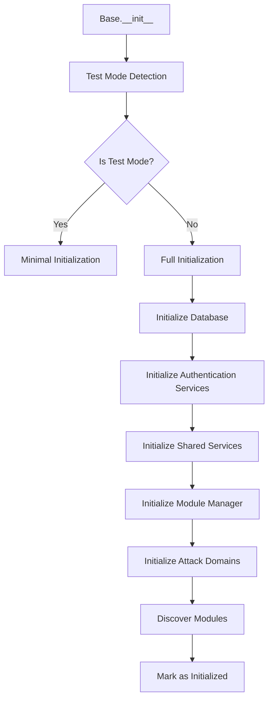

# Core Base System Architecture

## Overview

The Gibson Base system (`gibson/core/base.py`) implements the central orchestration pattern that coordinates all security testing operations. It serves as the single point of coordination for services, attack domains, modules, and scan execution.

## Base Orchestrator Class

### Architecture Pattern

The `Base` class implements a **Central Orchestrator Pattern** where a single class coordinates all system operations while delegating specific functionality to specialized services:

```python
class Base:
    """Central orchestration framework for Gibson security scanning.
    
    Handles module loading, scan execution, and coordination between
    attack domains and shared services.
    """
    
    def __init__(self, config: Optional[Config] = None, context: Optional[Context] = None):
        # Core configuration and context
        self.config = config or ConfigManager().config
        self.context = context
        
        # Service registry
        self.db_manager: Optional[DatabaseManager] = None
        self.module_manager: Optional[ModuleManager] = None
        self.payload_manager = None
        
        # Attack domain registry
        self.attack_domains: Dict[AttackDomain, BaseAttack] = {}
        self.available_modules: Dict[str, AttackDomain] = {}
        
        # Shared services
        self.ai_service = None
        self.git_service = None
        self.data_service = None
        
        # Authentication services
        self.credential_manager = None
        self.auth_service = None
        self.request_authenticator = None
        
        # State management
        self.initialized = False
        self.running_scans: Set[str] = set()
```

### Service Initialization Lifecycle

The Base orchestrator follows a specific initialization sequence to ensure proper dependency resolution:



#### 1. Database Initialization
```python
async def _initialize_database(self) -> None:
    """Initialize database connection with fallback handling."""
    try:
        # Handle path expansion for database URL
        db_url = self.config.database.url.replace("~", str(Path.home()))
        self.db_manager = DatabaseManager(db_url)
        await self.db_manager.initialize()
        
        # Set class-level db_manager for payload system access
        Base._db_manager = self.db_manager
        logger.info("Database initialized successfully")
        
    except ImportError as e:
        if "aiosqlite" in str(e):
            logger.warning("aiosqlite not available - database functionality disabled")
            self.db_manager = None
        else:
            raise
            
    except Exception as e:
        logger.error(f"Failed to initialize database: {e}")
        # Continue without database in test mode
        if self._detect_test_mode():
            logger.debug("Continuing without database in test mode")
            self.db_manager = None
        else:
            raise
```

**Key Features**:
- **Graceful Degradation**: System continues without database if unavailable
- **Test Mode Support**: Automatic detection and handling of test environments
- **Path Resolution**: Automatic expansion of `~` in database paths
- **Singleton Pattern**: Class-level database manager for shared access

#### 2. Authentication Service Initialization
```python
async def _initialize_authentication_services(self) -> None:
    """Initialize authentication services for secure credential management."""
    try:
        from gibson.core.auth.credential_manager import CredentialManager
        from gibson.core.auth.auth_service import AuthService
        from gibson.core.auth.request_auth import RequestAuthenticator
        
        # Initialize credential manager with encryption
        self.credential_manager = CredentialManager(config=self.config.auth)
        await self.credential_manager.initialize()
        
        # Initialize main authentication service
        self.auth_service = AuthService(
            credential_manager=self.credential_manager,
            config=self.config.auth
        )
        
        # Initialize request-level authenticator
        self.request_authenticator = RequestAuthenticator(
            credential_manager=self.credential_manager,
            auth_service=self.auth_service
        )
        
        logger.info("Authentication services initialized")
        
    except Exception as e:
        logger.warning(f"Authentication services not available: {e}")
        # Continue without authentication in development/test modes
        if self._detect_test_mode() or self.config.environment == "development":
            self.credential_manager = None
            self.auth_service = None
            self.request_authenticator = None
        else:
            raise
```

**Authentication Architecture**:
- **Multi-Layer Security**: Credential manager, auth service, and request authenticator
- **Encryption at Rest**: All credentials encrypted before storage
- **Provider Support**: Multiple authentication provider types
- **Development Mode**: Authentication disabled in test environments

#### 3. Module Discovery and Registration
```python
async def _discover_modules(self) -> None:
    """Discover available security modules across all domains."""
    self.available_modules = {}
    
    for domain in AttackDomain:
        if domain in self.attack_domains:
            attack_domain = self.attack_domains[domain]
            modules = await attack_domain.discover_modules()
            
            for module in modules:
                self.available_modules[module] = domain
                logger.debug(f"Discovered module: {module} (domain: {domain.value})")
    
    logger.info(f"Discovered {len(self.available_modules)} modules across {len(self.attack_domains)} domains")
```

## Attack Domain Architecture

### BaseAttack Interface

The `BaseAttack` class provides a consistent interface for all security attack domains:

```python
class BaseAttack:
    """Base class for attack domain implementations."""
    
    def __init__(self, config: Config, base_orchestrator: "Base"):
        self.config = config
        self.base = base_orchestrator  # Reference to Base for shared services
        self.domain = self._get_domain()
        self.enabled = True
    
    def _get_domain(self) -> AttackDomain:
        """Get attack domain for this class. Must be implemented by subclasses."""
        raise NotImplementedError("Subclasses must implement _get_domain()")
    
    async def discover_modules(self) -> List[str]:
        """Discover available modules for this domain."""
        domain_path = Path("gibson/modules") / self.domain.value
        if not domain_path.exists():
            return []
        
        modules = []
        for module_file in domain_path.glob("*.py"):
            if module_file.stem != "__init__":
                modules.append(module_file.stem)
        
        return modules
    
    async def execute_module(self, module_name: str, target: str) -> Optional[Finding]:
        """Execute a specific module against target."""
        raise NotImplementedError("Subclasses must implement execute_module()")
    
    async def get_capabilities(self) -> Dict[str, Any]:
        """Get domain-specific capabilities and metadata."""
        return {
            "domain": self.domain.value,
            "enabled": self.enabled,
            "modules": await self.discover_modules(),
        }
```

### Attack Domain Enumeration

Gibson organizes security tests into distinct attack domains based on the OWASP LLM Top 10:

```python
class AttackDomain(Enum):
    """Attack domain enumeration mapping to OWASP LLM categories."""
    
    PROMPT = "prompt"    # LLM01 - Prompt Injection attacks
    DATA = "data"        # LLM03 - Training Data Poisoning  
    MODEL = "model"      # LLM10 - Model Theft attacks
    SYSTEM = "system"    # System-level security tests
    OUTPUT = "output"    # LLM02 - Insecure Output Handling
```

**Domain Characteristics**:
- **Independent Operation**: Each domain can be enabled/disabled independently
- **Module Discovery**: Automatic discovery of modules within domain directories
- **Capability Reporting**: Each domain reports its available capabilities
- **Shared Service Access**: Domains access shared services through Base orchestrator reference

### Domain Implementation Pattern

Each attack domain follows a consistent implementation pattern:

```python
# Example: Prompt Attack Domain Implementation
class PromptAttackDomain(BaseAttack):
    """Implementation of prompt injection attack domain."""
    
    def _get_domain(self) -> AttackDomain:
        return AttackDomain.PROMPT
    
    async def initialize(self) -> None:
        """Initialize prompt-specific services."""
        # Load prompt templates
        # Initialize LLM clients
        # Set up validation rules
    
    async def execute_module(self, module_name: str, target: str) -> Optional[Finding]:
        """Execute prompt injection module against target."""
        # Load module from gibson/modules/prompt/{module_name}.py
        # Initialize module with configuration
        # Execute against target
        # Process and validate results
        # Return Finding object or None
```

## Service Coordination Patterns

### Singleton Service Pattern

Some services use singleton patterns for shared resource management:

```python
class Base:
    # Class-level database manager for singleton pattern
    _db_manager: Optional[DatabaseManager] = None
    
    async def _initialize_database(self) -> None:
        # ... initialization logic ...
        Base._db_manager = self.db_manager  # Set class-level reference
    
    @classmethod
    def get_database_manager(cls) -> Optional[DatabaseManager]:
        """Get shared database manager instance."""
        return cls._db_manager
```

**Benefits**:
- **Resource Efficiency**: Single database connection pool shared across system
- **Consistency**: All components use same database connection
- **Lifecycle Management**: Centralized connection lifecycle management

### Dependency Injection Pattern

Services are injected into components that need them:

```python
class SomeService:
    def __init__(self, base_orchestrator: Base):
        self.base = base_orchestrator
        # Access shared services through base orchestrator
        self.db_manager = base_orchestrator.db_manager
        self.credential_manager = base_orchestrator.credential_manager
```

## Error Handling and Recovery

### Test Mode Detection

The Base orchestrator automatically detects test environments and adjusts behavior:

```python
def _detect_test_mode(self) -> bool:
    """Detect if running in test mode for graceful degradation."""
    import sys
    
    # Check for pytest in the call stack
    if "pytest" in sys.modules:
        return True
    
    # Check for test-related environment variables
    test_env_vars = ["PYTEST_CURRENT_TEST", "CI", "GITHUB_ACTIONS"]
    if any(os.getenv(var) for var in test_env_vars):
        return True
    
    # Check if config specifies test environment
    if hasattr(self.config, 'environment') and self.config.environment == "test":
        return True
    
    return False
```

### Graceful Service Degradation

Services are designed to fail gracefully when dependencies are unavailable:

```python
async def _initialize_service_with_fallback(self, service_name: str, factory_func: Callable) -> Any:
    """Initialize service with fallback handling."""
    try:
        service = await factory_func()
        logger.info(f"{service_name} initialized successfully")
        return service
        
    except ImportError as e:
        logger.warning(f"{service_name} unavailable due to missing dependency: {e}")
        return None
        
    except Exception as e:
        if self._detect_test_mode():
            logger.debug(f"Continuing without {service_name} in test mode")
            return None
        else:
            logger.error(f"Failed to initialize {service_name}: {e}")
            raise
```

### Error Context and Recovery

The Base orchestrator maintains error context for debugging and recovery:

```python
class Base:
    def __init__(self):
        self.initialization_errors: List[Exception] = []
        self.service_status: Dict[str, str] = {}
    
    async def _track_service_initialization(self, service_name: str, init_func: Callable):
        """Track service initialization with error context."""
        try:
            service = await init_func()
            self.service_status[service_name] = "initialized"
            return service
            
        except Exception as e:
            self.initialization_errors.append(e)
            self.service_status[service_name] = f"failed: {str(e)}"
            
            if self._is_critical_service(service_name):
                raise
            else:
                logger.warning(f"Non-critical service {service_name} failed: {e}")
                return None
    
    def get_system_status(self) -> Dict[str, Any]:
        """Get comprehensive system status for diagnostics."""
        return {
            "initialized": self.initialized,
            "services": self.service_status,
            "errors": [str(e) for e in self.initialization_errors],
            "running_scans": len(self.running_scans),
            "available_modules": len(self.available_modules),
            "attack_domains": len(self.attack_domains)
        }
```

## Async Execution Patterns

### Concurrent Service Initialization

Services that don't depend on each other can be initialized concurrently:

```python
async def _initialize_independent_services(self) -> None:
    """Initialize services that don't depend on each other concurrently."""
    
    # Services that can initialize in parallel
    service_tasks = [
        self._initialize_git_service(),
        self._initialize_monitoring_service(),
        self._initialize_cache_service()
    ]
    
    # Wait for all to complete, collecting any exceptions
    results = await asyncio.gather(*service_tasks, return_exceptions=True)
    
    # Process results and handle any failures
    for i, result in enumerate(results):
        if isinstance(result, Exception):
            service_name = service_tasks[i].__name__.replace('_initialize_', '').replace('_service', '')
            logger.warning(f"Service {service_name} failed to initialize: {result}")
```

### Scan Execution Coordination

The Base orchestrator coordinates scan execution across multiple domains:

```python
async def execute_scan(self, scan_config: ScanConfig) -> ScanResult:
    """Execute security scan across relevant attack domains."""
    
    scan_id = str(uuid.uuid4())
    self.running_scans.add(scan_id)
    
    try:
        # Determine applicable attack domains
        applicable_domains = self._get_applicable_domains(scan_config)
        
        # Execute modules concurrently across domains
        domain_tasks = []
        for domain in applicable_domains:
            if domain in self.attack_domains:
                task = self._execute_domain_modules(
                    domain, scan_config, scan_id
                )
                domain_tasks.append(task)
        
        # Wait for all domain executions
        domain_results = await asyncio.gather(
            *domain_tasks, return_exceptions=True
        )
        
        # Aggregate results
        all_findings = []
        execution_errors = []
        
        for result in domain_results:
            if isinstance(result, Exception):
                execution_errors.append(result)
            else:
                all_findings.extend(result)
        
        # Create scan result
        return ScanResult(
            scan_id=scan_id,
            target=scan_config.target,
            findings=all_findings,
            errors=execution_errors,
            execution_time=time.time() - start_time
        )
        
    finally:
        self.running_scans.remove(scan_id)
```

## Performance Considerations

### Service Lifecycle Management

The Base orchestrator implements proper service lifecycle management to prevent resource leaks:

```python
class Base:
    async def __aenter__(self):
        """Async context manager entry."""
        await self.initialize()
        return self
    
    async def __aexit__(self, exc_type, exc_val, exc_tb):
        """Async context manager exit with cleanup."""
        await self.cleanup()
    
    async def cleanup(self) -> None:
        """Clean up resources and close connections."""
        cleanup_tasks = []
        
        if self.db_manager:
            cleanup_tasks.append(self.db_manager.close())
        
        if self.credential_manager:
            cleanup_tasks.append(self.credential_manager.close())
        
        # Add other service cleanup tasks
        for service_name, service in self._get_all_services().items():
            if hasattr(service, 'close'):
                cleanup_tasks.append(service.close())
        
        # Wait for all cleanup to complete
        await asyncio.gather(*cleanup_tasks, return_exceptions=True)
        
        logger.info("Base orchestrator cleanup completed")
```

### Resource Monitoring

The Base orchestrator can provide resource usage information:

```python
def get_resource_usage(self) -> Dict[str, Any]:
    """Get current resource usage information."""
    import psutil
    
    process = psutil.Process()
    
    return {
        "memory_mb": process.memory_info().rss / 1024 / 1024,
        "cpu_percent": process.cpu_percent(),
        "open_files": len(process.open_files()),
        "threads": process.num_threads(),
        "running_scans": len(self.running_scans),
        "database_connections": self.db_manager.get_connection_count() if self.db_manager else 0
    }
```

## Usage Examples

### Basic Usage with Context Manager
```python
from gibson.core.base import Base
from gibson.models.scan import ScanConfig

async def run_security_scan():
    scan_config = ScanConfig(
        target="https://api.example.com",
        domains=[AttackDomain.PROMPT, AttackDomain.OUTPUT]
    )
    
    async with Base() as gibson:
        result = await gibson.execute_scan(scan_config)
        
        print(f"Scan completed: {len(result.findings)} findings")
        for finding in result.findings:
            print(f"- {finding.title}: {finding.severity}")
```

### Advanced Configuration
```python
from gibson.core.base import Base
from gibson.core.config import Config

# Custom configuration
config = Config(
    database={"url": "sqlite:///custom.db"},
    auth={"encryption_key": "custom-key"},
    scanning={"timeout": 300}
)

base = Base(config=config)
await base.initialize()

# Check system status
status = base.get_system_status()
print(f"System initialized: {status['initialized']}")
print(f"Available modules: {status['available_modules']}")
```

### Custom Attack Domain Registration
```python
class CustomAttackDomain(BaseAttack):
    def _get_domain(self) -> AttackDomain:
        return AttackDomain.CUSTOM  # Would need to add to enum
    
    async def execute_module(self, module_name: str, target: str) -> Optional[Finding]:
        # Custom module execution logic
        pass

# Register with Base orchestrator
base = Base()
await base.initialize()
base.attack_domains[AttackDomain.CUSTOM] = CustomAttackDomain(base.config, base)
```

This Base system architecture provides the foundational coordination layer that enables Gibson's modular, extensible, and robust security testing framework while maintaining clean separation of concerns and proper error handling throughout the system.