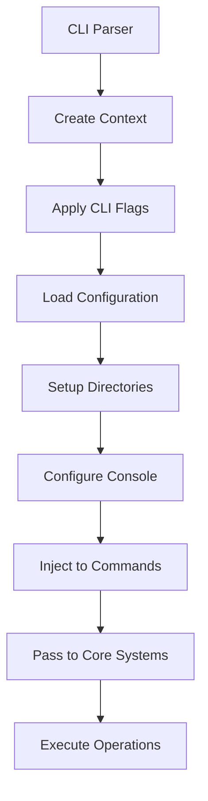
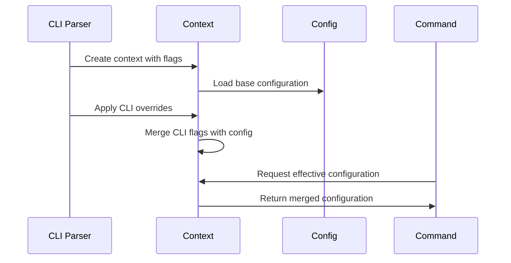

# Context Management System

## Overview

The Gibson context management system (`gibson/core/context.py`) provides global state management and dependency injection for CLI operations. It serves as the bridge between CLI commands and the core Gibson framework, managing console output, configuration context, and runtime state throughout command execution.

## Context Architecture

### Core Context Model

```python
@dataclass
class Context:
    """Global context object for CLI state management."""
    
    config: Config
    console: Console
    verbose: bool = False
    debug: bool = False
    quiet: bool = False
    no_color: bool = False
    output_format: Optional[str] = None
```

**Design Pattern**: The Context class implements a **Parameter Object Pattern** that encapsulates all CLI runtime state and dependencies in a single, easily-passed object.

### Context Components

#### Configuration Integration
- **Config Object**: Direct reference to hierarchical configuration system
- **Runtime Overrides**: CLI flags can override configuration values
- **Environment Awareness**: Context-aware configuration resolution

#### Console Management
- **Rich Console**: Integration with Rich library for enhanced terminal output
- **Output Control**: Centralized control over verbosity, colors, and formatting
- **Format Selection**: Support for multiple output formats (human, JSON, etc.)

#### State Management
- **Boolean Flags**: Simple flag-based state management for CLI options
- **Output Formatting**: Centralized output format selection and management
- **Directory Context**: Automatic setup of required directories

### Context Lifecycle

#### Initialization Flow
```python
def __post_init__(self) -> None:
    """Post-initialization setup."""
    # Apply settings to console
    if self.no_color:
        self.console.no_color = True
    if self.quiet:
        self.console.quiet = True
    
    # Ensure directories exist
    self._setup_directories()
```

**Lifecycle Stages**:
1. **Context Creation**: CLI framework creates Context with user parameters
2. **Console Configuration**: Apply CLI flags to Rich Console instance
3. **Directory Setup**: Ensure all required directories exist
4. **Dependency Injection**: Pass Context to command handlers

#### Directory Management
```python
def _setup_directories(self) -> None:
    """Setup required directories."""
    # Ensure data directories exist
    if self.config.data_dir:
        Path(self.config.data_dir).mkdir(parents=True, exist_ok=True)
    if self.config.cache_dir:
        Path(self.config.cache_dir).mkdir(parents=True, exist_ok=True)
    if self.config.module_dir:
        Path(self.config.module_dir).mkdir(parents=True, exist_ok=True)
    
    # Ensure config directory exists
    config_dir = Path.home() / ".config" / "gibson"
    config_dir.mkdir(parents=True, exist_ok=True)
    
    # Ensure gibson data directory exists
    gibson_dir = Path.home() / ".gibson"
    gibson_dir.mkdir(parents=True, exist_ok=True)
```

**Directory Structure Management**:
```
~/.gibson/                    # Main Gibson data directory
├── data/                     # Application data (from config.data_dir)
├── cache/                    # Cache files (from config.cache_dir)
├── modules/                  # Installed modules (from config.module_dir)
└── gibson.db                 # Database file

~/.config/gibson/             # Configuration directory
└── config.yaml               # User configuration file
```

### Integration Patterns

#### CLI Command Integration

The Context object is passed through the CLI command hierarchy using Typer's dependency injection:

```python
# Example CLI command integration
@app.command()
async def scan_command(
    target: str,
    ctx: Context = typer.Context(),
    verbose: bool = typer.Option(False, "--verbose", "-v"),
    quiet: bool = typer.Option(False, "--quiet", "-q"),
    no_color: bool = typer.Option(False, "--no-color"),
) -> None:
    """Execute security scan with context management."""
    
    # Context is automatically available with CLI state
    # Context.config contains hierarchical configuration
    # Context.console provides Rich terminal output
    
    if ctx.verbose:
        ctx.console.print("[dim]Verbose mode enabled[/dim]")
    
    # Use context configuration
    scan_config = ScanConfig(
        timeout=ctx.config.api.timeout,
        max_parallel=ctx.config.safety.max_parallel
    )
```

#### Base Orchestrator Integration

The Context object serves as the bridge between CLI and core system:

```python
# Integration with Base orchestrator
async def execute_with_context(context: Context) -> None:
    """Execute Gibson operations with context."""
    
    # Create Base orchestrator with context-aware configuration
    base = Base(config=context.config, context=context)
    
    # Context provides console for progress reporting
    base.set_progress_console(context.console)
    
    # Execute operations with context
    await base.initialize()
```

### Console Output Management

#### Rich Console Integration

The Context manages Rich Console configuration for consistent output:

```python
# Console configuration based on context flags
if self.no_color:
    self.console.no_color = True    # Disable color output
if self.quiet:
    self.console.quiet = True       # Suppress non-essential output
```

#### Output Format Control

Context provides centralized output format management:

```python
def get_output_format(self) -> str:
    """Get effective output format."""
    # Priority: CLI flag > config > default
    return (
        self.output_format or 
        self.config.output.format or 
        "human"
    )

def format_output(self, data: Any) -> str:
    """Format output according to context settings."""
    format_type = self.get_output_format()
    
    if format_type == "json":
        return json.dumps(data, indent=2)
    elif format_type == "yaml":
        return yaml.dump(data)
    else:
        return self._format_human_readable(data)
```

#### Progress and Status Reporting

Context provides consistent progress reporting across commands:

```python
def report_progress(self, message: str, step: int, total: int) -> None:
    """Report progress with context-aware formatting."""
    if not self.quiet:
        if self.verbose:
            self.console.print(f"[dim]Step {step}/{total}:[/dim] {message}")
        else:
            # Show progress bar for non-verbose mode
            progress = (step / total) * 100
            self.console.print(f"Progress: {progress:.1f}%")

def report_error(self, error: Exception, context_info: str = "") -> None:
    """Report errors with context-aware formatting."""
    if self.debug:
        # Full traceback in debug mode
        self.console.print_exception()
    else:
        # Simplified error message
        self.console.print(f"[red]Error:[/red] {str(error)}")
    
    if context_info and self.verbose:
        self.console.print(f"[dim]Context: {context_info}[/dim]")
```

### Data Flow Patterns

#### Context Creation and Propagation



#### Configuration Override Pattern



### State Management

#### Flag-Based State

The Context uses simple boolean flags for CLI state management:

```python
# State flags from CLI
verbose: bool = False       # Enhanced output verbosity
debug: bool = False         # Debug-level information
quiet: bool = False         # Minimal output mode
no_color: bool = False      # Disable colored output
```

#### Configuration State

Context maintains configuration state with override capability:

```python
# Configuration override pattern
def get_effective_config(self, override_key: str, cli_value: Any) -> Any:
    """Get configuration value with CLI override."""
    if cli_value is not None:
        return cli_value
    
    # Traverse nested configuration
    config_value = self.config
    for key_part in override_key.split('.'):
        config_value = getattr(config_value, key_part)
    
    return config_value
```

### Error Handling

#### Context-Aware Error Handling

```python
def handle_error(
    self, 
    error: Exception, 
    operation: str,
    show_traceback: bool = None
) -> None:
    """Handle errors with context-aware output."""
    
    # Use context debug setting if not explicitly specified
    show_traceback = show_traceback or self.debug
    
    if show_traceback:
        self.console.print_exception()
    else:
        self.console.print(f"[red]Error in {operation}:[/red] {str(error)}")
    
    # Log error details if verbose
    if self.verbose:
        logger.error(f"Error in {operation}: {str(error)}", exc_info=True)
```

#### Graceful Degradation

Context supports graceful degradation when components are unavailable:

```python
def create_fallback_console(self) -> Console:
    """Create fallback console if Rich is unavailable."""
    try:
        from rich.console import Console
        return Console(
            color_system=None if self.no_color else "auto",
            quiet=self.quiet
        )
    except ImportError:
        # Fallback to basic print statements
        return BasicConsole(no_color=self.no_color, quiet=self.quiet)
```

## Usage Patterns

### Basic CLI Integration

```python
import typer
from gibson.core.context import Context
from gibson.core.config import get_config

app = typer.Typer()

@app.command()
def example_command(
    target: str,
    verbose: bool = typer.Option(False, "--verbose", "-v"),
    quiet: bool = typer.Option(False, "--quiet", "-q"),
    no_color: bool = typer.Option(False, "--no-color"),
    output_format: str = typer.Option("human", "--format")
) -> None:
    """Example command with context integration."""
    
    # Create context with CLI parameters
    context = Context(
        config=get_config(),
        console=Console(),
        verbose=verbose,
        quiet=quiet,
        no_color=no_color,
        output_format=output_format
    )
    
    # Use context throughout operation
    if context.verbose:
        context.console.print("[dim]Starting operation...[/dim]")
    
    # Pass context to core operations
    result = execute_operation(target, context)
    
    # Context-aware output formatting
    formatted_output = context.format_output(result)
    context.console.print(formatted_output)
```

### Advanced Context Usage

```python
async def complex_operation_with_context(
    context: Context,
    operation_params: Dict[str, Any]
) -> OperationResult:
    """Complex operation using context for state management."""
    
    # Use context for progress reporting
    total_steps = 5
    
    context.report_progress("Initializing", 1, total_steps)
    
    # Context-aware configuration access
    timeout = context.get_effective_config("api.timeout", operation_params.get("timeout"))
    max_parallel = context.get_effective_config("safety.max_parallel", operation_params.get("parallel"))
    
    context.report_progress("Loading modules", 2, total_steps)
    
    try:
        # Execute with context-aware error handling
        modules = await load_modules(context.config.module_dir)
        
        context.report_progress("Executing scan", 3, total_steps)
        
        # Context provides configuration to core systems
        scan_result = await execute_scan_with_context(modules, context)
        
        context.report_progress("Processing results", 4, total_steps)
        
        processed_result = process_scan_results(scan_result, context)
        
        context.report_progress("Complete", 5, total_steps)
        
        return processed_result
        
    except Exception as e:
        context.handle_error(e, "complex_operation")
        raise
```

### Context-Aware Service Integration

```python
class ContextAwareService:
    """Service that uses context for configuration and output."""
    
    def __init__(self, context: Context):
        self.context = context
        self.config = context.config
        self.console = context.console
    
    async def execute_service_operation(self) -> ServiceResult:
        """Execute service operation with context integration."""
        
        # Use context configuration
        api_timeout = self.config.api.timeout
        retry_count = self.config.api.retry
        
        # Context-aware logging
        if self.context.verbose:
            self.console.print(f"[dim]Service config: timeout={api_timeout}, retry={retry_count}[/dim]")
        
        # Execute operation
        try:
            result = await self._perform_operation()
            
            if self.context.verbose:
                self.console.print("[green]Service operation completed successfully[/green]")
            
            return result
            
        except Exception as e:
            self.context.handle_error(e, "service_operation")
            raise
    
    def _perform_operation(self) -> ServiceResult:
        """Internal operation implementation."""
        # Service-specific logic here
        pass
```

## Technical Analysis

### Strengths

1. **Centralized State Management**: Single source of truth for CLI runtime state
2. **Clean Dependency Injection**: Simple parameter object pattern for context passing
3. **Configuration Integration**: Seamless integration with hierarchical configuration
4. **Console Abstraction**: Clean abstraction over Rich console functionality
5. **Directory Management**: Automatic setup of required directories

### Areas for Improvement

1. **Limited Context Scope**: Context is primarily CLI-focused, doesn't extend to core operations
2. **No Context Hierarchy**: No support for nested or scoped contexts
3. **Static Configuration**: No support for runtime configuration changes
4. **Basic State Management**: Simple boolean flags could be more sophisticated

### Improvement Recommendations

#### High Priority

1. **Context Hierarchy Support**
   ```python
   class Context:
       parent: Optional['Context'] = None
       children: List['Context'] = field(default_factory=list)
       
       def create_child_context(self, **overrides) -> 'Context':
           """Create child context with local overrides."""
   ```

2. **Enhanced State Management**
   ```python
   class ContextState:
       """Enhanced context state management."""
       
       def set_state(self, key: str, value: Any) -> None:
           """Set context state value."""
           
       def get_state(self, key: str, default: Any = None) -> Any:
           """Get context state value with fallback."""
   ```

#### Medium Priority

1. **Context Validation**: Add validation for context consistency and required fields
2. **Context Serialization**: Support for context serialization/deserialization
3. **Context Middleware**: Plugin system for context processing

This context management system provides essential state management and dependency injection for Gibson's CLI operations while maintaining simplicity and extensibility for future enhancements.