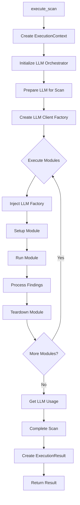
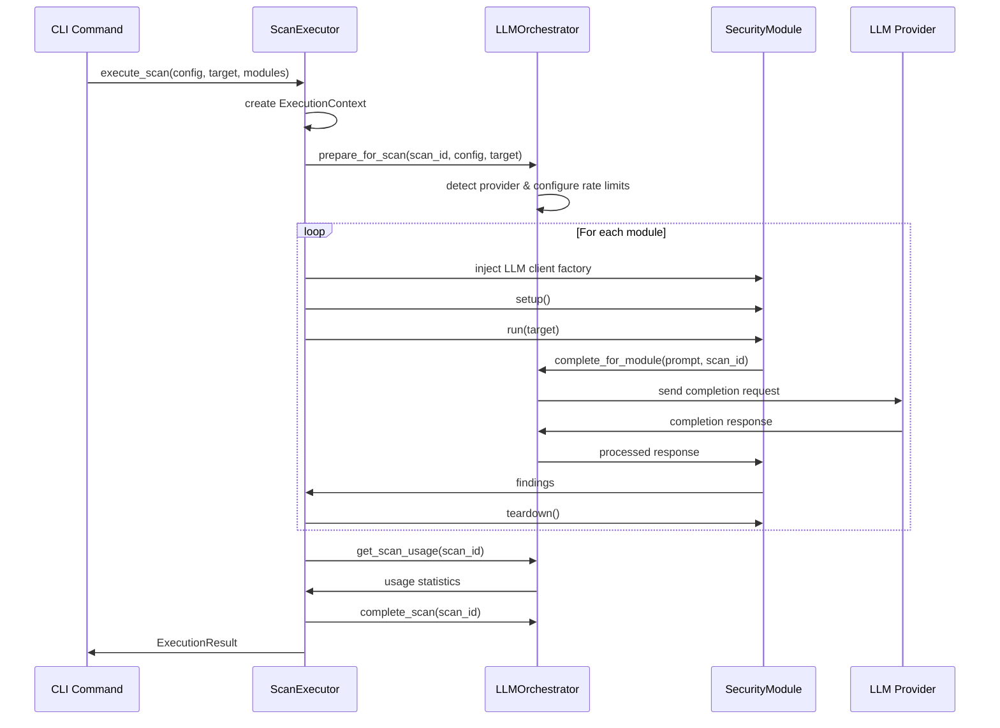
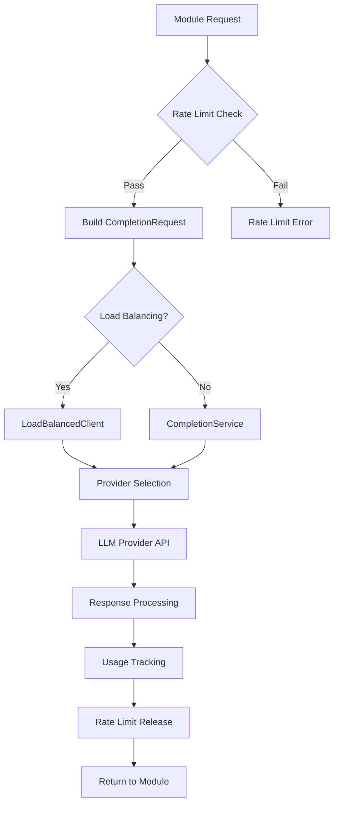

# Core Orchestrator System

## Overview

The Gibson orchestrator system (`gibson/core/orchestrator/`) implements the execution coordination layer that manages scan workflows and LLM integrations. It provides the runtime coordination between security modules, LLM providers, and scan execution while ensuring proper resource management and performance tracking.

## Architecture Components

### Scan Executor (`scan_executor.py`)

The `ScanExecutor` class manages the complete lifecycle of security scan execution:

#### Core Responsibilities
- **Scan Lifecycle Management**: Complete scan orchestration from initialization to completion
- **Module Coordination**: Manages concurrent execution of security modules
- **LLM Integration**: Coordinates with LLM orchestrator for AI-powered security testing
- **Error Handling**: Comprehensive error tracking and graceful degradation
- **Resource Tracking**: Memory, execution time, and LLM usage monitoring

#### Key Classes

##### ExecutionContext
```python
@dataclass
class ExecutionContext:
    """Context for scan execution."""
    scan_id: str
    scan_config: ScanConfig
    target: Target
    modules: List[BaseModule]
    start_time: datetime = field(default_factory=datetime.now)
    llm_orchestrator: Optional[Any] = None
    metadata: Dict[str, Any] = field(default_factory=dict)
```

**Purpose**: Maintains scan state and coordination context throughout execution lifecycle

##### ExecutionResult
```python
@dataclass
class ExecutionResult:
    """Result of scan execution."""
    scan_id: str
    status: ScanStatus
    findings: List[Finding]
    errors: List[str]
    duration_seconds: float
    llm_usage: Dict[str, Any]
    metadata: Dict[str, Any] = field(default_factory=dict)
```

**Purpose**: Comprehensive result aggregation with performance and usage metrics

#### Execution Flow



#### Error Handling Strategy

The scan executor implements comprehensive error handling:

1. **Module-Level Errors**: Individual module failures don't terminate entire scan
2. **LLM Errors**: Graceful fallback when LLM services are unavailable
3. **Resource Errors**: Memory and timeout protection with circuit breakers
4. **Status Classification**: `COMPLETED`, `PARTIAL`, `FAILED`, `CANCELLED` based on error patterns

#### State Management

```python
class ScanExecutor:
    def __init__(self):
        self.active_scans: Dict[str, ExecutionContext] = {}
        self.completed_scans: Dict[str, ExecutionResult] = {}
    
    async def cancel_scan(self, scan_id: str) -> bool:
        """Cancel active scan with resource cleanup."""
```

**Features**:
- **Active Scan Tracking**: Real-time monitoring of running scans
- **Result Persistence**: Completed scan results maintained for analysis
- **Cancellation Support**: Graceful scan termination with cleanup

### LLM Integration (`llm_integration.py`)

The `LLMOrchestrator` class manages all LLM operations for security testing:

#### Core Architecture

```python
@dataclass
class LLMOrchestrator:
    """Orchestrates LLM operations for security scans."""
    
    # Core components
    client_factory: Optional[LLMClientFactory] = None
    completion_service: Optional[CompletionService] = None
    usage_tracker: Optional[UsageTracker] = None
    rate_limiter: Optional[RateLimiter] = None
    
    # Load balancing and fallback
    provider_pool: Optional[ProviderPool] = None
    fallback_manager: Optional[FallbackManager] = None
    load_balanced_client: Optional[LoadBalancedClient] = None
```

#### Key Features

##### 1. Provider Management
- **Multi-Provider Support**: OpenAI, Anthropic, Azure OpenAI via LiteLLM
- **Provider Detection**: Automatic detection of target's LLM provider
- **Health Monitoring**: Continuous provider health checking
- **Fallback Coordination**: Automatic failover between providers

##### 2. Rate Limiting and Usage Tracking
```python
async def complete_for_module(
    self,
    module_name: str,
    prompt: str,
    scan_id: Optional[str] = None,
    **kwargs,
) -> CompletionResponse:
    # Apply rate limiting
    if self.rate_limiter and provider:
        token = await self.rate_limiter.acquire(
            provider=provider,
            estimated_tokens=request.max_tokens or 1000,
            module_name=module_name,
            scan_id=scan_id,
        )
```

**Rate Limiting Features**:
- **Per-Provider Limits**: Individual rate limits for each LLM provider
- **Module-Based Tracking**: Rate limiting granularity per security module
- **Token Estimation**: Proactive token usage estimation for rate planning
- **Scan Context**: Rate limits can be configured per scan

##### 3. Usage Analytics
```python
async def get_scan_usage(self, scan_id: str) -> Dict[str, Any]:
    """Get LLM usage statistics for a scan."""
    usage = await self.usage_tracker.get_usage_by_metadata(
        metadata_filter={"scan_id": scan_id}
    )
    
    return {
        "total_requests": len(usage),
        "total_tokens": sum(u.total_tokens for u in usage),
        "total_cost": sum(u.estimated_cost or 0 for u in usage),
        "by_module": self._aggregate_by_module(usage),
    }
```

**Analytics Capabilities**:
- **Cost Tracking**: Real-time cost estimation across providers
- **Token Usage**: Detailed token consumption analysis
- **Module Attribution**: Usage breakdown by security module
- **Scan-Level Aggregation**: Complete usage summary per scan execution

##### 4. Load Balancing
When enabled, the orchestrator implements intelligent load balancing:

- **Provider Pool Management**: Dynamic provider availability tracking  
- **Session Affinity**: Maintain consistency within scan sessions
- **Automatic Failover**: Seamless switching on provider failures
- **Performance Optimization**: Route requests to best-performing providers

#### Integration Patterns

##### Module Integration
```python
# Inject LLM completion function into modules
async def llm_complete(prompt: str, **kwargs) -> str:
    """LLM completion wrapper for module."""
    response = await llm_orchestrator.complete_for_module(
        module_name=module.name,
        prompt=prompt,
        scan_id=scan_id,
        **kwargs,
    )
    return response.choices[0].message.content if response.choices else ""

module.llm_complete = llm_complete
```

##### Scan Lifecycle Integration
```python
# Scan preparation
await llm_orchestrator.prepare_for_scan(
    scan_id=scan_id,
    scan_config=scan_config,
    target=target,
)

# Scan completion with usage reporting
usage = await llm_orchestrator.get_scan_usage(scan_id)
await llm_orchestrator.complete_scan(scan_id)
```

## Data Flow Architecture

### Scan Execution Data Flow



### LLM Request Flow



## Performance Characteristics

### Concurrent Execution
- **Module Parallelism**: Security modules execute concurrently per scan
- **Async Pattern**: Full async/await implementation for non-blocking I/O
- **Resource Pooling**: Shared LLM client connections and database pools
- **Memory Management**: Context cleanup and result streaming for large scans

### LLM Performance Optimization
- **Request Batching**: Intelligent request batching where supported by providers
- **Connection Pooling**: Persistent HTTP connections to LLM providers  
- **Caching**: Response caching for identical prompts within scan context
- **Provider Optimization**: Route requests to fastest available provider

### Scalability Patterns
- **Stateless Execution**: Scan execution can be distributed across multiple instances
- **Resource Limits**: Configurable memory and timeout limits per module
- **Circuit Breakers**: Protect against cascading failures in LLM services
- **Graceful Degradation**: Continue execution when LLM services are partially available

## Error Handling and Recovery

### Error Classification

#### 1. Module Errors
```python
try:
    module_findings = await module.run(target)
    findings.extend(module_findings)
except Exception as e:
    error_msg = f"Module {module.name} failed: {str(e)}"
    logger.error(error_msg)
    errors.append(error_msg)
```

**Strategy**: Individual module failures are isolated and don't terminate the entire scan

#### 2. LLM Provider Errors
```python
except Exception as e:
    # Release rate limit on error
    if self.rate_limiter and provider:
        await self.rate_limiter.release(provider=provider, success=False)
    
    logger.error(f"Module {module_name} completion failed: {e}")
    raise
```

**Features**:
- **Automatic Fallback**: Switch to alternative providers on failure
- **Rate Limit Recovery**: Proper rate limit token release on errors
- **Circuit Breaking**: Temporarily disable failing providers
- **Retry Logic**: Configurable retry attempts with exponential backoff

#### 3. Resource Exhaustion
- **Memory Monitoring**: Track memory usage during scan execution
- **Timeout Protection**: Enforce maximum execution time per module
- **Connection Limits**: Prevent connection pool exhaustion
- **Disk Space**: Monitor and prevent disk space exhaustion from result storage

### Recovery Mechanisms

#### Scan Recovery
```python
async def cancel_scan(self, scan_id: str) -> bool:
    """Cancel an active scan with proper cleanup."""
    if scan_id not in self.active_scans:
        return False
    
    context = self.active_scans[scan_id]
    
    # Complete scan in orchestrator
    if context.llm_orchestrator:
        await context.llm_orchestrator.complete_scan(scan_id)
    
    # Create cancelled result with partial data
    result = ExecutionResult(
        scan_id=scan_id,
        status=ScanStatus.CANCELLED,
        findings=[],  # Could preserve partial findings
        errors=["Scan cancelled by user"],
        duration_seconds=duration,
        llm_usage={},
    )
```

## Configuration and Customization

### LLM Orchestrator Configuration
```python
orchestrator = LLMOrchestrator(
    enable_fallback=True,           # Provider fallback on failures
    enable_rate_limiting=True,      # Rate limiting protection
    enable_usage_tracking=True,     # Cost and usage analytics
    enable_load_balancing=False,    # Load balancing across providers
)
```

### Scan-Specific Configuration
- **Provider Preferences**: Target-specific provider selection
- **Rate Limit Overrides**: Custom rate limits per scan type
- **Timeout Configuration**: Module-specific execution timeouts
- **Resource Limits**: Memory and CPU constraints per scan

### Module Integration Customization
- **LLM Client Injection**: Modules receive configured LLM clients
- **Completion Wrappers**: Custom completion functions per module type
- **Context Propagation**: Scan context available throughout module execution
- **Metadata Injection**: Custom metadata passed to LLM requests

## Integration Points

### Dependencies
- **gibson.core.llm**: Complete LLM integration layer
- **gibson.models.scan**: Scan configuration and result models
- **gibson.models.target**: Target specification and detection
- **gibson.models.findings**: Security finding models
- **gibson.core.modules.base**: Security module base interface

### External Integrations
- **LiteLLM**: Multi-provider LLM abstraction layer
- **LLM Providers**: OpenAI, Anthropic, Azure OpenAI, local models
- **Database**: Scan result persistence and usage tracking
- **Monitoring**: Performance metrics and health checking

## Usage Examples

### Basic Scan Execution
```python
from gibson.core.orchestrator.scan_executor import get_scan_executor
from gibson.models.scan import ScanConfig
from gibson.models.target import Target

scan_executor = get_scan_executor()

# Execute security scan
result = await scan_executor.execute_scan(
    scan_config=ScanConfig(scan_type=ScanType.COMPREHENSIVE),
    target=Target(url="https://api.example.com"),
    modules=[PromptInjectionModule(), DataLeakageModule()]
)

print(f"Scan completed: {result.status}")
print(f"Findings: {len(result.findings)}")
print(f"LLM Cost: ${result.llm_usage.get('total_cost', 0):.4f}")
```

### Custom LLM Integration
```python
from gibson.core.orchestrator.llm_integration import get_llm_orchestrator

# Get LLM orchestrator
llm_orchestrator = await get_llm_orchestrator()

# Direct LLM completion for custom module
response = await llm_orchestrator.complete_for_module(
    module_name="custom_security_test",
    prompt="Analyze this API endpoint for vulnerabilities: ...",
    scan_id=scan_id,
    temperature=0.1,
    max_tokens=2000
)

print(f"LLM Response: {response.choices[0].message.content}")
```

### Scan Monitoring
```python
# Monitor active scans
active_scans = scan_executor.list_active_scans()
print(f"Active scans: {len(active_scans)}")

# Get scan status
status = scan_executor.get_scan_status(scan_id)
print(f"Scan {scan_id} status: {status}")

# Get detailed results
result = scan_executor.get_scan_result(scan_id)
if result:
    print(f"Duration: {result.duration_seconds:.2f}s")
    print(f"Errors: {len(result.errors)}")
```

## Technical Debt and Improvements

### Current Technical Debt

#### 1. Global State Management
- **Global Executor Instance**: Single global scan executor limits scalability
- **LLM Orchestrator Singleton**: Global orchestrator state prevents isolation
- **Resource Cleanup**: Manual cleanup required, no automatic resource management

#### 2. Error Recovery Gaps
- **Partial Scan Results**: Limited support for preserving partial results on cancellation
- **Provider Failover**: Basic failover logic could be more sophisticated
- **Module Isolation**: Module failures can affect scan-level state

#### 3. Performance Bottlenecks
- **Sequential Module Setup**: Modules are set up sequentially, not in parallel
- **Memory Accumulation**: Large scan results accumulate in memory
- **Connection Pooling**: Basic connection pooling without advanced optimization

### Improvement Recommendations

#### High Priority

1. **Resource Management Refactor**
   ```python
   class ManagedScanExecutor:
       """Scan executor with proper resource management."""
       
       async def __aenter__(self):
           await self.initialize()
           return self
           
       async def __aexit__(self, exc_type, exc_val, exc_tb):
           await self.cleanup()
   ```

2. **Scan State Isolation**
   - Remove global state dependencies
   - Implement per-scan resource isolation
   - Add concurrent scan execution support

3. **Enhanced Error Recovery**
   - Implement sophisticated retry mechanisms
   - Add partial result preservation on failures
   - Enhance provider failover with health scoring

#### Medium Priority

1. **Performance Optimization**
   - Implement parallel module initialization
   - Add result streaming for large scans
   - Optimize memory usage patterns

2. **Advanced LLM Features**
   - Add prompt templating and optimization
   - Implement response caching strategies
   - Add cost optimization algorithms

#### Low Priority

1. **Monitoring Enhancements**
   - Add distributed tracing integration
   - Implement performance profiling
   - Add custom metrics export

2. **Configuration Improvements**
   - Add dynamic configuration reloading
   - Implement configuration validation schemas
   - Add environment-specific configurations

This orchestrator system provides the essential coordination layer for Gibson's security testing capabilities while maintaining flexibility for future enhancements and optimizations.