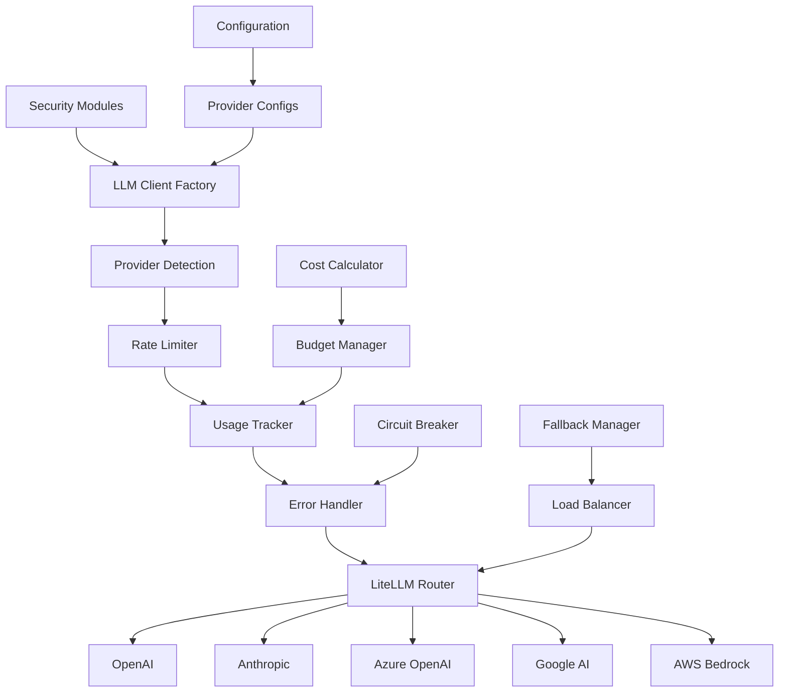
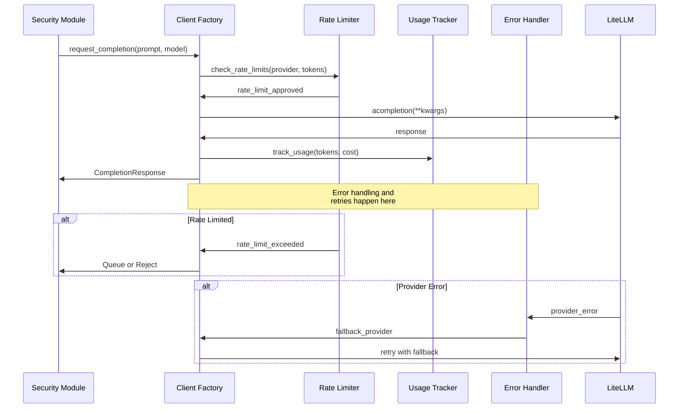
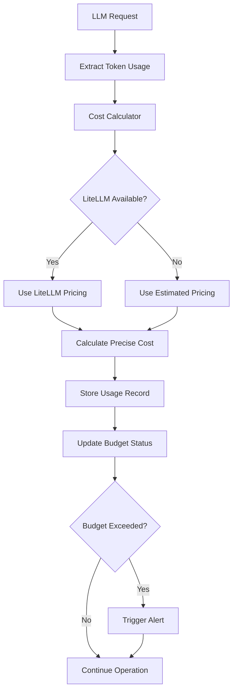
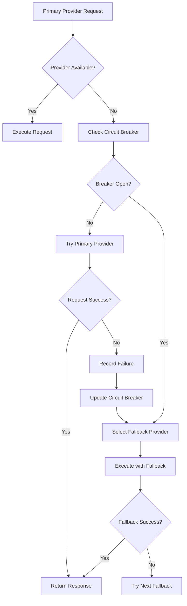

# LLM Integration System

## Overview

The Gibson LLM integration system (`gibson/core/llm/`) provides comprehensive Large Language Model capabilities through LiteLLM integration. It offers enterprise-grade features including multi-provider support, cost tracking, rate limiting, error handling, and advanced fallback mechanisms. The system is designed for production security testing workloads requiring reliable, cost-effective, and scalable AI operations.

## Architecture Components

### Core LLM Services

#### Client Factory (`client_factory.py`)
- **Primary Purpose**: Async LLM client creation and management with provider auto-detection
- **Key Features**: Connection pooling, health checking, circuit breakers, provider fallback
- **Integration Pattern**: Factory pattern with async context management and resource cleanup

#### Type System (`types.py`)
- **Primary Purpose**: Comprehensive type definitions for type-safe LLM operations
- **Key Features**: Pydantic models, protocol interfaces, enum definitions, response validation
- **Coverage**: Provider configs, request/response models, usage tracking, error types

#### Usage Tracking (`usage_tracking.py`)
- **Primary Purpose**: Cost monitoring and budget management for LLM operations
- **Key Features**: Real-time cost calculation, budget alerts, usage analytics, export capabilities
- **Storage**: Database persistence with trend analysis and reporting

#### Rate Limiting (`rate_limiting.py`)
- **Primary Purpose**: Token bucket rate limiting with provider-specific limits
- **Key Features**: Distributed limiting, request queuing, backpressure management, priority handling
- **Algorithms**: Token bucket, sliding window, concurrent request limiting

### LLM Integration Architecture



## Core Components Analysis

### LLM Client Factory

The `LLMClientFactory` provides comprehensive client management:

#### Factory Pattern Implementation
```python
class LLMClientFactory:
    """Production-ready async client factory for LiteLLM."""
    
    def __init__(
        self,
        default_timeout: float = 60.0,
        max_connections: int = 100,
        max_keepalive_connections: int = 20,
        pool_limits: Optional[httpx.Limits] = None,
    ):
        """Initialize with connection pooling and resource management."""
```

#### Provider Auto-Detection
```python
async def detect_providers(self) -> List[LLMProvider]:
    """Automatically detect available LLM providers from environment."""
    
    discovered_providers = []
    
    # Check environment variables for each provider
    if os.getenv("OPENAI_API_KEY"):
        discovered_providers.append(LLMProvider.OPENAI)
    
    if os.getenv("ANTHROPIC_API_KEY"):
        discovered_providers.append(LLMProvider.ANTHROPIC)
    
    if os.getenv("AZURE_OPENAI_API_KEY"):
        discovered_providers.append(LLMProvider.AZURE_OPENAI)
    
    return discovered_providers
```

#### Health Checking
```python
class HealthStatus(GibsonBaseModel):
    """Health status for an LLM provider."""
    
    provider: LLMProvider
    is_healthy: bool
    last_check: datetime
    response_time: Optional[float] = None
    error_message: Optional[str] = None
    consecutive_failures: int = 0

async def check_provider_health(self, provider: LLMProvider) -> HealthStatus:
    """Check health of specific provider with lightweight test request."""
```

#### Circuit Breaker Integration
```python
class CircuitBreakerState(GibsonBaseModel):
    """Circuit breaker state for provider failure handling."""
    
    is_open: bool = False
    failure_count: int = 0
    last_failure: Optional[datetime] = None
    next_retry: Optional[datetime] = None
    failure_threshold: int = 5
    recovery_timeout: int = 60

    def should_allow_request(self) -> bool:
        """Check if request should be allowed through circuit breaker."""
        if not self.is_open:
            return True
        
        if self.next_retry and datetime.utcnow() >= self.next_retry:
            return True  # Half-open state
        
        return False
```

### Type System

The comprehensive type system provides type safety across all LLM operations:

#### Provider Configuration Types
```python
class BaseProviderConfig(GibsonBaseModel):
    """Base configuration for all LLM providers."""
    
    provider: LLMProvider
    model: str
    api_key: Optional[str] = None
    api_base: Optional[str] = None
    timeout: float = 60.0
    max_retries: int = 3
    
class OpenAIConfig(BaseProviderConfig):
    """OpenAI-specific configuration."""
    
    provider: Literal[LLMProvider.OPENAI] = LLMProvider.OPENAI
    organization: Optional[str] = None
    project: Optional[str] = None

class AnthropicConfig(BaseProviderConfig):
    """Anthropic-specific configuration."""
    
    provider: Literal[LLMProvider.ANTHROPIC] = LLMProvider.ANTHROPIC
    default_headers: Dict[str, str] = Field(default_factory=dict)
```

#### Request/Response Models
```python
class CompletionRequest(GibsonBaseModel):
    """LLM completion request with validation."""
    
    model: str = Field(description="Model identifier")
    messages: List[ChatMessage] = Field(description="Conversation messages")
    temperature: float = Field(default=0.7, ge=0.0, le=2.0)
    max_tokens: Optional[int] = Field(default=None, gt=0)
    stream: bool = Field(default=False)
    
class CompletionResponse(GibsonBaseModel):
    """LLM completion response with metadata."""
    
    id: str = Field(description="Response ID")
    model: str = Field(description="Model used")
    choices: List[CompletionChoice] = Field(description="Generated choices")
    usage: Optional[TokenUsage] = Field(description="Token usage information")
    created: datetime = Field(description="Response timestamp")
```

#### Usage and Cost Models
```python
class UsageRecord(TimestampedModel):
    """Individual usage record for cost tracking."""
    
    id: UUID = Field(default_factory=uuid4)
    provider: LLMProvider
    model: str
    prompt_tokens: int = 0
    completion_tokens: int = 0
    total_tokens: int = 0
    estimated_cost: Decimal = Field(default=Decimal("0.00"))
    
    # Context information
    module_name: Optional[str] = None
    scan_id: Optional[str] = None
    target_id: Optional[UUID] = None
```

### Usage Tracking System

The usage tracking system provides comprehensive cost monitoring:

#### Cost Calculator
```python
class CostCalculator:
    """Calculate costs for LLM usage using LiteLLM pricing."""
    
    def __init__(self):
        self.pricing_data = self._load_pricing_data()
    
    async def calculate_cost(
        self, 
        provider: LLMProvider,
        model: str,
        prompt_tokens: int,
        completion_tokens: int
    ) -> Decimal:
        """Calculate cost for specific usage."""
        
        if LITELLM_AVAILABLE:
            # Use LiteLLM's built-in cost calculation
            cost = litellm.cost_calculator.completion_cost(
                model=f"{provider.value}/{model}",
                prompt_tokens=prompt_tokens,
                completion_tokens=completion_tokens
            )
            return Decimal(str(cost)).quantize(Decimal("0.0001"))
        
        # Fallback to estimated pricing
        return self._estimate_cost(provider, model, prompt_tokens, completion_tokens)
```

#### Budget Management
```python
class BudgetManager:
    """Manage budgets and alerts for LLM usage."""
    
    def __init__(self, usage_tracker: 'UsageTracker'):
        self.usage_tracker = usage_tracker
        self.budgets: Dict[str, Budget] = {}
        self.alert_callbacks: List[Callable] = []
    
    async def check_budget_status(
        self, 
        scope: str,
        budget_type: BudgetType
    ) -> BudgetStatus:
        """Check current budget status and trigger alerts."""
        
        current_usage = await self.usage_tracker.get_usage_for_scope(
            scope=scope,
            period=budget_type
        )
        
        budget = self.budgets.get(scope)
        if not budget:
            return BudgetStatus(status="no_budget", usage=current_usage)
        
        percentage = (current_usage.cost / budget.limit) * 100
        
        if percentage >= 100:
            await self._trigger_alert(scope, AlertLevel.CRITICAL, percentage)
            return BudgetStatus(status="exceeded", usage=current_usage, percentage=percentage)
        elif percentage >= 90:
            await self._trigger_alert(scope, AlertLevel.WARNING, percentage)
            return BudgetStatus(status="warning", usage=current_usage, percentage=percentage)
        
        return BudgetStatus(status="ok", usage=current_usage, percentage=percentage)
```

#### Usage Analytics
```python
class UsageReporter:
    """Generate usage reports and analytics."""
    
    async def generate_summary(
        self,
        start_date: datetime,
        end_date: datetime,
        groupby: List[str] = None
    ) -> UsageSummary:
        """Generate comprehensive usage summary."""
        
        usage_records = await self.usage_database.get_usage(
            start_date=start_date,
            end_date=end_date
        )
        
        return UsageSummary(
            period_start=start_date,
            period_end=end_date,
            total_requests=len(usage_records),
            total_tokens=sum(r.total_tokens for r in usage_records),
            total_cost=sum(r.estimated_cost for r in usage_records),
            by_provider=self._group_by_provider(usage_records),
            by_module=self._group_by_module(usage_records),
            by_model=self._group_by_model(usage_records),
            trends=await self._calculate_trends(usage_records)
        )
```

### Rate Limiting System

The rate limiting system implements multiple algorithms for fine-grained control:

#### Token Bucket Algorithm
```python
class TokenBucket:
    """Token bucket rate limiter implementation."""
    
    def __init__(
        self,
        capacity: int,
        refill_rate: float,  # tokens per second
        initial_tokens: Optional[int] = None
    ):
        self.capacity = capacity
        self.refill_rate = refill_rate
        self.tokens = initial_tokens or capacity
        self.last_refill = time.time()
    
    def acquire(self, tokens: int = 1) -> bool:
        """Attempt to acquire tokens from bucket."""
        self._refill()
        
        if self.tokens >= tokens:
            self.tokens -= tokens
            return True
        
        return False
    
    def _refill(self) -> None:
        """Refill tokens based on elapsed time."""
        now = time.time()
        elapsed = now - self.last_refill
        tokens_to_add = elapsed * self.refill_rate
        
        self.tokens = min(self.capacity, self.tokens + tokens_to_add)
        self.last_refill = now
```

#### Provider-Specific Limits
```python
PROVIDER_DEFAULTS = {
    LLMProvider.OPENAI: {
        "requests_per_minute": 3500,
        "tokens_per_minute": 90000,
        "concurrent_requests": 50,
    },
    LLMProvider.ANTHROPIC: {
        "requests_per_minute": 1000,
        "tokens_per_minute": 40000,
        "concurrent_requests": 20,
    },
    LLMProvider.AZURE_OPENAI: {
        "requests_per_minute": 1800,
        "tokens_per_minute": 120000,
        "concurrent_requests": 100,
    },
    LLMProvider.GOOGLE_AI: {
        "requests_per_minute": 1500,
        "tokens_per_minute": 32000,
        "concurrent_requests": 30,
    },
}
```

#### Request Queuing
```python
class RequestQueue:
    """Priority-based request queuing with backpressure handling."""
    
    def __init__(self, max_size: int = 1000):
        self.max_size = max_size
        self.queues = {
            Priority.CRITICAL: asyncio.Queue(),
            Priority.HIGH: asyncio.Queue(),
            Priority.NORMAL: asyncio.Queue(),
            Priority.LOW: asyncio.Queue(),
        }
    
    async def enqueue(
        self, 
        request: QueuedRequest, 
        priority: Priority = Priority.NORMAL
    ) -> bool:
        """Enqueue request with priority handling."""
        if self.total_size >= self.max_size:
            return False  # Queue full
        
        queue = self.queues[priority]
        await queue.put(request)
        return True
    
    async def dequeue(self) -> Optional[QueuedRequest]:
        """Dequeue highest priority request."""
        # Process in priority order
        for priority in [Priority.CRITICAL, Priority.HIGH, Priority.NORMAL, Priority.LOW]:
            queue = self.queues[priority]
            if not queue.empty():
                return await queue.get()
        
        return None
```

## Integration Flow Patterns

### Standard LLM Request Flow



### Cost Tracking Flow



### Provider Fallback Flow



## Configuration and Customization

### Provider Configuration
```yaml
llm:
  providers:
    openai:
      enabled: true
      model: "gpt-4o"
      api_key: "${OPENAI_API_KEY}"
      max_tokens: 4000
      temperature: 0.7
      timeout: 60
      rate_limits:
        requests_per_minute: 3500
        tokens_per_minute: 90000
    
    anthropic:
      enabled: true
      model: "claude-3-5-sonnet-20241022"
      api_key: "${ANTHROPIC_API_KEY}"
      max_tokens: 4000
      temperature: 0.7
      timeout: 60
      rate_limits:
        requests_per_minute: 1000
        tokens_per_minute: 40000
    
    azure_openai:
      enabled: false
      api_key: "${AZURE_OPENAI_API_KEY}"
      api_base: "${AZURE_OPENAI_ENDPOINT}"
      api_version: "2024-02-15-preview"
      deployment_name: "gpt-4"
```

### Budget Configuration
```yaml
llm:
  budgets:
    daily:
      limit: 50.00
      currency: "USD"
      alerts:
        - threshold: 75
          level: "warning"
        - threshold: 90
          level: "critical"
    
    monthly:
      limit: 1000.00
      currency: "USD"
      alerts:
        - threshold: 80
          level: "warning"
        - threshold: 95
          level: "critical"
```

### Rate Limiting Configuration
```yaml
llm:
  rate_limiting:
    algorithm: "token_bucket"
    default_limits:
      requests_per_minute: 1000
      tokens_per_minute: 50000
      concurrent_requests: 20
    
    backpressure:
      queue_size: 1000
      timeout: 30
      strategy: "queue"  # queue, reject, throttle, circuit_break
    
    circuit_breaker:
      failure_threshold: 5
      recovery_timeout: 60
      half_open_requests: 3
```

## Performance Characteristics

### Request Performance
- **Connection Pooling**: Persistent HTTP connections reduce latency
- **Async Operations**: Non-blocking I/O for high concurrency
- **Request Queuing**: ~1ms queue operations for smooth traffic shaping
- **Rate Limiting**: <1ms token bucket operations

### Cost Tracking Performance
- **Real-time Calculation**: <5ms per request cost calculation
- **Database Storage**: Async batch operations for high throughput
- **Memory Usage**: Minimal overhead with efficient data structures
- **Aggregation**: Optimized queries for trend analysis

### Error Handling Performance
- **Circuit Breaker**: <1ms state checks
- **Fallback Selection**: <10ms provider selection with health scoring
- **Retry Logic**: Exponential backoff with jitter for optimal recovery

## Security and Reliability

### Security Features
- **API Key Management**: Secure credential storage and rotation
- **Request Validation**: Input sanitization and size limits
- **Provider Isolation**: Separate credential contexts per provider
- **Audit Logging**: Complete request/response logging for security analysis

### Reliability Features
- **Circuit Breakers**: Automatic failure isolation
- **Health Monitoring**: Continuous provider health assessment
- **Graceful Degradation**: System continues with reduced capability
- **Resource Protection**: Memory and connection limits prevent exhaustion

### Monitoring and Observability
- **Metrics Collection**: Request rates, error rates, response times
- **Cost Tracking**: Real-time spend monitoring with alerts
- **Performance Analytics**: Latency percentiles and throughput metrics
- **Provider Statistics**: Per-provider success rates and health scores

## Usage Examples

### Basic LLM Client Usage
```python
from gibson.core.llm import create_llm_client_factory, CompletionRequest

# Initialize client factory
client_factory = await create_llm_client_factory()

# Create completion request
request = CompletionRequest(
    model="gpt-4o",
    messages=[
        {"role": "system", "content": "You are a security testing assistant."},
        {"role": "user", "content": "Analyze this API endpoint for vulnerabilities: /api/users/{id}"}
    ],
    temperature=0.1,
    max_tokens=2000
)

# Execute request with automatic provider selection
response = await client_factory.complete(request)

print(f"Response: {response.choices[0].message.content}")
print(f"Tokens used: {response.usage.total_tokens}")
print(f"Cost: ${response.usage.estimated_cost}")
```

### Advanced Usage with Cost Tracking
```python
from gibson.core.llm import (
    create_llm_client_factory,
    create_usage_tracker,
    BudgetManager,
    BudgetType
)

# Initialize components
client_factory = await create_llm_client_factory()
usage_tracker = await create_usage_tracker()
budget_manager = BudgetManager(usage_tracker)

# Set daily budget
await budget_manager.set_budget("daily", BudgetType.DAILY, Decimal("50.00"))

# Check budget before expensive operation
budget_status = await budget_manager.check_budget_status("daily", BudgetType.DAILY)
if budget_status.status == "exceeded":
    raise Exception("Daily budget exceeded")

# Execute request with usage tracking
response = await client_factory.complete(request)

# Track usage automatically happens in background
usage_summary = await usage_tracker.get_summary(
    start_date=datetime.now() - timedelta(days=1),
    end_date=datetime.now()
)

print(f"Today's usage: ${usage_summary.total_cost}")
print(f"Requests made: {usage_summary.total_requests}")
```

### Provider Fallback Configuration
```python
from gibson.core.llm import (
    LLMProvider,
    FallbackManager,
    LoadBalancingStrategy
)

# Configure provider fallback chain
fallback_config = {
    "primary": LLMProvider.OPENAI,
    "fallbacks": [
        {"provider": LLMProvider.ANTHROPIC, "weight": 0.8},
        {"provider": LLMProvider.AZURE_OPENAI, "weight": 0.6},
        {"provider": LLMProvider.GOOGLE_AI, "weight": 0.4},
    ],
    "strategy": LoadBalancingStrategy.HEALTH_WEIGHTED
}

fallback_manager = FallbackManager(fallback_config)

# Request automatically uses fallback on provider failures
response = await fallback_manager.complete_with_fallback(request)
```

This LLM integration system provides enterprise-grade AI capabilities for Gibson's security testing framework while maintaining cost control, reliability, and performance at scale.