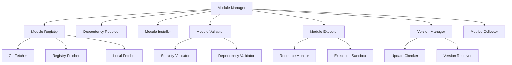
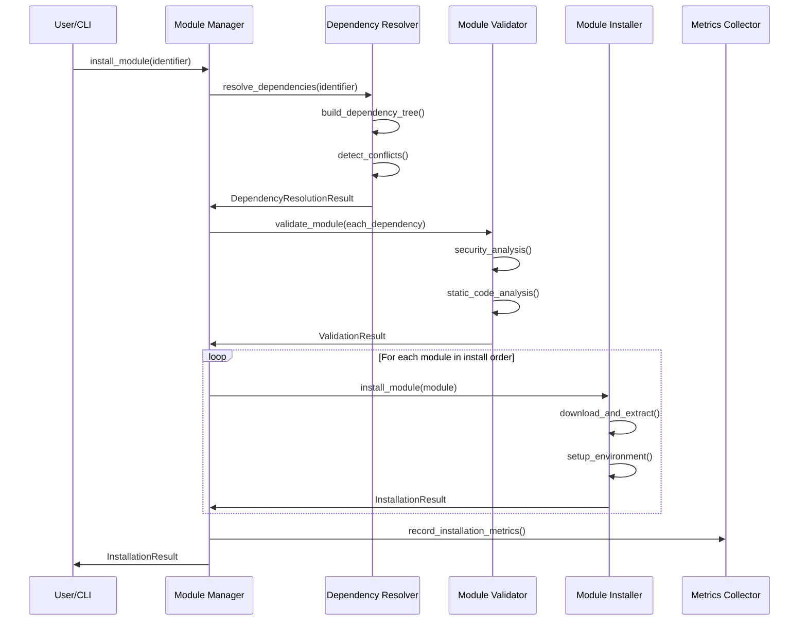
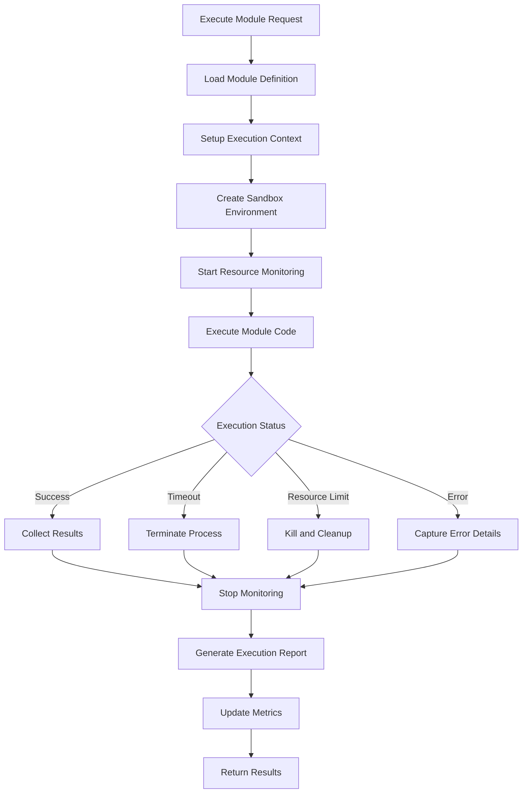
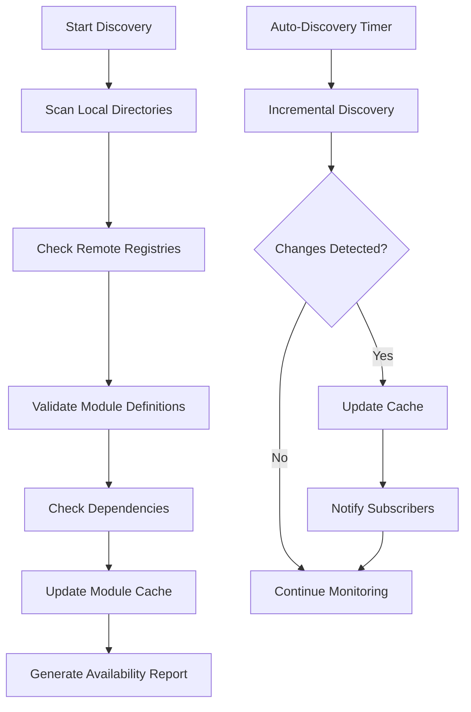

# Module Management System

## Overview

The Gibson Module Management System (`gibson/core/module_management/`) provides comprehensive lifecycle management for security testing modules. It handles module discovery, installation, dependency resolution, validation, execution orchestration, and performance monitoring. The system supports multiple module sources including Git repositories, package registries, and local development, with robust security validation and resource management.

## Architecture Components

### Core Management Services

#### Module Manager (`manager.py`)
- **Primary Purpose**: Central orchestrator for all module operations
- **Key Features**: Module discovery, installation coordination, dependency resolution, execution management
- **Integration Pattern**: Factory pattern with async lifecycle management and configuration-driven operation

#### Module Registry (`registry.py`)
- **Primary Purpose**: Module source management and metadata tracking
- **Key Features**: Multi-source support, version tracking, availability monitoring, search capabilities
- **Sources**: Git repositories, package registries, local directories, remote catalogs

#### Module Validator (`validator.py` & `security_validator.py`)
- **Primary Purpose**: Comprehensive module validation and security analysis
- **Key Features**: Static code analysis, security issue detection, permission auditing, risk assessment
- **Validation Types**: Syntax validation, dependency analysis, security scanning, resource analysis

#### Module Executor (`executor.py`)
- **Primary Purpose**: Safe module execution with resource limits and monitoring
- **Key Features**: Sandboxed execution, resource monitoring, timeout handling, performance tracking
- **Safety Measures**: Memory limits, CPU throttling, network isolation, filesystem restrictions

### Module Management Architecture



## Core Components Analysis

### Module Manager

The `ModuleManager` class orchestrates all module operations:

#### Initialization and Configuration
```python
class ModuleManager:
    """Orchestrates all module management operations."""
    
    def __init__(self, config_path: Optional[Path] = None, modules_dir: Optional[Path] = None):
        """Initialize module manager with configuration."""
        
        # Load hierarchical configuration
        self.config = self._load_config(config_path)
        
        # Initialize component ecosystem
        self.dependency_resolver = DependencyResolver()
        self.installer = ModuleInstaller(install_dir=self.modules_dir)
        self.executor = ModuleExecutor(
            max_execution_time=self.config["execution"]["max_execution_time"],
            max_memory_mb=self.config["execution"]["max_memory_mb"],
            max_cpu_percent=self.config["execution"]["max_cpu_percent"],
        )
        self.version_manager = VersionManager()
        self.metrics_collector = MetricsCollector()
```

#### Module Discovery
```python
async def discover_modules(self) -> Dict[str, ModuleDefinitionModel]:
    """Discover all available modules from configured sources."""
    
    discovered = {}
    
    # Scan configured module directories
    for scan_path in self.config["discovery"]["scan_paths"]:
        path = Path(scan_path).expanduser()
        if path.exists():
            modules = await self._scan_directory(path)
            discovered.update(modules)
    
    # Discover from remote registries
    registry_modules = await self.version_manager.discover_remote_modules()
    discovered.update(registry_modules)
    
    # Update module cache
    self._module_cache.update(discovered)
    
    return discovered
```

#### Module Installation Orchestration
```python
async def install_module(
    self, 
    module_identifier: str, 
    options: ModuleInstallOptions = None
) -> InstallationResult:
    """Install a module with comprehensive validation and dependency resolution."""
    
    try:
        # 1. Resolve module and dependencies
        resolution_result = await self.dependency_resolver.resolve(
            module_identifier, options
        )
        
        if not resolution_result.success:
            return InstallationResult(
                success=False, 
                errors=resolution_result.errors,
                module_id=module_identifier
            )
        
        # 2. Validate all modules before installation
        validation_results = []
        for module in resolution_result.modules:
            validation = await self._validate_module(module)
            validation_results.append(validation)
            
            if not validation.valid and not options.force_install:
                return InstallationResult(
                    success=False,
                    errors=[f"Module validation failed: {validation.errors}"],
                    module_id=module_identifier
                )
        
        # 3. Install modules in dependency order
        installed_modules = []
        for module in resolution_result.install_order:
            install_result = await self.installer.install(module, options)
            
            if install_result.success:
                installed_modules.append(module)
                await self.metrics_collector.record_installation(module)
            else:
                # Rollback on failure
                await self._rollback_installation(installed_modules)
                return install_result
        
        return InstallationResult(
            success=True,
            installed_modules=installed_modules,
            validation_results=validation_results,
            module_id=module_identifier
        )
        
    except Exception as e:
        logger.error(f"Module installation failed: {e}")
        return InstallationResult(
            success=False, 
            errors=[str(e)],
            module_id=module_identifier
        )
```

### Module Validation System

The validation system provides comprehensive security and quality analysis:

#### Security Validation
```python
class SecurityValidator:
    """Validates modules for security issues and risks."""
    
    DANGEROUS_IMPORTS = {
        'os': ['system', 'popen', 'execv', 'execl', 'spawn'],
        'subprocess': ['run', 'call', 'Popen', 'check_output'],
        'eval': ['eval', 'exec', 'compile'],
        'importlib': ['import_module', '__import__'],
        'socket': ['socket', 'create_connection'],
        'urllib': ['urlopen', 'request'],
        'requests': ['get', 'post', 'put', 'delete'],
    }
    
    async def validate_security(self, module_path: Path) -> ValidationResult:
        """Perform comprehensive security analysis."""
        
        issues = []
        warnings = []
        
        # Static code analysis
        ast_tree = self._parse_module(module_path)
        
        # Check for dangerous imports
        dangerous_imports = self._check_dangerous_imports(ast_tree)
        issues.extend(dangerous_imports)
        
        # Check for privilege escalation attempts
        privilege_issues = self._check_privilege_escalation(ast_tree)
        issues.extend(privilege_issues)
        
        # Check for file system access patterns
        fs_issues = self._check_filesystem_access(ast_tree)
        issues.extend(fs_issues)
        
        # Check for network access patterns
        network_issues = self._check_network_access(ast_tree)
        issues.extend(network_issues)
        
        # Determine overall risk level
        risk_level = self._calculate_risk_level(issues)
        
        return ValidationResult(
            valid=len([i for i in issues if i.severity == "critical"]) == 0,
            security_issues=issues,
            warnings=warnings,
            risk_level=risk_level,
            validation_time=time.time() - start_time
        )
```

#### Dependency Validation
```python
class DependencyResolver:
    """Resolves module dependencies with conflict detection."""
    
    async def resolve(
        self, 
        module_identifier: str, 
        options: ModuleInstallOptions
    ) -> DependencyResolutionResult:
        """Resolve dependencies with circular dependency detection."""
        
        resolution_graph = DependencyGraph()
        resolved_modules = []
        
        try:
            # Build dependency tree
            await self._build_dependency_tree(
                module_identifier, resolution_graph, set()
            )
            
            # Check for circular dependencies
            cycles = resolution_graph.find_cycles()
            if cycles:
                return DependencyResolutionResult(
                    success=False,
                    errors=[f"Circular dependency detected: {' -> '.join(cycle)}" for cycle in cycles]
                )
            
            # Resolve version conflicts
            version_conflicts = self._detect_version_conflicts(resolution_graph)
            if version_conflicts and not options.resolve_conflicts:
                return DependencyResolutionResult(
                    success=False,
                    errors=[f"Version conflict: {conflict}" for conflict in version_conflicts]
                )
            
            # Generate installation order
            install_order = resolution_graph.topological_sort()
            
            return DependencyResolutionResult(
                success=True,
                modules=resolved_modules,
                install_order=install_order,
                dependency_graph=resolution_graph
            )
            
        except Exception as e:
            return DependencyResolutionResult(
                success=False,
                errors=[f"Dependency resolution failed: {e}"]
            )
```

### Module Execution System

The execution system provides safe, monitored module execution:

#### Resource-Limited Execution
```python
class ModuleExecutor:
    """Execute modules with resource limits and monitoring."""
    
    def __init__(
        self,
        modules_dir: Path,
        max_execution_time: int = 300,
        max_memory_mb: int = 512,
        max_cpu_percent: int = 80
    ):
        self.modules_dir = modules_dir
        self.max_execution_time = max_execution_time
        self.max_memory_mb = max_memory_mb
        self.max_cpu_percent = max_cpu_percent
        self.resource_monitor = ResourceMonitor()
    
    async def execute_module(
        self,
        module: ModuleDefinitionModel,
        context: ModuleExecutionContextModel
    ) -> ModuleResultModel:
        """Execute module with comprehensive monitoring."""
        
        execution_id = str(uuid4())
        start_time = datetime.utcnow()
        
        try:
            # Setup execution environment
            execution_env = await self._setup_execution_environment(module)
            
            # Start resource monitoring
            monitor_task = asyncio.create_task(
                self.resource_monitor.monitor_execution(
                    execution_id, 
                    self.max_memory_mb, 
                    self.max_cpu_percent
                )
            )
            
            # Execute module with timeout
            result = await asyncio.wait_for(
                self._execute_in_sandbox(module, context, execution_env),
                timeout=self.max_execution_time
            )
            
            # Stop monitoring
            monitor_task.cancel()
            execution_stats = await self.resource_monitor.get_stats(execution_id)
            
            return ModuleResultModel(
                module_id=module.id,
                execution_id=execution_id,
                status=ExecutionStatus.COMPLETED,
                result=result,
                execution_time=(datetime.utcnow() - start_time).total_seconds(),
                resource_usage=execution_stats,
                started_at=start_time,
                completed_at=datetime.utcnow()
            )
            
        except asyncio.TimeoutError:
            return ModuleResultModel(
                module_id=module.id,
                execution_id=execution_id,
                status=ExecutionStatus.TIMEOUT,
                error="Module execution exceeded time limit",
                execution_time=self.max_execution_time,
                started_at=start_time,
                completed_at=datetime.utcnow()
            )
            
        except ResourceLimitExceededError as e:
            return ModuleResultModel(
                module_id=module.id,
                execution_id=execution_id,
                status=ExecutionStatus.RESOURCE_LIMIT_EXCEEDED,
                error=f"Resource limit exceeded: {e}",
                execution_time=(datetime.utcnow() - start_time).total_seconds(),
                started_at=start_time,
                completed_at=datetime.utcnow()
            )
```

#### Execution Sandbox
```python
async def _execute_in_sandbox(
    self,
    module: ModuleDefinitionModel,
    context: ModuleExecutionContextModel,
    execution_env: Dict[str, Any]
) -> Any:
    """Execute module in isolated sandbox environment."""
    
    # Create isolated process
    sandbox_process = await self._create_sandbox_process(execution_env)
    
    # Setup module-specific environment
    module_env = {
        'GIBSON_MODULE_ID': module.id,
        'GIBSON_MODULE_NAME': module.name,
        'GIBSON_EXECUTION_ID': context.execution_id,
        'GIBSON_TARGET_URL': context.target.url if context.target else None,
        'GIBSON_MODULE_CONFIG': json.dumps(context.config),
        **execution_env
    }
    
    # Load and execute module
    module_path = self.modules_dir / module.id / "main.py"
    
    if not module_path.exists():
        raise ModuleExecutionError(f"Module main file not found: {module_path}")
    
    # Execute with restricted environment
    result = await sandbox_process.run_python_script(
        script_path=module_path,
        environment=module_env,
        working_directory=self.modules_dir / module.id,
        restrictions={
            'network_access': module.permissions.network_access,
            'filesystem_access': module.permissions.filesystem_access,
            'subprocess_access': module.permissions.subprocess_access,
        }
    )
    
    return result
```

## Data Flow Patterns

### Module Installation Flow



### Module Execution Flow



### Module Discovery Flow



## Configuration and Customization

### Module Management Configuration
```yaml
module_management:
  installation:
    base_dir: "~/.gibson/modules"
    backup_dir: "~/.gibson/modules/.backups"
    auto_backup: true
    parallel_installs: 3
    
  execution:
    max_execution_time: 300      # 5 minutes
    max_memory_mb: 512          # 512 MB RAM limit
    max_cpu_percent: 80         # 80% CPU usage limit
    sandbox_enabled: true
    network_isolation: true
    filesystem_restrictions: true
    
  registry:
    url: "https://registry.gibson.ai/api/v1"
    auth_token: "${GIBSON_REGISTRY_TOKEN}"
    cache_ttl: 3600            # 1 hour cache
    sources:
      - name: "official"
        url: "https://github.com/gibson-ai/modules"
        priority: 100
      - name: "community"  
        url: "https://github.com/gibson-ai/community-modules"
        priority: 50
        
  cache:
    directory: "~/.gibson/cache/modules"
    max_size_mb: 1024          # 1 GB cache limit
    cleanup_interval: 86400    # Daily cleanup
    
  discovery:
    auto_discover: true
    discovery_interval: 3600   # Hourly discovery
    scan_paths:
      - "~/.gibson/modules"
      - "./gibson/core/modules"
      - "./custom_modules"
      
  validation:
    security_enabled: true
    strict_mode: false
    allow_dangerous_imports: false
    require_signed_modules: false
    
  metrics:
    enabled: true
    metrics_dir: "~/.gibson/metrics"
    persist_interval: 300      # 5 minutes
    retention_days: 30
```

### Module Definition Schema
```yaml
# module.yaml - Module definition file
name: "sql-injection-scanner"
version: "1.2.0"
description: "Advanced SQL injection vulnerability scanner"
author: "Gibson Security Team"
license: "MIT"

domain: "prompt"
category: "injection"
tags: ["sql", "injection", "database", "web"]

# Module dependencies
dependencies:
  gibson_core: ">=1.0.0"
  requests: ">=2.25.0"
  sqlparse: ">=0.4.0"
  
# Required permissions
permissions:
  network_access: true
  filesystem_access: false
  subprocess_access: false
  environment_access: ["HTTP_PROXY", "HTTPS_PROXY"]

# Module configuration schema
config_schema:
  type: "object"
  properties:
    payloads_file:
      type: "string"
      description: "Path to SQL injection payloads"
      default: "payloads/sql_injection.txt"
    timeout:
      type: "integer"
      description: "Request timeout in seconds"
      default: 30
      minimum: 1
      maximum: 300
    max_payloads:
      type: "integer" 
      description: "Maximum payloads to test"
      default: 100
      minimum: 1
      maximum: 1000

# Execution requirements
runtime:
  python_version: ">=3.8"
  memory_limit_mb: 256
  execution_timeout: 180
  
# Module metadata
metadata:
  homepage: "https://github.com/gibson-ai/modules/sql-injection-scanner"
  documentation: "https://docs.gibson.ai/modules/sql-injection-scanner"
  issues: "https://github.com/gibson-ai/modules/issues"
  created_at: "2024-01-15T10:00:00Z"
  updated_at: "2024-03-20T14:30:00Z"
```

## Performance Characteristics

### Module Discovery Performance
- **Local Directory Scan**: ~50-100ms per directory
- **Remote Registry Lookup**: ~200-500ms per registry
- **Cache Hit Ratio**: 90%+ for repeated lookups
- **Incremental Discovery**: ~10-20ms for change detection

### Installation Performance
- **Dependency Resolution**: ~100-300ms for typical modules
- **Module Download**: Network dependent, ~1-5MB average
- **Validation Processing**: ~50-200ms per module
- **Installation Time**: ~1-3 seconds total per module

### Execution Performance  
- **Sandbox Setup**: ~100-200ms initialization
- **Resource Monitoring**: ~1% CPU overhead
- **Module Execution**: Module dependent
- **Result Collection**: ~10-50ms post-processing

### Memory Usage
- **Module Manager**: ~50-100MB base memory
- **Module Cache**: ~1-5MB per cached module
- **Execution Sandbox**: Configurable limits (default 512MB)
- **Monitoring Overhead**: ~10-20MB per active execution

## Security and Safety Features

### Security Validation
- **Static Code Analysis**: AST-based security scanning
- **Import Analysis**: Detection of dangerous Python imports
- **Permission Auditing**: Required capability analysis
- **Signature Verification**: Optional module signing validation

### Execution Safety
- **Resource Limits**: Memory, CPU, and time constraints
- **Network Isolation**: Optional network access restriction
- **Filesystem Sandbox**: Restricted file system access
- **Process Isolation**: Separate process execution

### Dependency Security
- **Circular Dependency Detection**: Prevent infinite loops
- **Version Conflict Resolution**: Automatic conflict resolution
- **Supply Chain Validation**: Dependency source verification
- **License Compliance**: License compatibility checking

## Error Handling and Recovery

### Module Management Errors
```python
class ModuleManagementError(Exception):
    """Base exception for module management operations."""
    pass

class ModuleNotFoundError(ModuleManagementError):
    """Raised when a requested module cannot be found."""
    pass

class ModuleInstallationError(ModuleManagementError):
    """Raised when module installation fails."""
    pass

class DependencyError(ModuleManagementError):
    """Raised when dependency resolution fails."""
    pass

class ModuleValidationError(ModuleManagementError):
    """Raised when module validation fails."""
    pass

class ModuleExecutionError(ModuleManagementError):
    """Raised when module execution fails."""
    pass
```

### Recovery Strategies
- **Installation Rollback**: Automatic rollback on installation failure
- **Dependency Fallback**: Alternative dependency resolution
- **Execution Retry**: Configurable retry logic for transient failures
- **Cache Recovery**: Automatic cache rebuilding on corruption

## Integration Points

### CLI Integration
```python
# Command-level module operations
@app.command()
async def install_module(
    module_name: str,
    version: Optional[str] = None,
    force: bool = typer.Option(False, "--force"),
    module_manager: ModuleManager = Depends(get_module_manager)
):
    """Install a security module."""
    
    options = ModuleInstallOptions(
        version=version,
        force_install=force,
        include_dev_dependencies=False
    )
    
    result = await module_manager.install_module(module_name, options)
    
    if result.success:
        console.print(f"✓ Module {module_name} installed successfully")
    else:
        console.print(f"✗ Installation failed: {result.errors}")
```

### Core System Integration
```python
# Base orchestrator integration
class Base:
    async def _initialize_module_manager(self) -> None:
        """Initialize module management system."""
        
        self.module_manager = ModuleManager(
            config_path=self.config.module_management.config_path,
            modules_dir=self.config.module_management.modules_dir
        )
        
        await self.module_manager.initialize()
        
        # Discover and validate available modules
        self.available_modules = await self.module_manager.discover_modules()
```

## Usage Examples

### Basic Module Management
```python
from gibson.core.module_management import ModuleManager, ModuleInstallOptions

# Initialize module manager
module_manager = ModuleManager()
await module_manager.initialize()

# Install a module with dependencies
options = ModuleInstallOptions(
    version=">=1.0.0",
    include_dev_dependencies=False,
    force_install=False
)

result = await module_manager.install_module("sql-injection-scanner", options)
if result.success:
    print(f"Installed {len(result.installed_modules)} modules")
else:
    print(f"Installation failed: {result.errors}")

# List available modules
modules = await module_manager.list_available_modules()
for module in modules:
    print(f"{module.name} v{module.version} - {module.description}")
```

### Module Execution
```python
from gibson.core.module_management import ModuleManager
from gibson.models.module import ModuleExecutionContextModel
from gibson.models.domain import TargetModel

# Setup execution context
target = TargetModel(url="https://api.example.com", name="Test API")
context = ModuleExecutionContextModel(
    target=target,
    config={"timeout": 30, "max_payloads": 50},
    execution_id=str(uuid4())
)

# Execute module
module = await module_manager.get_module("sql-injection-scanner")
result = await module_manager.execute_module(module, context)

if result.status == ExecutionStatus.COMPLETED:
    print(f"Module completed in {result.execution_time:.2f}s")
    print(f"Findings: {result.result}")
else:
    print(f"Execution failed: {result.error}")
```

### Custom Module Development
```python
# custom_module/main.py - Custom security module
from gibson.core.modules.base import BaseModule
from gibson.models.domain import TargetModel
from gibson.models.findings import Finding, Severity

class CustomSecurityModule(BaseModule):
    """Custom security testing module."""
    
    def __init__(self):
        super().__init__(
            name="custom-security-test",
            version="1.0.0",
            description="Custom security testing module"
        )
    
    async def run(self, target: TargetModel) -> List[Finding]:
        """Execute security test against target."""
        
        # Custom security testing logic
        findings = []
        
        # Perform security analysis
        if await self.check_vulnerability(target):
            finding = Finding(
                title="Custom Vulnerability Detected",
                description="Custom security issue found",
                severity=Severity.HIGH,
                target_url=target.url,
                evidence={"test_result": "vulnerable"}
            )
            findings.append(finding)
        
        return findings
    
    async def check_vulnerability(self, target: TargetModel) -> bool:
        """Custom vulnerability check logic."""
        # Implementation here
        return False
```

This module management system provides comprehensive lifecycle management for Gibson's security testing modules while maintaining security, performance, and reliability standards for production deployments.