# Gibson Framework Data Flow Documentation

## Overview

This documentation provides comprehensive analysis of data flow patterns throughout the Gibson framework. It traces how data moves from initial user input through all system components, showing transformations, storage patterns, integration points, and output generation.

## Data Flow Architecture

### High-Level Data Movement

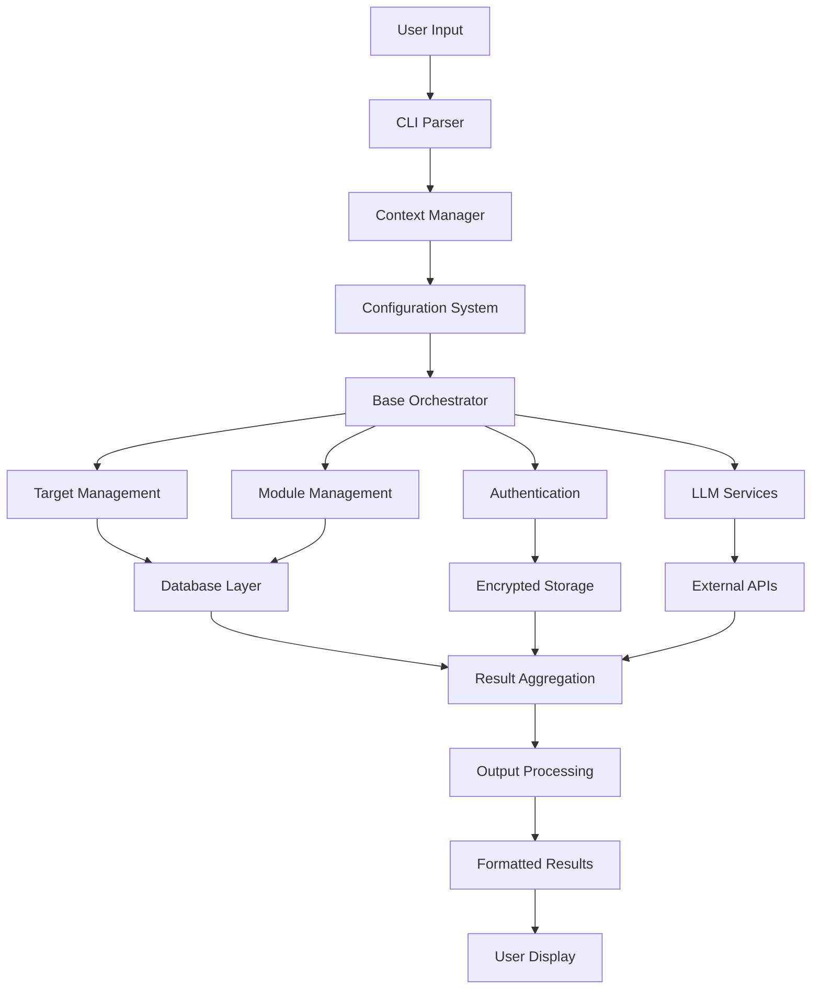

## Core Data Types and Flow Patterns

### 1. Configuration Data Flow

Configuration data flows through multiple layers with hierarchical precedence:

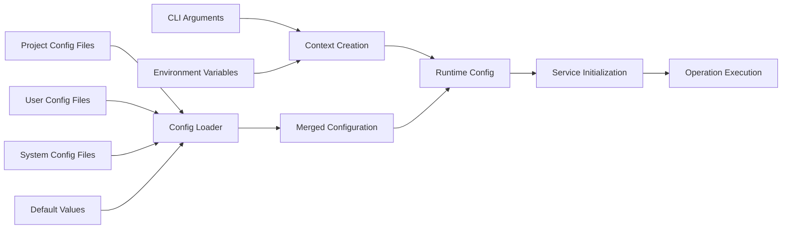

**Data Transformations:**
- CLI flags override configuration file values
- Environment variables provide runtime overrides
- Pydantic models validate and normalize all configuration
- Type conversion ensures consistent data types

**File References:**
- Input: `gibson/cli/commands/*.py` (CLI parameters)
- Processing: `gibson/core/config.py` (configuration merging)
- Output: Service-specific configuration objects

### 2. Target Data Flow

Target information flows from user input through validation to execution:

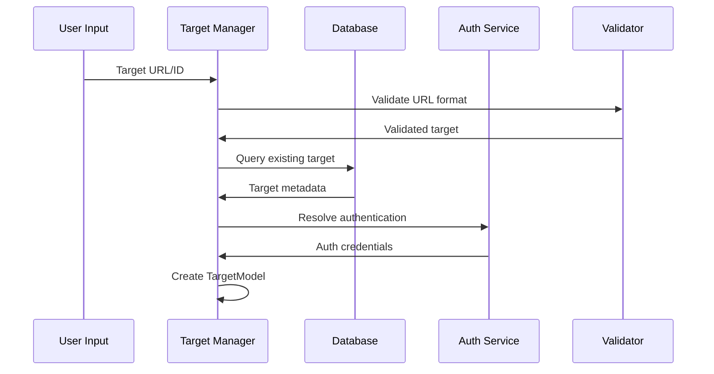

**Data Structure Evolution:**
```python
# Input: Raw URL string
raw_url = "https://api.example.com/v1"

# Stage 1: Parsed URL components
parsed_url = ParsedURL(
    scheme="https",
    host="api.example.com",
    path="/v1",
    port=443
)

# Stage 2: Target model creation
target = TargetModel(
    id=UUID("12345678-1234-5678-9012-123456789012"),
    url="https://api.example.com/v1",
    name="Example API",
    base_url="https://api.example.com",
    authentication_type=AuthenticationType.API_KEY
)

# Stage 3: Enriched with authentication
target.authentication = ApiKeyCredential(
    token="sk-...",
    key_format=ApiKeyFormat.BEARER_TOKEN,
    validation_status=ValidationStatus.VALID
)

# Stage 4: Database persistence
target_db = TargetDB(
    id=target.id,
    url=target.url,
    name=target.name,
    auth_data=encrypt(target.authentication),
    created_at=datetime.utcnow(),
    updated_at=datetime.utcnow()
)
```

### 3. Module Data Flow

Module data flows through discovery, selection, and execution phases:

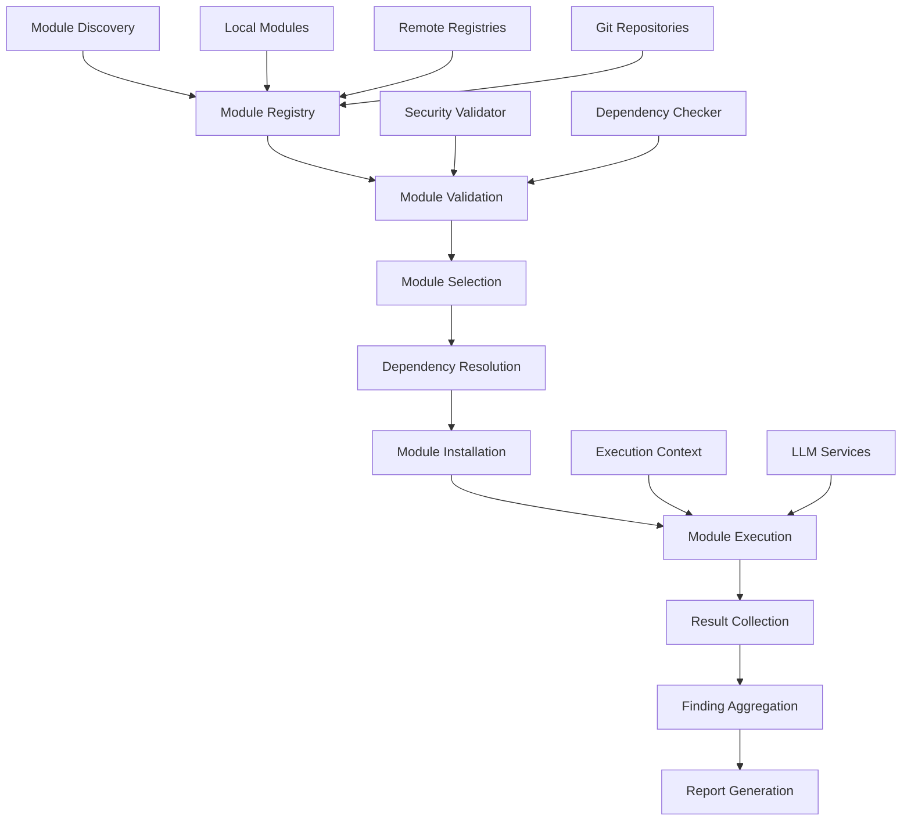

**Module Execution Data Flow:**
```python
# Input: Module selection criteria
module_criteria = ModuleFilter(
    domain=AttackDomain.PROMPT,
    tags=["sql-injection", "web"],
    min_version="1.0.0"
)

# Stage 1: Module discovery
discovered_modules = {
    "sql-injection-scanner": ModuleDefinition(
        name="sql-injection-scanner",
        version="1.2.0",
        domain=AttackDomain.PROMPT,
        config_schema={...}
    )
}

# Stage 2: Module selection and validation
selected_modules = [
    ValidatedModule(
        definition=discovered_modules["sql-injection-scanner"],
        validation_result=ValidationResult(
            valid=True,
            risk_level="medium",
            security_issues=[]
        )
    )
]

# Stage 3: Execution context creation
execution_context = ModuleExecutionContext(
    module_id="sql-injection-scanner",
    target=target,
    config={"timeout": 30, "max_payloads": 100},
    llm_client=llm_client_factory.create_client()
)

# Stage 4: Execution results
module_result = ModuleResult(
    module_id="sql-injection-scanner",
    findings=[
        Finding(
            title="SQL Injection Vulnerability",
            severity=Severity.HIGH,
            description="SQL injection found in /api/users",
            evidence={"payload": "' OR 1=1--", "response_diff": "..."}
        )
    ],
    execution_time=45.2,
    llm_usage={"requests": 5, "tokens": 1250, "cost": 0.0025}
)
```

### 4. Authentication Data Flow

Authentication data requires special handling for security:

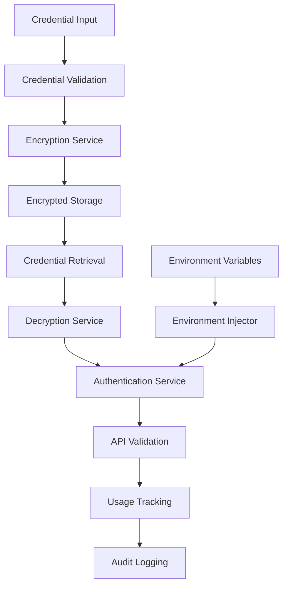

**Secure Data Transformations:**
```python
# Input: Raw API key
raw_key = "sk-1234567890abcdef1234567890abcdef"

# Stage 1: Credential model creation
credential = ApiKeyCredential(
    token=raw_key,
    key_format=ApiKeyFormat.OPENAI_FORMAT,
    validation_status=ValidationStatus.UNTESTED,
    created_at=datetime.utcnow()
)

# Stage 2: Encryption for storage
encrypted_data = CredentialEncryption.encrypt(
    data=credential.model_dump_json(),
    target_id=str(target.id),
    master_key=encryption_master_key
)

# Stage 3: Database storage
credential_db = EncryptedCredential(
    target_id=target.id,
    encrypted_data=encrypted_data,
    key_id=encryption_key_id,
    created_at=datetime.utcnow()
)

# Stage 4: Metadata tracking (non-sensitive)
metadata = CredentialMetadata(
    target_id=target.id,
    key_format=credential.key_format,
    masked_key="sk-****cdef",
    validation_status=ValidationStatus.VALID,
    last_validated=datetime.utcnow()
)
```

### 5. LLM Data Flow

LLM integration involves request/response cycles with cost tracking:

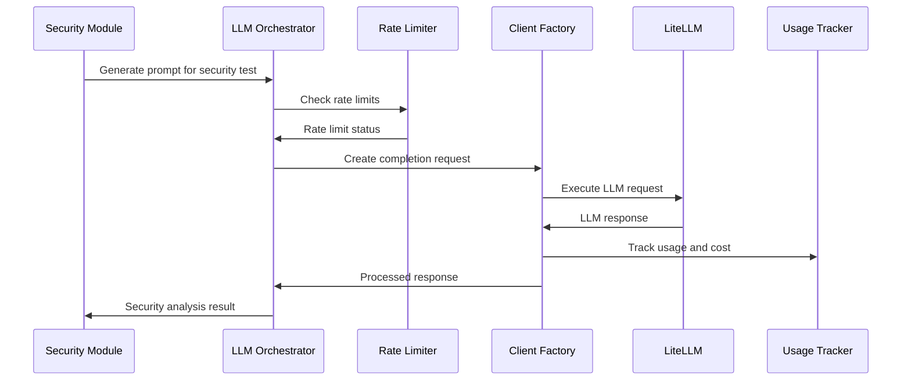

**LLM Request/Response Data Flow:**
```python
# Stage 1: Security module generates prompt
prompt_data = SecurityPrompt(
    template="Analyze this API endpoint for vulnerabilities: {endpoint}",
    variables={"endpoint": "/api/users/{id}"},
    context="SQL injection testing"
)

# Stage 2: LLM request formation
llm_request = CompletionRequest(
    model="gpt-4o",
    messages=[
        ChatMessage(role="system", content="You are a security testing assistant."),
        ChatMessage(role="user", content=prompt_data.render())
    ],
    temperature=0.1,
    max_tokens=2000
)

# Stage 3: LLM response processing
llm_response = CompletionResponse(
    id="chatcmpl-123",
    model="gpt-4o",
    choices=[
        CompletionChoice(
            message=ChatMessage(
                role="assistant", 
                content="This endpoint appears vulnerable to SQL injection..."
            ),
            finish_reason=FinishReason.STOP
        )
    ],
    usage=TokenUsage(
        prompt_tokens=150,
        completion_tokens=400,
        total_tokens=550
    )
)

# Stage 4: Usage tracking
usage_record = UsageRecord(
    provider=LLMProvider.OPENAI,
    model="gpt-4o",
    prompt_tokens=150,
    completion_tokens=400,
    total_tokens=550,
    estimated_cost=Decimal("0.0165"),
    module_name="sql-injection-scanner",
    scan_id="scan-12345"
)

# Stage 5: Security analysis result
security_result = SecurityAnalysisResult(
    vulnerability_detected=True,
    vulnerability_type="SQL Injection",
    confidence_score=0.85,
    explanation="The endpoint uses user input directly in SQL queries...",
    recommended_payloads=["' OR 1=1--", "'; DROP TABLE users;--"]
)
```

### 6. Result Aggregation and Output Flow

Results from multiple sources are aggregated and formatted:

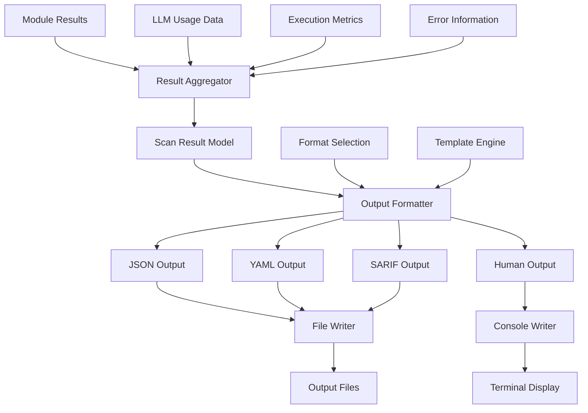

**Result Processing Pipeline:**
```python
# Stage 1: Individual module results
module_results = [
    ModuleResult(
        module_name="sql-injection-scanner",
        findings=[Finding(title="SQL Injection", severity=Severity.HIGH)],
        execution_time=45.2,
        llm_usage={"cost": 0.0025}
    ),
    ModuleResult(
        module_name="xss-scanner", 
        findings=[Finding(title="XSS Vulnerability", severity=Severity.MEDIUM)],
        execution_time=32.1,
        llm_usage={"cost": 0.0018}
    )
]

# Stage 2: Aggregated scan result
scan_result = ScanResult(
    scan_id="scan-12345",
    target=target,
    findings=[
        # All findings from all modules
        Finding(title="SQL Injection", severity=Severity.HIGH),
        Finding(title="XSS Vulnerability", severity=Severity.MEDIUM)
    ],
    modules_executed=2,
    execution_time=77.3,
    llm_usage={
        "total_requests": 8,
        "total_cost": 0.0043,
        "by_module": {
            "sql-injection-scanner": {"cost": 0.0025},
            "xss-scanner": {"cost": 0.0018}
        }
    },
    summary={
        "total_findings": 2,
        "critical_findings": 0,
        "high_findings": 1,
        "medium_findings": 1,
        "low_findings": 0
    }
)

# Stage 3: Output formatting
formatted_outputs = {
    "json": JSONFormatter.format(scan_result),
    "yaml": YAMLFormatter.format(scan_result), 
    "sarif": SARIFFormatter.format(scan_result),
    "human": HumanFormatter.format(scan_result, console)
}
```

## Database Data Flow Patterns

### Database Schema and Relationships

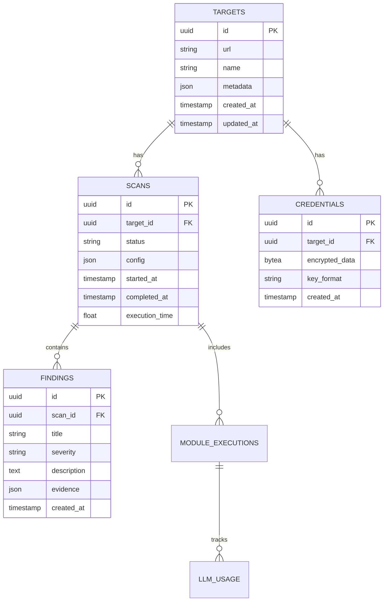

### Database Operations Flow

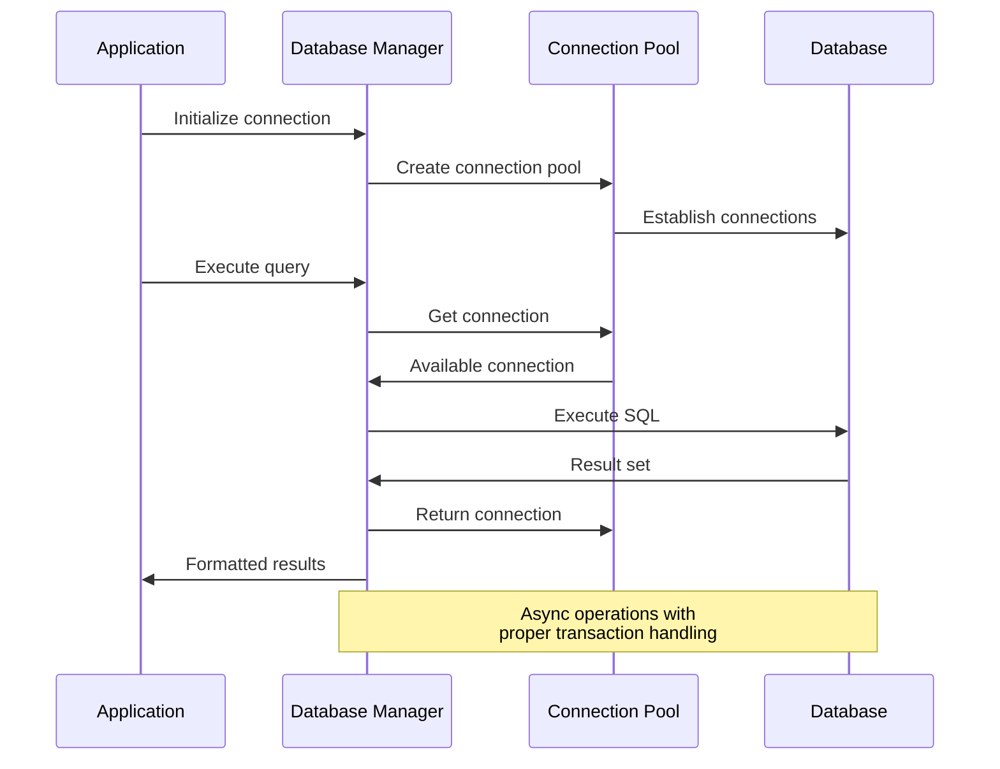

## File System Data Flow

### Configuration File Processing

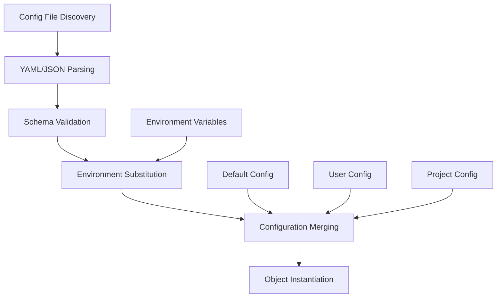

### Module and Payload Storage

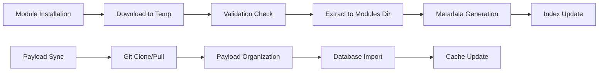

## Error Propagation Patterns

### Error Flow Through System Layers

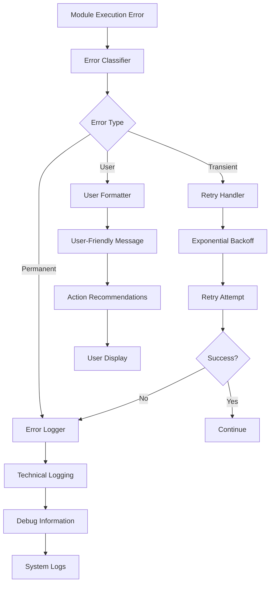

### Error Context Preservation

```python
# Error occurs in deep module execution
class ModuleExecutionError(Exception):
    def __init__(self, message: str, context: Dict[str, Any]):
        super().__init__(message)
        self.context = context

try:
    result = await module.execute(target)
except Exception as e:
    # Preserve execution context
    error = ModuleExecutionError(
        message=f"Module {module.name} failed: {e}",
        context={
            "module_name": module.name,
            "module_version": module.version,
            "target_url": target.url,
            "execution_id": execution_id,
            "timestamp": datetime.utcnow(),
            "original_error": str(e),
            "traceback": traceback.format_exc()
        }
    )
    
    # Error bubbles up with context intact
    raise error from e
```

## Performance and Optimization Patterns

### Data Flow Optimization Strategies

1. **Connection Pooling**
   ```python
   # Reuse database connections
   async with database_manager.get_session() as session:
       results = await session.execute(query)
   ```

2. **Async Processing Pipelines**
   ```python
   # Process data streams asynchronously
   async for batch in data_stream.batch(size=100):
       await asyncio.gather(*[process_item(item) for item in batch])
   ```

3. **Caching Strategies**
   ```python
   # Cache expensive computations
   @lru_cache(maxsize=1000)
   def expensive_computation(input_data: str) -> str:
       return process_data(input_data)
   ```

4. **Result Streaming**
   ```python
   # Stream large result sets
   async def stream_scan_results(scan_id: str):
       async for finding in finding_repository.stream(scan_id):
           yield format_finding(finding)
   ```

This comprehensive data flow documentation provides complete insight into how information moves through the Gibson framework, enabling developers and system administrators to understand system behavior, optimize performance, and troubleshoot issues effectively.