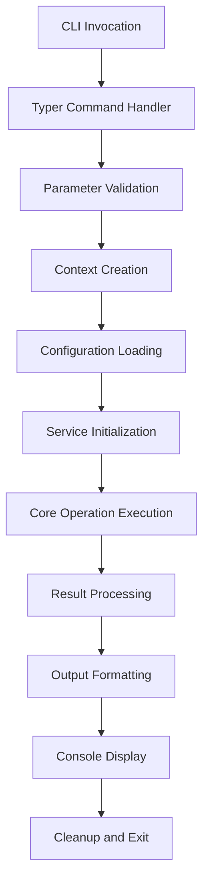
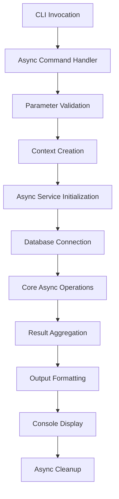
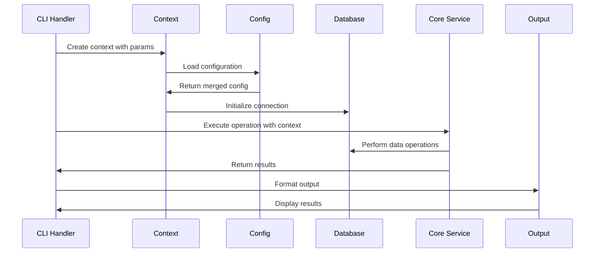
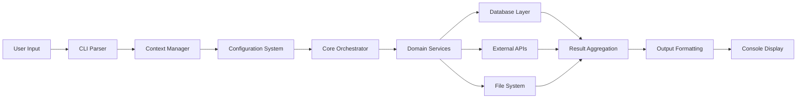
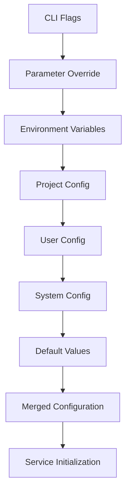
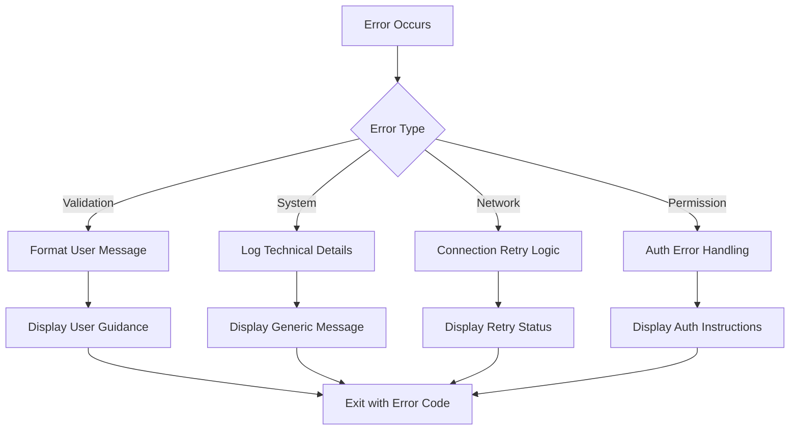

# Gibson CLI Workflow Documentation

## Overview

This section provides comprehensive workflow tracing for all Gibson CLI commands, showing the complete data flow from command invocation through system execution to result output. Each workflow is documented with detailed sequence diagrams, data transformations, integration points, and performance characteristics.

## Command Categories

### Core Security Commands
- [`gibson scan`](scan-workflow.md) - Execute security scans against targets
- [`gibson chain`](chain-workflow.md) - Execute chained multi-step attack sequences

### Module Management Commands  
- [`gibson module`](module-workflow.md) - Module lifecycle management operations
- [`gibson payload`](payload-workflow.md) - Payload synchronization and management

### Target Management Commands
- [`gibson target`](target-workflow.md) - Target configuration and management

### System Configuration Commands
- [`gibson config`](config-workflow.md) - Configuration management
- [`gibson health`](health-workflow.md) - System health checking
- [`gibson console`](console-workflow.md) - Interactive console mode

### Reporting and Output Commands
- [`gibson report`](report-workflow.md) - Generate security reports

### Authentication Commands
- [`gibson credentials`](credentials-workflow.md) - Credential management

### Database Commands
- [`gibson database`](database-workflow.md) - Database operations

### Schema Commands
- [`gibson schema`](schema-workflow.md) - Schema synchronization

### LLM Commands
- [`gibson llm`](llm-workflow.md) - LLM configuration and testing

## Workflow Analysis Framework

Each command workflow is analyzed using a consistent framework:

### 1. Command Flow Analysis
- **Entry Point**: CLI command definition and parameter parsing
- **Validation**: Input validation and parameter processing
- **Context Creation**: CLI context setup and dependency injection
- **Core Processing**: Business logic execution through Gibson core systems
- **Result Processing**: Output formatting and presentation
- **Exit Handling**: Cleanup and resource management

### 2. Data Flow Tracing
- **Input Data**: Command parameters, configuration files, environment variables
- **Data Transformations**: Pydantic model validation, data normalization, format conversion
- **System Integration**: Database operations, API calls, file system operations
- **Output Generation**: Result formatting, console output, file writing

### 3. Integration Points
- **Configuration System**: How commands access and use configuration
- **Database Layer**: Database connection and operation patterns
- **Authentication**: Credential management and validation
- **Core Services**: Integration with Base orchestrator and domain services
- **External Systems**: API calls, file operations, network communications

### 4. Error Handling
- **Validation Errors**: Input parameter validation and user feedback
- **System Errors**: Core system error handling and recovery
- **User Experience**: Error message formatting and guidance
- **Logging**: Error logging and debugging information

### 5. Performance Characteristics
- **Execution Time**: Typical command execution times
- **Resource Usage**: Memory and CPU utilization patterns
- **Scalability**: Performance with large datasets or concurrent operations
- **Optimization Opportunities**: Identified performance improvement areas

## Command Workflow Patterns

Gibson CLI commands follow consistent architectural patterns:

### Standard Command Pattern

### Async Command Pattern

### Service Integration Pattern

## Data Flow Visualization

### High-Level System Flow

### Configuration Flow

### Error Handling Flow

## Performance Analysis

### Command Performance Benchmarks
- **Simple Commands** (`gibson health`): ~100-200ms
- **Configuration Commands** (`gibson config`): ~200-500ms  
- **Database Commands** (`gibson database`): ~500ms-2s
- **Complex Operations** (`gibson scan`): ~10s-5min depending on scope
- **Module Operations** (`gibson module install`): ~1-10s per module

### Resource Usage Patterns
- **Memory Usage**: 50-200MB typical, 500MB+ for large operations
- **CPU Usage**: Moderate during active operations, minimal during I/O waits
- **Network Usage**: Variable based on API calls and module downloads
- **Disk Usage**: Minimal for configuration, significant for module/payload caching

### Optimization Opportunities
- **Connection Pooling**: Reuse database connections across operations
- **Configuration Caching**: Cache parsed configuration to avoid repeated loading
- **Async Operations**: More async patterns for I/O-bound operations
- **Result Streaming**: Stream large result sets instead of batching
- **Module Preloading**: Cache frequently used modules in memory

## Integration Patterns

### Database Integration
All database-connected commands follow this pattern:
1. Initialize database manager from configuration
2. Create async session for operation
3. Execute database operations with proper transaction handling
4. Close session and cleanup resources

### Configuration Integration  
Commands access configuration through:
1. Context creation with CLI parameter overrides
2. Hierarchical configuration loading (CLI > env > files > defaults)
3. Configuration validation and normalization
4. Service initialization with resolved configuration

### Authentication Integration
Security-sensitive commands integrate authentication via:
1. Credential manager initialization
2. Target-specific credential retrieval
3. Authentication validation and testing
4. Secure credential usage in operations

### Core Service Integration
Most commands integrate with core services:
1. Base orchestrator initialization
2. Domain service coordination  
3. Module management integration
4. Result processing and validation

## Documentation Organization

Each workflow document follows this structure:

### Command Overview
- Command purpose and use cases
- Parameters and options
- Expected behavior and outputs

### Detailed Flow Analysis
- Step-by-step execution trace
- Code path analysis with file references
- Data transformation points
- Integration touchpoints

### Sequence Diagrams
- Actor interactions
- System component communication
- Timing and ordering dependencies
- Error handling paths

### Data Flow Diagrams
- Input data sources
- Processing stages
- Output destinations
- Storage patterns

### Configuration Impact
- Configuration parameters used
- Default behavior vs configured behavior
- Environment-specific differences

### Error Scenarios
- Common error conditions
- Error handling strategies
- User experience considerations
- Recovery procedures

### Performance Analysis
- Execution time characteristics
- Resource utilization
- Scalability considerations
- Optimization recommendations

This comprehensive workflow documentation provides developers, security engineers, and system administrators with deep insight into Gibson's operational patterns and integration architecture.