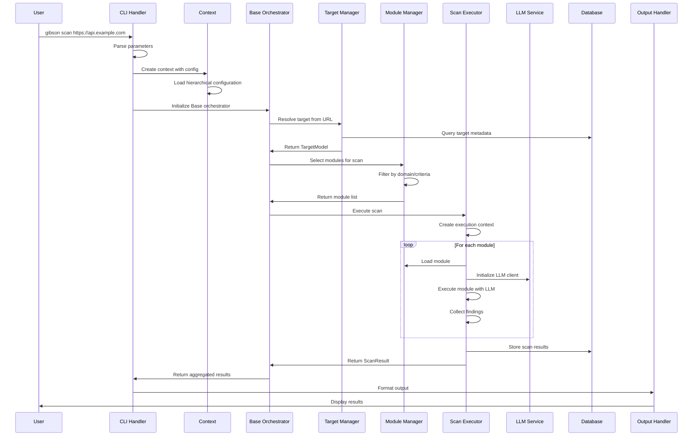

# Gibson Scan Command Workflow

## Overview

The `gibson scan` command is the primary interface for executing security tests against targets. It orchestrates the complete security testing lifecycle including target validation, module selection, execution coordination, result aggregation, and report generation.

**Command Signature:**
```bash
gibson scan [TARGET] [OPTIONS]
```

**Primary Use Cases:**
- Execute comprehensive security scans against web APIs
- Run targeted vulnerability assessments  
- Perform automated penetration testing
- Generate security compliance reports

## Command Flow Analysis

### 1. Entry Point and Parameter Processing

**File:** `gibson/cli/commands/scan.py`

```python
@app.command()
async def scan(
    target: str = typer.Argument(..., help="Target URL or identifier"),
    modules: Optional[List[str]] = typer.Option(None, "--module", "-m"),
    domain: Optional[str] = typer.Option(None, "--domain", "-d"), 
    config_file: Optional[str] = typer.Option(None, "--config", "-c"),
    output_format: str = typer.Option("human", "--format", "-f"),
    output_file: Optional[str] = typer.Option(None, "--output", "-o"),
    verbose: bool = typer.Option(False, "--verbose", "-v"),
    dry_run: bool = typer.Option(False, "--dry-run"),
    concurrent: int = typer.Option(5, "--concurrent"),
    timeout: int = typer.Option(300, "--timeout"),
    ctx: typer.Context
):
    """Execute security scan against target."""
```

### 2. Parameter Validation and Context Creation

The scan command performs comprehensive input validation:

```python
# Validate target URL format
try:
    parsed_target = TargetModel.from_url(target)
except ValueError as e:
    raise typer.BadParameter(f"Invalid target URL: {e}")

# Validate output format
valid_formats = ["human", "json", "yaml", "sarif"]
if output_format not in valid_formats:
    raise typer.BadParameter(f"Format must be one of: {', '.join(valid_formats)}")

# Create CLI context with configuration
context = Context(
    config=get_config(config_file),
    console=Console(),
    verbose=verbose,
    output_format=output_format
)
```

### 3. Core Processing Integration

The scan command integrates with Gibson's core orchestration system:

```python
async def execute_scan_workflow(
    target: str,
    context: Context,
    scan_options: ScanOptions
) -> ScanResult:
    """Execute complete scan workflow."""
    
    # Initialize Base orchestrator
    async with Base(config=context.config, context=context) as gibson:
        
        # Validate target and resolve authentication
        target_obj = await gibson.resolve_target(target)
        
        # Select and validate modules
        selected_modules = await gibson.select_modules(
            domain=scan_options.domain,
            module_names=scan_options.modules,
            target=target_obj
        )
        
        # Execute scan
        scan_result = await gibson.execute_scan(
            target=target_obj,
            modules=selected_modules,
            options=scan_options
        )
        
        return scan_result
```

## Detailed Sequence Diagram



## Data Flow Analysis

### Input Data Sources

1. **Command Parameters**
   - Target URL/identifier
   - Module selection criteria
   - Output format and destination
   - Execution parameters (timeout, concurrency)

2. **Configuration Files**
   - Default scan configuration
   - Target-specific settings
   - Module configuration overrides
   - Authentication credentials

3. **Environment Variables**
   - API keys and credentials
   - Runtime configuration overrides
   - CI/CD integration settings

4. **Database State**
   - Existing target definitions
   - Historical scan results
   - Module metadata and status

### Data Transformations

#### 1. Target Resolution
```python
# Input: String URL
target_str = "https://api.example.com"

# Transformation: Parse and validate
target_obj = TargetModel(
    url="https://api.example.com",
    name="API Example",
    authentication_type="api_key",
    base_url="https://api.example.com",
    metadata={"scan_timestamp": datetime.utcnow()}
)
```

#### 2. Module Selection
```python
# Input: Domain filter and module names
domain_filter = "prompt"
module_names = ["sql-injection", "xss-scanner"]

# Transformation: Resolve to module instances
selected_modules = [
    ModuleDefinition(
        name="sql-injection",
        domain=AttackDomain.PROMPT,
        version="1.2.0",
        config=module_config
    ),
    ModuleDefinition(
        name="xss-scanner", 
        domain=AttackDomain.PROMPT,
        version="2.1.0",
        config=module_config
    )
]
```

#### 3. Scan Configuration
```python
# Input: CLI options and configuration
scan_config = ScanConfig(
    target=target_obj,
    modules=selected_modules,
    concurrent_limit=5,
    timeout_seconds=300,
    output_format="json",
    llm_integration=True
)
```

### System Integration Points

#### 1. Target Management Integration
```python
# gibson/core/targets/manager.py
class TargetManager:
    async def resolve_target(self, identifier: str) -> TargetModel:
        """Resolve target from identifier with authentication."""
        
        # Check database for existing target
        existing = await self.repository.get_by_url(identifier)
        if existing:
            return existing
            
        # Create new target from URL
        target = TargetModel.from_url(identifier)
        
        # Resolve authentication if available
        auth_info = await self.auth_service.resolve_authentication(target)
        if auth_info:
            target.authentication = auth_info
            
        # Store for future use
        await self.repository.save(target)
        
        return target
```

#### 2. Module Management Integration  
```python
# gibson/core/module_management/manager.py
class ModuleManager:
    async def select_modules_for_scan(
        self, 
        domain: Optional[AttackDomain],
        module_names: Optional[List[str]],
        target: TargetModel
    ) -> List[ModuleDefinition]:
        """Select appropriate modules for scan."""
        
        available_modules = await self.discover_modules()
        selected = []
        
        if module_names:
            # Explicit module selection
            for name in module_names:
                module = available_modules.get(name)
                if module:
                    selected.append(module)
                else:
                    logger.warning(f"Module not found: {name}")
        else:
            # Automatic selection based on domain/target
            for module in available_modules.values():
                if self._is_module_applicable(module, domain, target):
                    selected.append(module)
        
        return selected
```

#### 3. Scan Execution Integration
```python
# gibson/core/orchestrator/scan_executor.py
class ScanExecutor:
    async def execute_scan(
        self,
        scan_config: ScanConfig,
        target: TargetModel,
        modules: List[ModuleDefinition]
    ) -> ScanResult:
        """Execute comprehensive security scan."""
        
        scan_id = str(uuid.uuid4())
        start_time = datetime.utcnow()
        
        # Initialize LLM orchestrator
        llm_orchestrator = await get_llm_orchestrator()
        await llm_orchestrator.prepare_for_scan(scan_id, scan_config, target)
        
        # Execute modules concurrently
        findings = []
        execution_errors = []
        
        semaphore = asyncio.Semaphore(scan_config.concurrent_limit)
        
        async def execute_module(module: ModuleDefinition):
            async with semaphore:
                try:
                    module_findings = await self._execute_single_module(
                        module, target, scan_id, llm_orchestrator
                    )
                    findings.extend(module_findings)
                except Exception as e:
                    execution_errors.append(f"Module {module.name}: {e}")
        
        # Execute all modules
        tasks = [execute_module(module) for module in modules]
        await asyncio.gather(*tasks, return_exceptions=True)
        
        # Generate scan result
        return ScanResult(
            scan_id=scan_id,
            target=target,
            modules_executed=len(modules),
            findings=findings,
            errors=execution_errors,
            execution_time=(datetime.utcnow() - start_time).total_seconds(),
            llm_usage=await llm_orchestrator.get_scan_usage(scan_id)
        )
```

#### 4. LLM Integration
```python
# gibson/core/orchestrator/llm_integration.py
class LLMOrchestrator:
    async def prepare_for_scan(
        self,
        scan_id: str,
        scan_config: ScanConfig, 
        target: TargetModel
    ):
        """Prepare LLM services for scan execution."""
        
        # Detect target's LLM provider if applicable
        provider = target.detect_llm_provider()
        
        # Configure rate limits for scan
        if self.rate_limiter and hasattr(scan_config, 'rate_limits'):
            await self.rate_limiter.set_scan_limits(scan_id, scan_config.rate_limits)
            
        # Track active scan
        self.active_scans[scan_id] = {
            'config': scan_config,
            'target': target,
            'provider': provider,
            'start_time': time.time()
        }
```

## Output Processing and Formatting

### Result Aggregation
```python
# gibson/models/scan.py
@dataclass
class ScanResult:
    scan_id: str
    target: TargetModel
    findings: List[Finding]
    modules_executed: int
    execution_time: float
    llm_usage: Dict[str, Any]
    errors: List[str]
    metadata: Dict[str, Any]
    
    def get_summary(self) -> Dict[str, Any]:
        """Generate scan summary statistics."""
        return {
            'total_findings': len(self.findings),
            'critical_findings': len([f for f in self.findings if f.severity == Severity.CRITICAL]),
            'high_findings': len([f for f in self.findings if f.severity == Severity.HIGH]),
            'modules_executed': self.modules_executed,
            'execution_time_seconds': self.execution_time,
            'llm_requests': self.llm_usage.get('total_requests', 0),
            'llm_cost_usd': self.llm_usage.get('total_cost', 0)
        }
```

### Output Format Handling
```python
# gibson/cli/commands/scan.py
def format_scan_results(
    result: ScanResult, 
    output_format: str,
    context: Context
) -> str:
    """Format scan results for output."""
    
    if output_format == "json":
        return json.dumps(result.model_dump(), indent=2, default=str)
        
    elif output_format == "yaml":
        return yaml.dump(result.model_dump(), default_flow_style=False)
        
    elif output_format == "sarif":
        return convert_to_sarif(result)
        
    elif output_format == "human":
        return format_human_readable(result, context.console)
        
    else:
        raise ValueError(f"Unsupported output format: {output_format}")

def format_human_readable(result: ScanResult, console: Console) -> str:
    """Format results for human consumption."""
    
    output = []
    
    # Scan summary
    summary = result.get_summary()
    output.append(f"🎯 Scan completed for {result.target.url}")
    output.append(f"📊 Found {summary['total_findings']} findings in {summary['execution_time_seconds']:.1f}s")
    output.append(f"⚡ Executed {summary['modules_executed']} modules")
    
    if summary['llm_requests'] > 0:
        output.append(f"🤖 LLM usage: {summary['llm_requests']} requests, ${summary['llm_cost_usd']:.4f}")
    
    # Findings breakdown
    if result.findings:
        output.append("\n📋 Findings by Severity:")
        
        for severity in [Severity.CRITICAL, Severity.HIGH, Severity.MEDIUM, Severity.LOW]:
            findings = [f for f in result.findings if f.severity == severity]
            if findings:
                output.append(f"  {severity.value.title()}: {len(findings)}")
                
        output.append("\n🔍 Detailed Findings:")
        for i, finding in enumerate(result.findings[:10], 1):  # Show first 10
            output.append(f"  {i}. {finding.title} ({finding.severity.value})")
            output.append(f"     {finding.description}")
    
    # Execution errors
    if result.errors:
        output.append(f"\n⚠️  Execution Errors ({len(result.errors)}):")
        for error in result.errors:
            output.append(f"  • {error}")
    
    return "\n".join(output)
```

## Error Handling Scenarios

### Common Error Conditions

#### 1. Target Unreachable
```python
try:
    target = await target_manager.resolve_target(target_url)
except NetworkError as e:
    console.print(f"[red]✗[/red] Cannot reach target: {e}")
    console.print("💡 Check network connectivity and target URL")
    raise typer.Exit(1)
```

#### 2. Authentication Failure  
```python
try:
    auth_result = await auth_service.validate_credential(target)
    if not auth_result.is_valid:
        console.print(f"[red]✗[/red] Authentication failed: {auth_result.error_message}")
        console.print("💡 Use 'gibson credentials add' to configure authentication")
        raise typer.Exit(1)
except Exception as e:
    console.print(f"[red]✗[/red] Authentication error: {e}")
    raise typer.Exit(1)
```

#### 3. Module Execution Failures
```python
if scan_result.errors:
    console.print(f"[yellow]⚠️[/yellow] {len(scan_result.errors)} modules failed:")
    for error in scan_result.errors:
        console.print(f"  • {error}")
    
    if len(scan_result.errors) == len(selected_modules):
        console.print("[red]✗[/red] All modules failed - scan aborted")
        raise typer.Exit(1)
```

#### 4. Resource Exhaustion
```python
try:
    scan_result = await executor.execute_scan(config, target, modules)
except ResourceLimitExceededError as e:
    console.print(f"[red]✗[/red] Resource limit exceeded: {e}")
    console.print("💡 Try reducing --concurrent or increasing timeout limits")
    raise typer.Exit(1)
```

## Performance Characteristics

### Execution Time Analysis

**Typical Performance:**
- **Simple scan** (1-3 modules): 10-30 seconds
- **Comprehensive scan** (10+ modules): 2-10 minutes  
- **Large-scale scan** (50+ endpoints): 10-60 minutes

**Performance Factors:**
- Number of modules executed
- Target response time and complexity
- LLM API response latency
- Network connectivity quality
- Concurrent execution limits

### Resource Usage Patterns

**Memory Usage:**
- Base scan process: ~100-200MB
- Per-module overhead: ~10-50MB
- LLM response caching: ~50-200MB
- Result storage: ~1-10MB per scan

**CPU Usage:**
- Parsing and validation: ~20% CPU burst
- Module execution: ~40-80% depending on concurrency
- Result processing: ~10-30% CPU
- I/O operations: Minimal CPU, high I/O wait

**Network Usage:**
- Target probing: 1-100KB per request
- LLM API calls: 1-50KB per request/response
- Module downloads: 1-10MB per module (cached)

### Optimization Opportunities

1. **Module Preloading**: Cache frequently used modules in memory
2. **Connection Pooling**: Reuse HTTP connections for target testing
3. **Result Streaming**: Stream results instead of batching for large scans
4. **Parallel Initialization**: Initialize services concurrently
5. **Smart Caching**: Cache target metadata and module results

## Integration Testing Scenarios

### End-to-End Test Cases

1. **Basic Scan Execution**
   ```bash
   gibson scan https://api.example.com --format json
   ```

2. **Module-Specific Scan**
   ```bash
   gibson scan https://api.example.com -m sql-injection -m xss-scanner
   ```

3. **Domain-Filtered Scan**
   ```bash
   gibson scan https://api.example.com --domain prompt --concurrent 10
   ```

4. **Configuration-Driven Scan**
   ```bash
   gibson scan https://api.example.com --config scan-config.yaml --output report.json
   ```

5. **Dry Run Mode**
   ```bash
   gibson scan https://api.example.com --dry-run --verbose
   ```

This comprehensive workflow documentation provides complete insight into the Gibson scan command's execution path, data transformations, and system integration patterns.